## ida使用

### 修改汇编指令

1. 把鼠标定位到要修改的指令(函数图上的就行)
2. 调出16进制的窗口 `View` -> `Open subviews` ->`Hex dump` （这步可以不做）
3. 修改 `Edit` -> `Patch program` -> `Change byte...`
4. 改完后，记得保存 `Edit` -> `Patch program` -> `Apply patches to input file`

### 快捷键

`Shift + F12` 调出字符串窗口

`Alt + T` 搜索字符串

# 静态分析

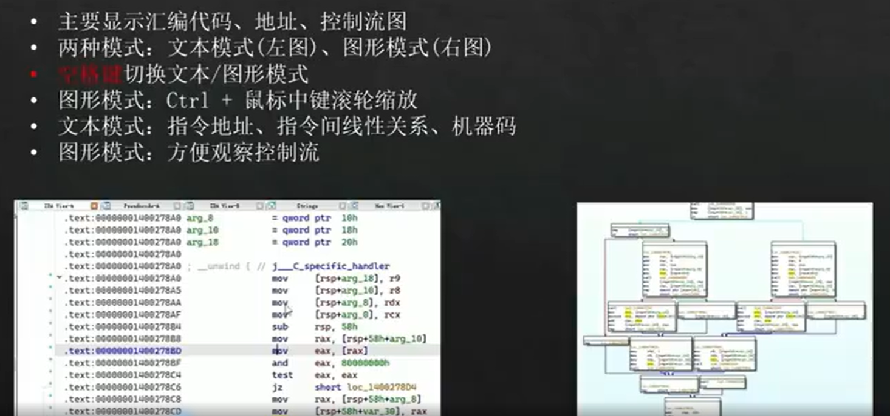

在伪代码窗口，鼠标定位到想看的那行，再点Tab，就能定位到它相应的汇编代码

字符串表 `shift + F12`

双击某字符串，进入定义的位置

字符串不一定全

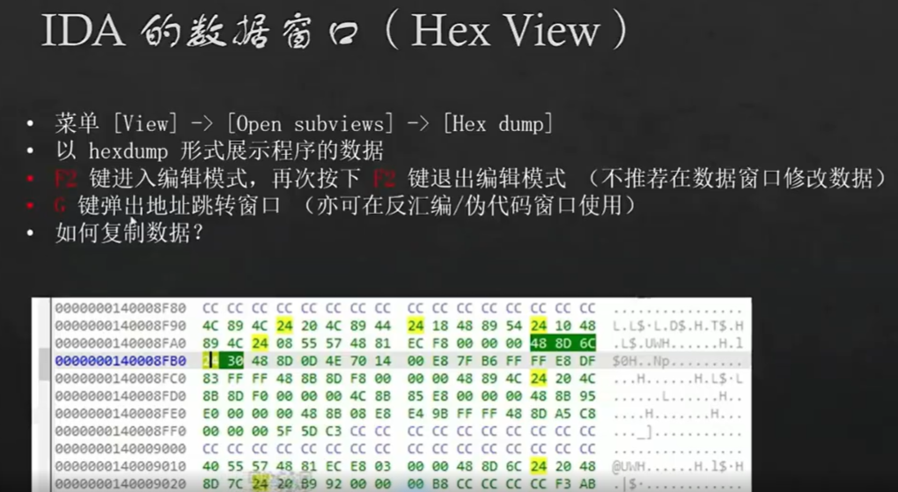

1. 右键 `Edit`进入编辑模式。
2. 右键`apply changes`退出编辑模式。
3. Edit->Patch program -> Apply patches to input file... 保存

ctrl+v撤销上一次操作

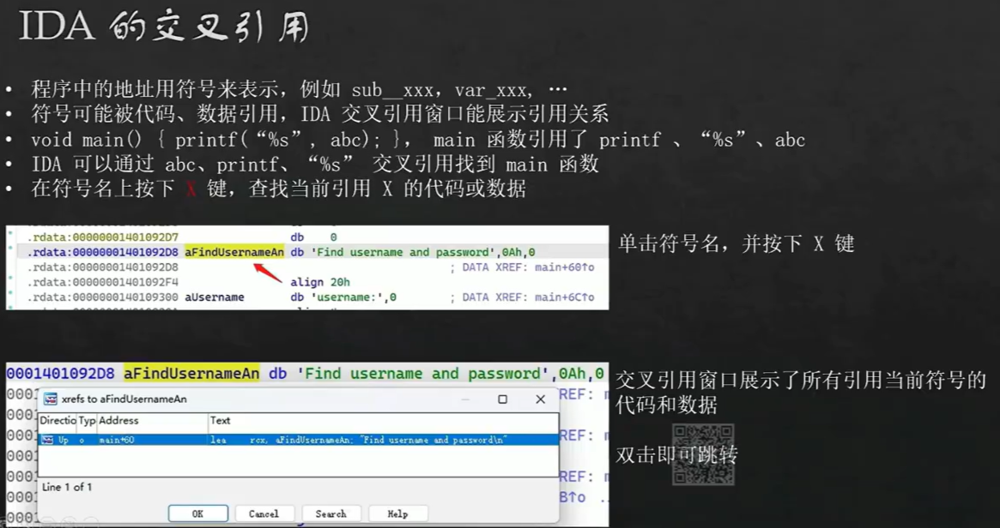

如果跳转了其它窗口，是因为跟点前的窗口有关。需要再点一下你像切换过去的窗口，然后在跳转，就可以跳转到同款窗口了

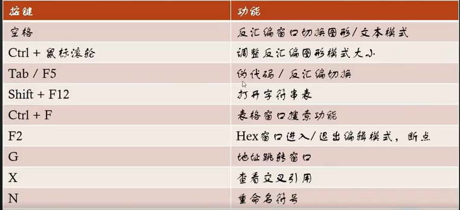

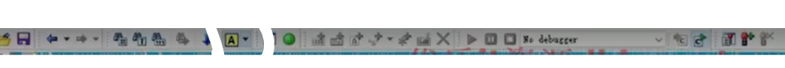

这个可以锁定高亮，让某个单词一直亮着

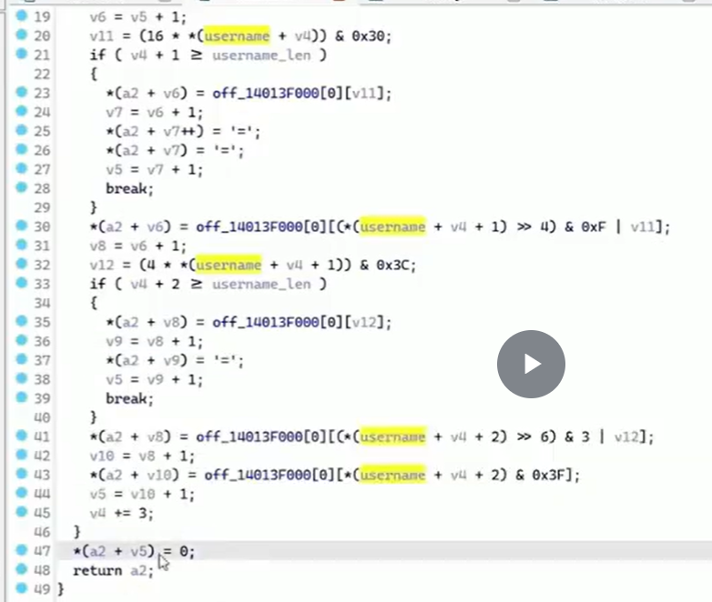

关键：`0x3F`猜测是base64

base64编码过程，有‘=‘是编码，解码没有`=`

在伪代码窗口，光标定位在十六进制，按下`h`可以转成十进制；按`r`切换成对应的ascii编码字符

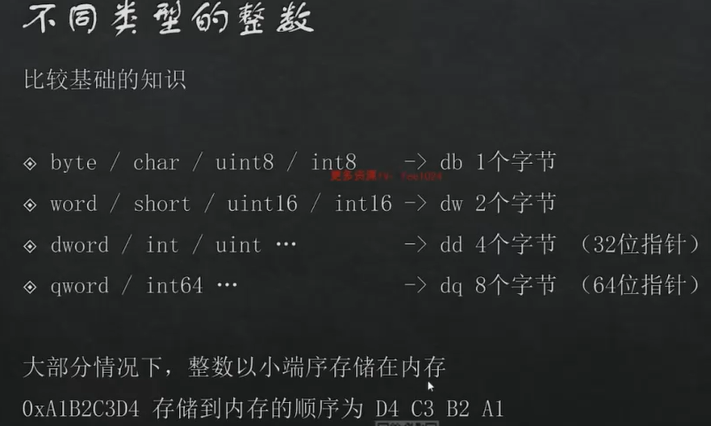

在 db上按下`d`建，会把db变成dw,再按下变成dd，然后dq

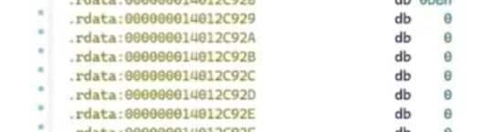

按`u`把字符转成数字

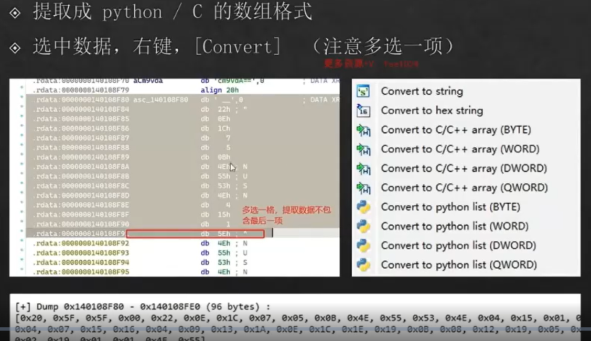

数据和代码是可以相互转换的；把jz,jnz连起来的代码下方转成数据，然后选中（记得多选一行）转成nop

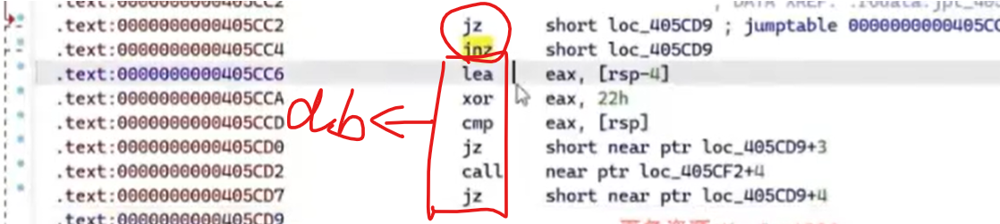

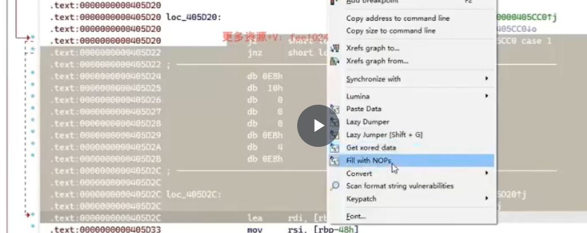

全部处理完后，让ida重新分析函数

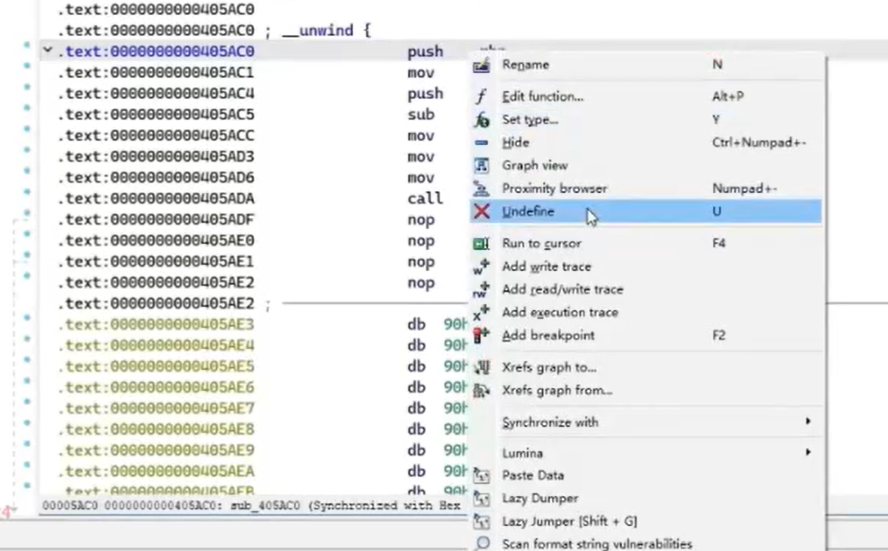

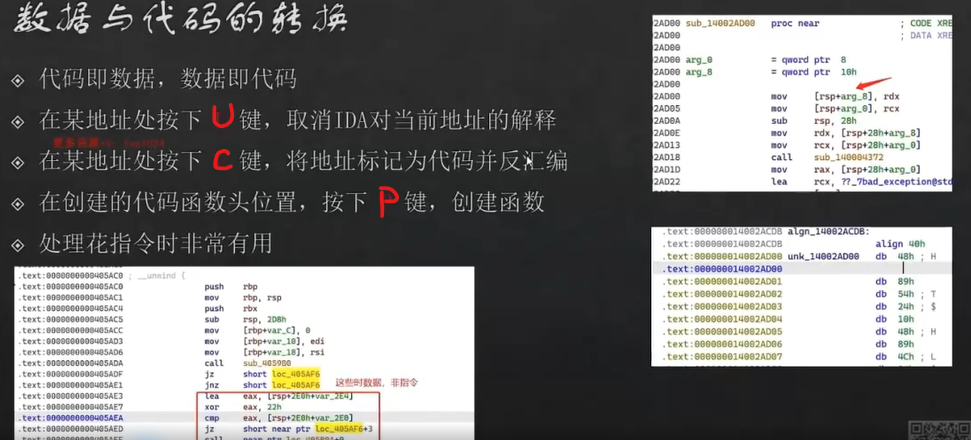

IDA内置函数、类型定义在头文件defs.h

# 动态调试

如果不小心关掉了什么窗口，去debugger->debugger windows找

ctrl+P跳转ip强制让程序执行到某个地方，不根据判断结果

F2设置断点

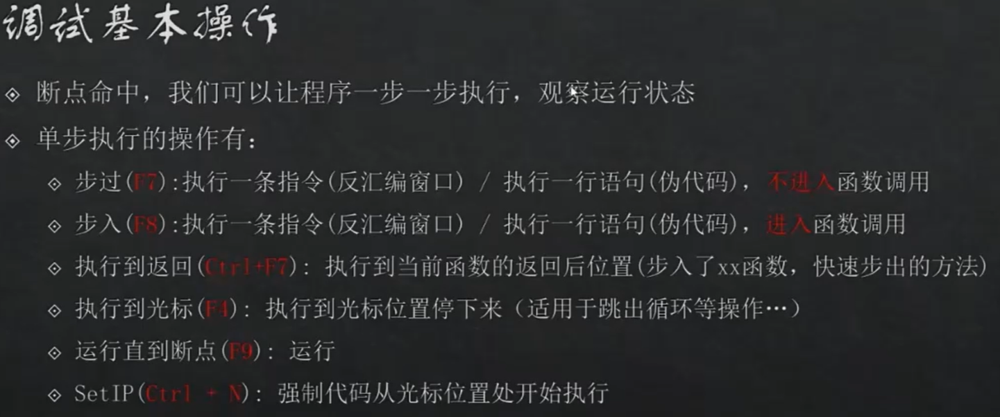

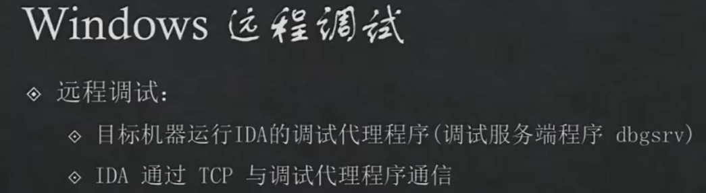

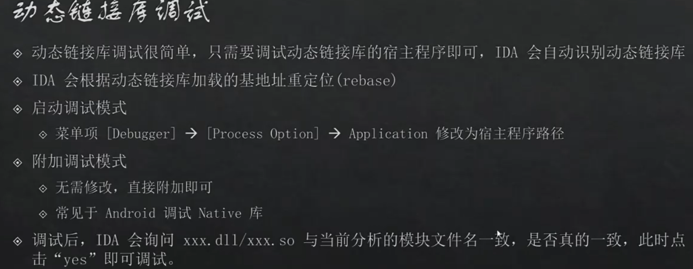

## 断点

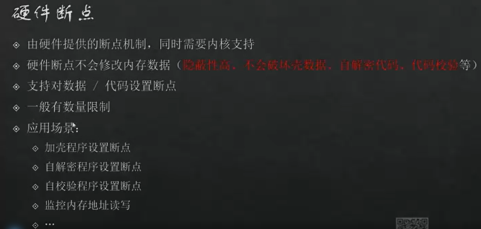
