## ida使用

### 修改汇编指令

1. 把鼠标定位到要修改的指令(函数图上的就行)
2. 调出16进制的窗口 `View` -> `Open subviews` ->`Hex dump` （这步可以不做）
3. 修改 `Edit` -> `Patch program` -> `Change byte...`
4. 改完后，记得保存 `Edit` -> `Patch program` -> `Apply patches to input file`

### 快捷键

`Shift + F12` 调出字符串窗口

`Alt + T` 搜索字符串


# 静态分析

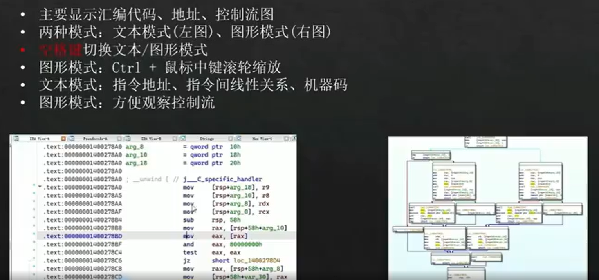

在伪代码窗口，鼠标定位到想看的那行，再点Tab，就能定位到它相应的汇编代码

字符串表 `shift + F12`

双击某字符串，进入定义的位置

字符串不一定全

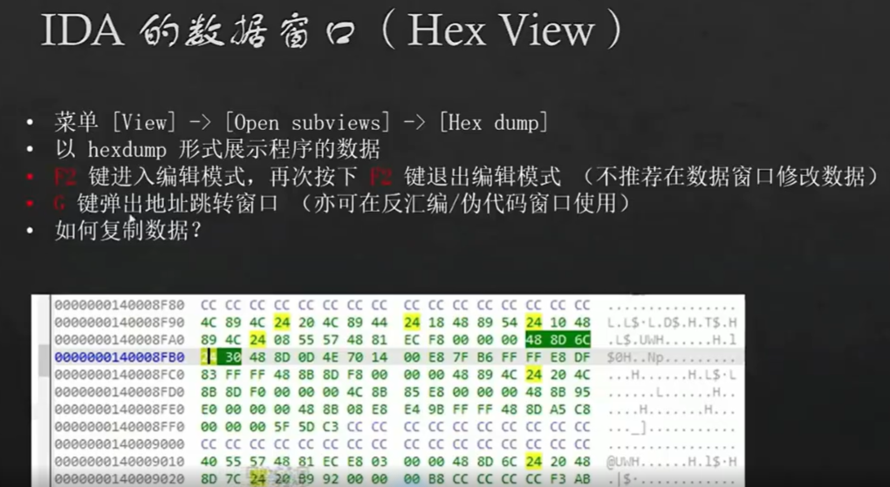

1. 右键 `Edit`进入编辑模式。
2. 右键`apply changes`退出编辑模式。
3. Edit->Patch program -> Apply patches to input file... 保存

ctrl+v撤销上一次操作

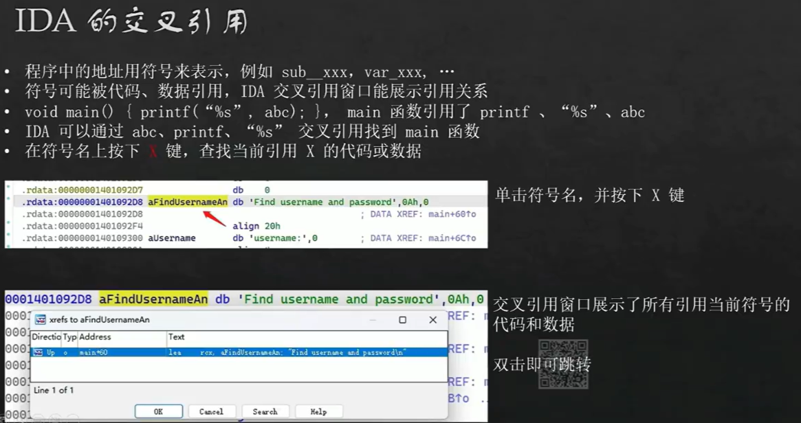

如果跳转了其它窗口，是因为跟点前的窗口有关。需要再点一下你像切换过去的窗口，然后在跳转，就可以跳转到同款窗口了

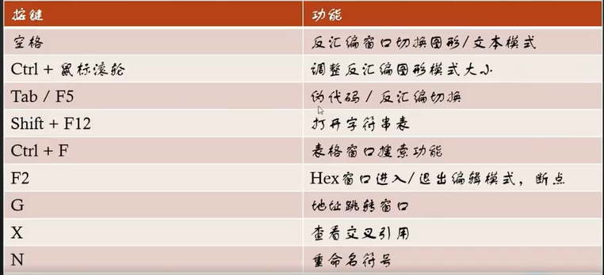


这个可以锁定高亮，让某个单词一直亮着

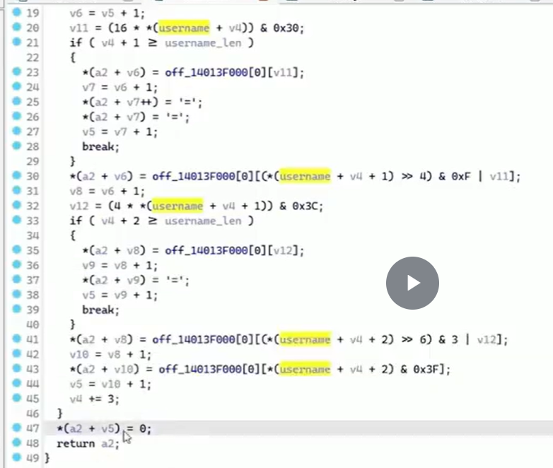

关键：`0x3F`猜测是base64

base64编码过程，有‘=‘是编码，解码没有`=`

在伪代码窗口，光标定位在十六进制，按下`h`可以转成十进制；按`r`切换成对应的ascii编码字符

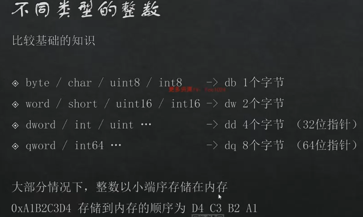

在 db上按下`d`建，会把db变成dw,再按下变成dd，然后dq

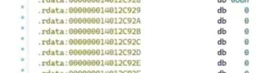

按`u`把字符转成数字


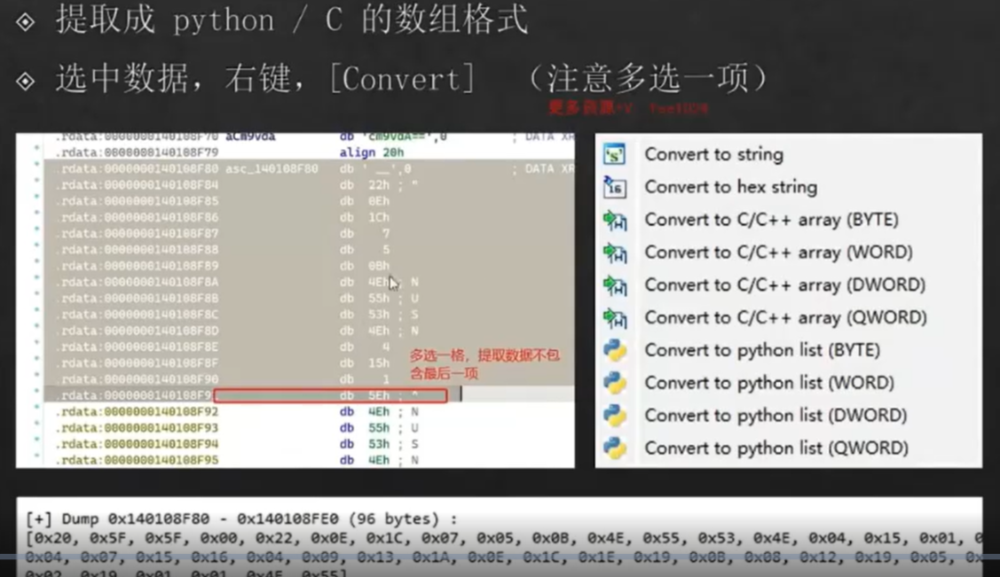


数据和代码是可以相互转换的；把jz,jnz连起来的代码下方转成数据，然后选中（记得多选一行）转成nop

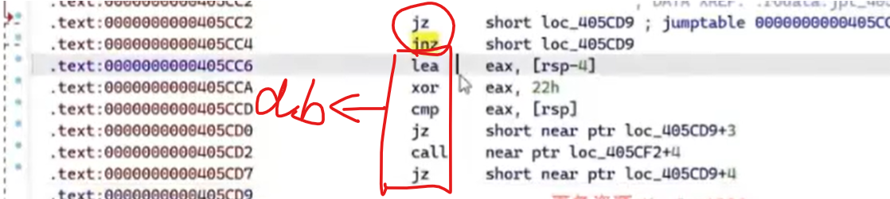

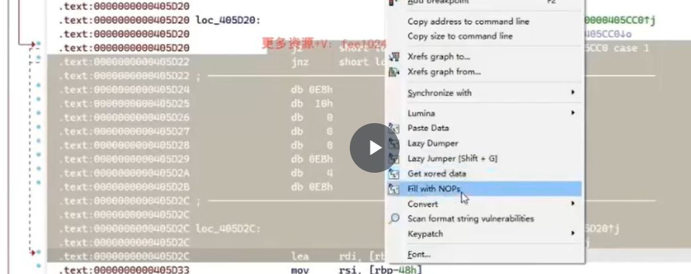

全部处理完后，让ida重新分析函数

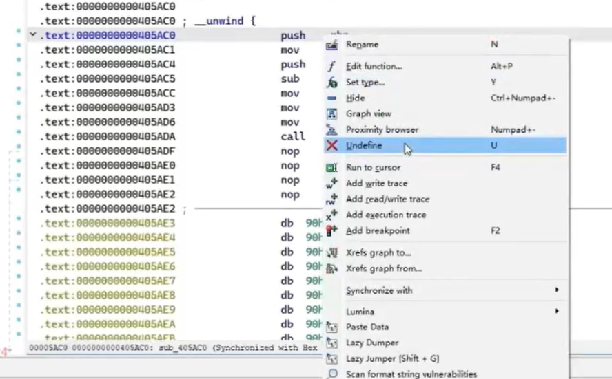

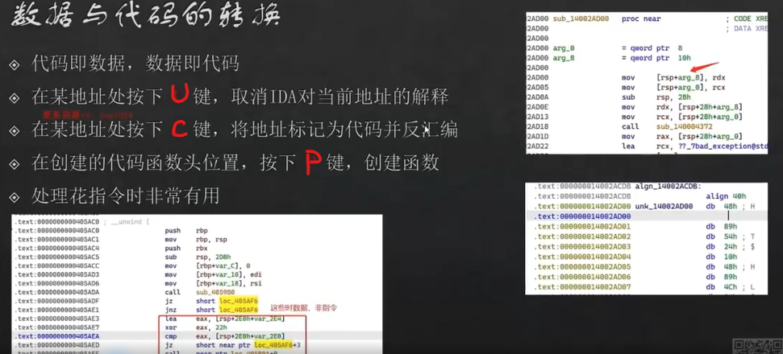

IDA内置函数、类型定义在头文件defs.h

# 动态调试

如果不小心关掉了什么窗口，去debugger->debugger windows找

ctrl+P跳转ip强制让程序执行到某个地方，不根据判断结果

F2设置断点

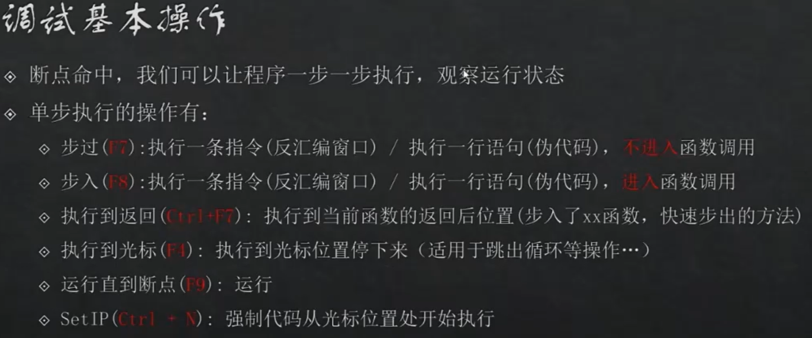

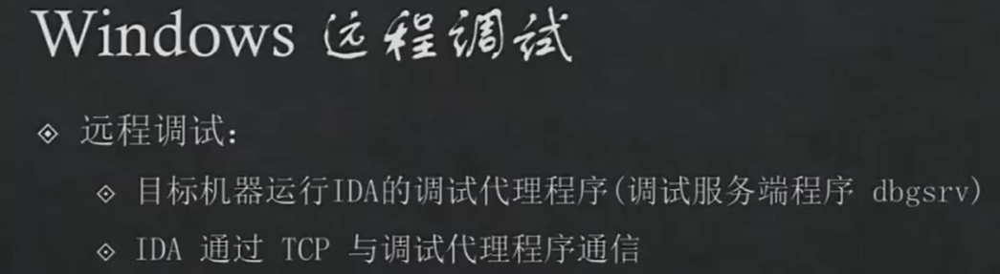

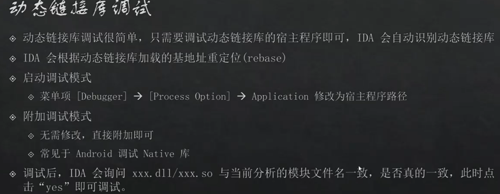

## 断点

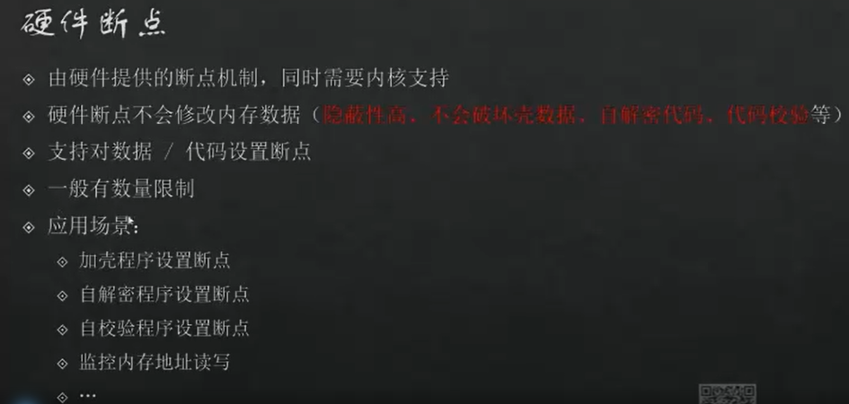

# 调试权限

Android系统默认不允许应用被随意调试，如果想要调试，需要满足二者之一的条件。

- 安卓系统中 `ro.debuggable=1 (默认是0) `   【推荐】

  - 方案一：基于magisk面具的 `MagiskHidePropsConf` 模块，改写`ro.debuggable`的值为1
  - 方案二：定制AOSP时，将`ro.debuggable`的值设置为 1【用userdebug版本编译】

- 应用`AndroidManifest.xml`中 `Application` 标签包含属性 `android:debuggable="true"` 

  可以使用mt管理，修改，重新签名。
  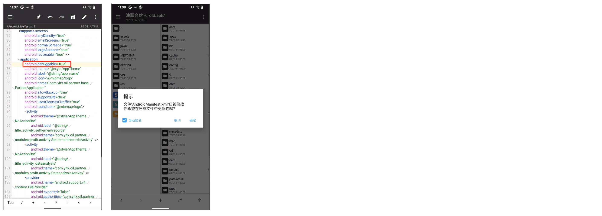

## 面具模块

### 刷模块

在magisk面具中输入MagiskHidePropsConf模块。【MagiskHidePropsConf-v6.1.2.zip】

步骤：

- 将 `MagiskHidePropsConf-v6.1.2.zip` 上传至手机目录

- 打开magisk面具，刷入模块

- 重启手机


### 设置

在设置之前，可以先读取手机的`ro.debuggable`属性值。

```
>>>adb shell getprop ro.debuggable
>>>0
```

修改设置步骤：

- 第1步：adb shell

- 第2步：props

  ```
  =====================================
   Select an option below.
  =====================================
  1 - Edit device fingerprint
  2 - Force BASIC key attestation
  3 - Device simulation (disabled)
  4 - Edit MagiskHide props (active)
  5 - Add/edit custom props (active)       【选择】
  6 - Delete prop values
  7 - Script settings
  8 - Collect logs
  u - Perform module update check
  r - Reset all options/settings
  b - Reboot device
  e - Exit
  ```

- 第3步：输入5，回车继续

  ```
  n - New custom prop                     【选择】
  b - Go back to main menu
  e - Exit
  ```

- 第4步：输入n，回车继续

  ```
  Enter the prop to set. Example:
  ro.sf.lcd_density
  b - Go back
  e - Exit
  Enter your desired option:             【输入 ro.debuggable】
  ```

  ```
  ro.debuggable is
  one of the sensitive props that can be
  set by the MagiskHide props option.
  
  Are you sure you want to proceed?
  y - Yes
  n - No
  e - Exit
  
  Enter your desired option:             【输入y】
  ```

  ```
  Enter the value you want to set
  ro.debuggable to,
  or select from the options below.
  
  The currently set value is:
  0
  Please enter the new value.
  
  b - Go back
  e - Exit
  
  Enter your desired option:            【输入1】
  ```

  ```
  =====================================
   ro.debuggable
  =====================================
  
  This will set ro.debuggable to:
  
  1
  
  Pick an option below to change
  what boot stage the prop will
  be set in, or set/reset a delay:
  
  1 - Default (current)
  2 - post-fs-data
  3 - late_start service
  4 - Both boot stages
  d - Delay
  
  Do you want to continue?
  
  Enter y(es), n(o), e(xit)
  or an option from above:             【输入y】
  ```

  ```
  =====================================
   Reboot - ro.debuggable
  =====================================
  
  Reboot for changes to take effect.
  
  Do you want to reboot now (y/n)?
  
  Enter y(es), n(o) or e(xit):        【输入y】
  ```


根据上述执行操作完毕后，再次查看手机的`ro.debuggable`属性值就变成1。

```
>>>adb shell getprop ro.debuggable
>>>1
```

如果后续不想要重置，按照上述指引将自定义创建的属性删除即可。

# debug so file

```xml
android:extractNativeLibs="true"
android:debuggable="true"
```

1. `adb push android_server64 /data/local/tmp/as75-64` change its name into `as75-64`
2. `chmod 755 as75-64`
3. `./as75-64`  `-p` to bypass anti debug
4. `adb forward tcp:23946 tcp:23946`

## attach(IDA 7.5)

PAY ATTENTION : make sure you have clicked your apps functional place to load the target so file . **don't open any so file**

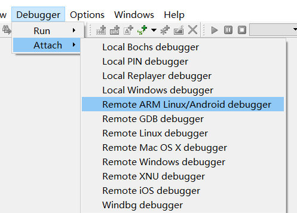

`ctrl F` to search your process name, like `com.xx.xx`. if you dont see it, `ctrl U` to refresh it. or right click, refresh.

go to `Modules`, right click `quick search` search your package's name

double click your target

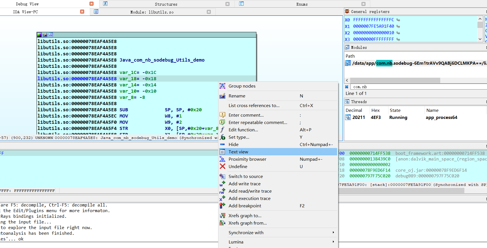

choose `Text view`, `F2` to set a breakpoint. `F8` to next step

## launch(IDA 8.3)

C:\Users\Administrator\AppData\Local\Android\Sdk\tools

monitor.bat

### error

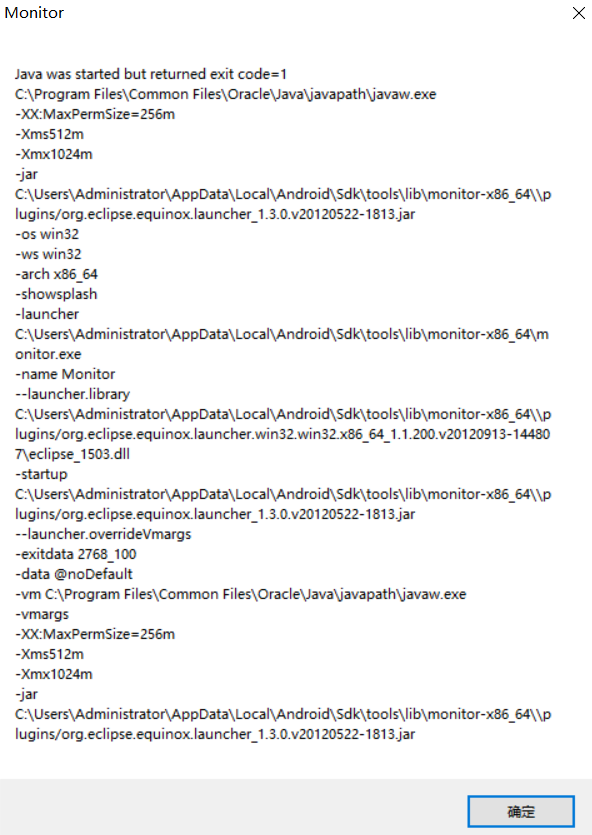

check your java version

```
java -version

C:\Users\Administrator>java -version
java version "21.0.5" 2024-10-15 LTS
Java(TM) SE Runtime Environment (build 21.0.5+9-LTS-239)
Java HotSpot(TM) 64-Bit Server VM (build 21.0.5+9-LTS-239, mixed mode, sharing)
```

mine was 21, that's not propriate, switch it to 1.8 will be fine :)

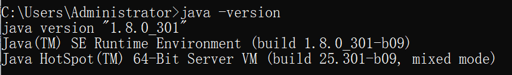

### 1. start an app

eg. `adb shell am start -D -n  com.zj.wuaipojie2025_game/com.zj.wuaipojie2025_game.MainActivity`

```
adb shell am start -D -n  包/Activity名称
```

```shell
dumpsys activity activities | grep -i run # if you dont know which activity to start
```

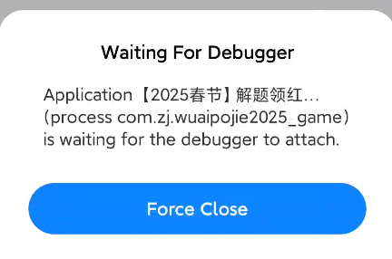

### 2. open ida

find the target function, right click choose `text view`.

`F2` to set a breakpoint. 

1. `Debugger` - `Remote ARM Linux/Android debugger`
2. `Debugger` - `Process Options`

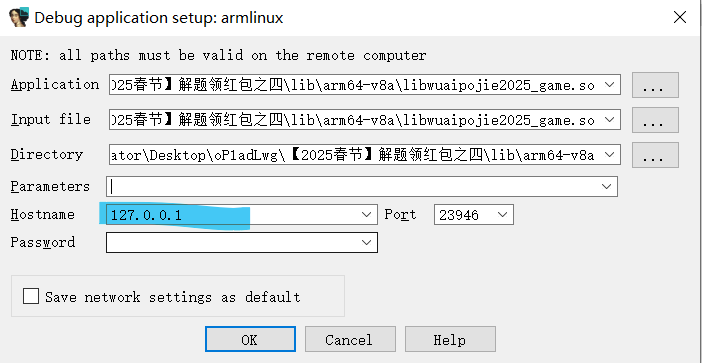

3. `Debugger` - `Attach process`

4. resume

```shell
jdb -connect com.sun.jdi.SocketAttach:hostname=127.0.0.1,port=8700
```


## ro.debugable

Android system does not allow applications to be arbitrarily debugged by default. To enable debugging, one of the following conditions must be met:

- In Android system, `ro.debuggable=1` (default is 0) [Recommended]
  - Option 1: Use the `MagiskHidePropsConf` module based on Magisk to change the value of `ro.debuggable` to 1.
  - Option 2: When customizing AOSP, set the value of `ro.debuggable` to 1 (compile with the userdebug version).

- The `Application` tag in the application's `AndroidManifest.xml` contains the attribute `android:debuggable="true"`.
  - You can use MT Manager to modify and re-sign the application.

if it shows `?` , reboot adb, no need to close monitor


