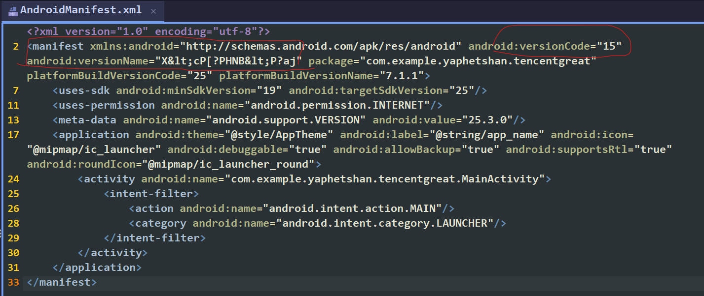
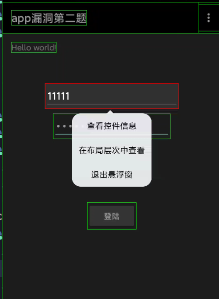
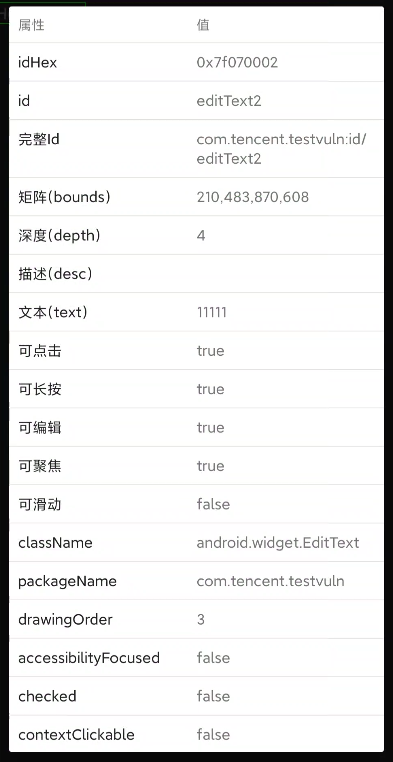
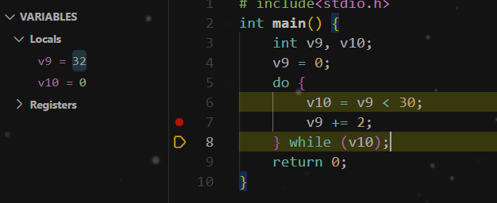

website: https://adworld.xctf.org.cn/challenges/list

# TOOO EZ
## GFSJ0498

```java
public void onClick(View v) {
    try {
        String inputString = MainActivity.this.text.getText().toString();
        PackageInfo pinfo = MainActivity.this.getPackageManager().getPackageInfo(BuildConfig.APPLICATION_ID, 16384);
        String versionCode = pinfo.versionName;
        int versionName = pinfo.versionCode;
        for (int i = 0; i < inputString.length() && i < versionCode.length(); i++) {
            if (inputString.charAt(i) != (versionCode.charAt(i) ^ versionName)) {
                Toast.makeText(MainActivity.this, "再接再厉，加油~", 1).show();
                return;
            }
        }
        if (inputString.length() == versionCode.length()) {
            Toast.makeText(MainActivity.this, "恭喜开启闯关之门！", 1).show();
            return;
        }
    } catch (PackageManager.NameNotFoundException e) {
    }
    Toast.makeText(MainActivity.this, "年轻人不要耍小聪明噢", 1).show();
}
```

you can see `versionCode` and `versionName` directly from xml



```python
def get_correct_string(version_name: str, version_code: int) -> str:
    correct_string = ""
    for char in version_name:
        # Reverse the XOR operation
        correct_char = chr(ord(char) ^ version_code)
        correct_string += correct_char
    return correct_string

# Example usage
version_name = "X<cP[?PHNB<P?aj"  # Decoded versionName from XML
version_code = 15  # Version code from XML

correct_input = get_correct_string(version_name, version_code)
print("The correct input string is:", correct_input)
```

##  GFSJ0499

knowledge you need to know:

- https://stackoverflow.com/questions/51917897/explanation-about-intent-getstringextra-and-intent-putextra-in-android-studio

- https://blog.csdn.net/qq_33210042/article/details/118496620


use 界面分析app to check out its id. click the **second** button.






```java
    protected void onCreate(Bundle bundle) {
        super.onCreate(bundle);
        setContentView(R.layout.activity_main);
        this.a = (Button) findViewById(R.id.button1);
        this.a.setOnClickListener(this);
        this.c = (EditText) findViewById(R.id.editText1);
        this.d = (EditText) findViewById(R.id.editText2);
        SharedPreferences.Editor edit = getSharedPreferences("test", 0).edit();
        edit.putLong("ili", System.currentTimeMillis());
        edit.commit();
        Log.d("hashcode", SignatureTool.getSignature(this) + "");
    }
```

so we know username input is actually `this.d`, while pwd input is `this.c`

```java
    public void onClick(View view) {
        switch (view.getId()) {
            case R.id.button1 /* 2131165187 */:
                if (this.c.getText().length() == 0 || this.d.getText().length() == 0) {
                    Toast.makeText(this, "不能为空", 1).show();
                    return;
                }
                String obj = this.c.getText().toString();
                String obj2 = this.d.getText().toString();
                Log.e("test", obj + " test2 = " + obj2);
                Intent intent = new Intent(this, SecondActivity.class);
                intent.putExtra("ili", obj);
                intent.putExtra("lil", obj2);
                startActivity(intent);
                return;
            default:
                return;
        }
    }
```

`ili = passward string`

`lil = username string`

 `SecondActivity`

```java
    protected void onCreate(Bundle bundle) {
        super.onCreate(bundle);
        setContentView(R.layout.activity_main2);
        Intent intent = getIntent();
        String stringExtra = intent.getStringExtra("ili");  // passward string
        String stringExtra2 = intent.getStringExtra("lil");  // username string
        if (Encryto.doRawData(this, stringExtra + stringExtra2).equals("VEIzd/V2UPYNdn/bxH3Xig==")) {
            intent.setAction("android.test.action.MoniterInstallService");
            intent.setClass(this, MoniterInstallService.class);
            intent.putExtra("company", "tencent");
            intent.putExtra("name", "hacker");
            intent.putExtra("age", 18);
            startActivity(intent);
            startService(intent);
        }
        SharedPreferences.Editor edit = getSharedPreferences("test", 0).edit();
        edit.putString("ilil", stringExtra);
        edit.putString("lili", stringExtra2);
        edit.commit();
    }
```

```java
public class Encryto {
    public static native int checkSignature(Object obj);

    public static native String decode(Object obj, String str);

    public static native String doRawData(Object obj, String str);

    public static native String encode(Object obj, String str);

    public native String HelloLoad();

    static {
        System.loadLibrary("JNIEncrypt");
    }
}
```

```c
jstring __fastcall doRawData(JNIEnv_ *env, int a2, int this, int str)
{
  const char *str0; // r6
  const char *v7; // r8
  jstring result; // r0
  jstring (__fastcall *v9)(JNIEnv *, const jchar *, jsize); // r6
  char *v10; // r5
  size_t v11; // r2
  char keychar[24]; // [sp+0h] [bp-28h] BYREF

  if ( j_checkSignature(env) == 1 )
  {
    strcpy(keychar, "thisisatestkey==");
    str0 = env->functions->GetStringUTFChars(env, str, 0);
    v7 = (const char *)j_AES_128_ECB_PKCS5Padding_Encrypt(str0, keychar);
    env->functions->ReleaseStringUTFChars((JNIEnv *)env, (jstring)str, str0);
    result = env->functions->NewStringUTF(env, v7);
  }
  else
  {
    v9 = env->functions->NewString;
    v10 = UNSIGNATURE[0];
    v11 = strlen(UNSIGNATURE[0]);
    result = v9(&env->functions, (const jchar *)v10, v11);
  }
  return result;
}
```

To reverse-engineer the decryption and derive the string `"VEIzd/V2UPYNdn/bxH3Xig=="` after applying Base64 encoding, we can analyze the provided C code.

### Observations from the Code:

1. **Key Used**: `"thisisatestkey=="` is the AES key used for encryption/decryption.
2. **AES Mode**: AES-128-ECB with PKCS5 padding is used.
3. Decryption Logic:
   - Input `str` is encrypted using `j_AES_128_ECB_PKCS5Padding_Encrypt`.
   - To reverse this, we need to **decrypt** the ciphertext.

### Python Code:

Below is the Python implementation to reverse the encryption and decrypt the string to derive the required result:

```python
from Crypto.Cipher import AES
import base64

def decrypt_and_base64(ciphertext: str, key: str) -> str:
    # Convert the key and ciphertext to bytes
    key_bytes = key.encode('utf-8')
    ciphertext_bytes = base64.b64decode(ciphertext)
    
    # Ensure the key is 16 bytes (AES-128 requires a 16-byte key)
    assert len(key_bytes) == 16, "Key must be 16 bytes for AES-128"

    # Create AES cipher in ECB mode
    cipher = AES.new(key_bytes, AES.MODE_ECB)

    # Decrypt the ciphertext
    decrypted_bytes = cipher.decrypt(ciphertext_bytes)
    
    # Remove PKCS5 padding
    pad_len = decrypted_bytes[-1]
    decrypted_bytes = decrypted_bytes[:-pad_len]
    
    # Convert to string and re-encode in Base64
    decrypted_str = decrypted_bytes.decode('utf-8')
    # encoded_result = base64.b64encode(decrypted_str.encode('utf-8')).decode('utf-8')
   
    return decrypted_str


ciphertext = "VEIzd/V2UPYNdn/bxH3Xig=="  # Replace this with the actual encrypted string
key = "thisisatestkey=="
result = decrypt_and_base64(ciphertext, key)

print("Result:", result)
```

and, boom, the app crushed. here is the reason: just open xml file if you need ;)

**Service**: The service `com.tencent.testvuln.MoniterInstallService` is successfully started because:

- It is registered with the action `"android.test.action.MoniterInstallService"`.
- The `startService(intent)` call will launch it.

**Activity**: The `startActivity(intent)` call **will not launch any activity** because:

- No activity is declared with an `intent-filter` matching the action `"android.test.action.MoniterInstallService"`.
- This will likely cause the app to crash with an `ActivityNotFoundException`.

## GFSJ0500

- https://book.jorianwoltjer.com/mobile/android-backup

I CANT EVEN OPEN IT. pass, i will crack it later :(

- https://blog.csdn.net/shuaicenglou3032/article/details/104297223


## GFSJ0505

```c
bool __fastcall Java_com_testjava_jack_pingan2_cyberpeace_CheckString(JNIEnv_ *env, __int64 a2, __int64 str)
{
  const char *str_1; // x20
  __int64 v4; // x0
  signed int v5; // w21
  unsigned __int64 v6; // x22
  _BYTE *v7; // x0
  _BYTE *v8; // x19
  size_t v9; // w2
  unsigned __int64 v10; // x20
  _BYTE *v11; // x8
  char v12; // w9
  char v13; // w10
  char v14; // w9
  __int64 v15; // x20
  _BYTE *v16; // x8
  char v17; // w10
  unsigned __int64 v18; // x0
  unsigned __int64 v19; // x8

  str_1 = env->functions->GetStringUTFChars(env, str, 0LL);
  v4 = strlen(str_1);
  v5 = v4;
  v6 = ((v4 << 32) + 0x100000000LL) >> 32;
  v7 = malloc(((v4 << 32) + 0x100000000LL) >> 32);
  v8 = v7;
  if ( v6 > v5 )
    v9 = v6 - v5;
  else
    v9 = 0;
  memset(&v7[v5], 0, v9);
  memcpy(v8, str_1, v5);
  if ( strlen(v8) >= 2uLL )
  {
    v10 = 0LL;
    do
    {
      v11 = &v8[v10];
      v12 = v8[v10 + 16];
      v13 = v8[v10++];
      *v11 = v12;
      v11[16] = v13;
    }
    while ( strlen(v8) >> 1 > v10 );
  }
  if ( *v8 )
  {
    v14 = v8[1];
    v8[1] = *v8;
    *v8 = v14;
    if ( strlen(v8) >= 3uLL )
    {
      v15 = 0LL;
      do
      {
        v16 = &v8[v15];
        v17 = v8[v15 + 2];
        v16[2] = v8[v15 + 3];
        v16[3] = v17;
        v18 = strlen(v8);
        v19 = v15 + 4;
        v15 += 2LL;
      }
      while ( v18 > v19 );
    }
  }
  return strcmp(v8, "f72c5a36569418a20907b55be5bf95ad") == 0;
}
```

return 1 should be fine. v8 = "f72c5a36569418a20907b55be5bf95ad"

```python
def reverse_check_string(target: str) -> str:
    # Initialize the transformed string as the target
    v8 = list(target)  # Work with the string as a list of characters

    # Reverse the final block-swapping logic
    if len(v8) >= 3:
        v15 = len(v8) - 4
        while v15 >= 0:
            v8[v15 + 3], v8[v15 + 2] = v8[v15 + 2], v8[v15 + 3]
            v15 -= 2

    # Reverse the first two-character swap
    if len(v8) >= 2:
        v8[0], v8[1] = v8[1], v8[0]

    # Reverse the 16-character swap logic
    if len(v8) >= 2:
        v10 = len(v8) // 2 - 1
        while v10 >= 0:
            v8[v10], v8[v10 + 16] = v8[v10 + 16], v8[v10]
            v10 -= 1

    # Convert the list back to a string
    transformed_str = "".join(v8)
    return transformed_str


# Example usage
target_hash = "f72c5a36569418a20907b55be5bf95ad"  # Target string to match
original_str = reverse_check_string(target_hash)

print("The original input string (str) is:", original_str)
```

------

### **Step 1: Input String and Initial Setup**

#### **C Code**:

```c
str_1 = env->functions->GetStringUTFChars(env, str, 0LL);
v4 = strlen(str_1);
v5 = v4;
v6 = ((v4 << 32) + 0x100000000LL) >> 32;
v7 = malloc(((v4 << 32) + 0x100000000LL) >> 32);
v8 = v7;
if (v6 > v5)
    v9 = v6 - v5;
else
    v9 = 0;
memset(&v7[v5], 0, v9);
memcpy(v8, str_1, v5);
```

- The input `str` is retrieved using `GetStringUTFChars`.
- Memory is allocated for `v8` to hold the same size as `str_1`.
- The contents of `str_1` are copied to `v8`.

#### **Python Equivalent**:

```python
v8 = list(target)  # Target string (to match the output "f72c5a36569418a20907b55be5bf95ad")
```

- In Python, we directly start with the target string as a list of characters (`v8`).

------

### **Step 2: 16-Character Swap**

#### **C Code**:

```c
if (strlen(v8) >= 2uLL) {
    v10 = 0LL;
    do {
        v11 = &v8[v10];
        v12 = v8[v10 + 16];
        v13 = v8[v10++];
        *v11 = v12;
        v11[16] = v13;
    } while (strlen(v8) >> 1 > v10);
}
```

- For each character in the first half of the string, swap it with the character 16 positions ahead (`v8[v10] <-> v8[v10 + 16]`).
- The loop runs until `strlen(v8) >> 1`.
-  `strlen(v8) >> 1` is equivalent to `len(v8) // 2` in Python, where `//` denotes integer division.

#### **Python Equivalent** (Reversed):

```python
if len(v8) >= 2:
    v10 = len(v8) // 2 - 1
    while v10 >= 0:
        v8[v10], v8[v10 + 16] = v8[v10 + 16], v8[v10]
        v10 -= 1
```

- In Python, the logic is reversed: Start from the last index (`len(v8) // 2 - 1`) and iterate backward, swapping characters at `v10` and `v10 + 16`.

------

### **Step 3: First Two Characters Swap**

#### **C Code**:

```c
if (*v8) {
    v14 = v8[1];
    v8[1] = *v8;
    *v8 = v14;
}
```

- The first two characters of the string are swapped (`v8[0] <-> v8[1]`).

#### **Python Equivalent** (Reversed):

```python
if len(v8) >= 2:
    v8[0], v8[1] = v8[1], v8[0]
```

- Reverse the swap by swapping `v8[0]` and `v8[1]` again.

------

### **Step 4: Final Block-Swapping Logic**

#### **C Code**:

```c
if (strlen(v8) >= 3uLL) {  // len(v8) == 32
    v15 = 0LL;
    do {
        v16 = &v8[v15];
        v17 = v8[v15 + 2];
        v16[2] = v8[v15 + 3];
        v16[3] = v17;
        v18 = strlen(v8);
        v19 = v15 + 4;  // 28 + 4 = 32, jump out of the block
        v15 += 2LL;
    } while (v18 > v19);
}
```

- For every two characters in the string, swap the 3rd and 4th characters in blocks of 4 (`v8[v15 + 2] <-> v8[v15 + 3]`).
- The loop increments by 2 each time (`v15 += 2`).

#### **Python Equivalent** (Reversed):

```python
if len(v8) >= 3:
    v15 = len(v8) - 4  # final 4 characters do nothing
    while v15 >= 0:
        v8[v15 + 3], v8[v15 + 2] = v8[v15 + 2], v8[v15 + 3]
        v15 -= 2
```

- Start from the end of the string (`len(v8) - 4`) and iterate backward in steps of 2, swapping characters at `v15 + 2` and `v15 + 3`.

------

### **Step 5: Final Comparison**

#### **C Code**:

```c
return strcmp(v8, "f72c5a36569418a20907b55be5bf95ad") == 0;
```

- The transformed string (`v8`) is compared to the target string `"f72c5a36569418a20907b55be5bf95ad"`.
- If they are equal, the function returns `true`.

#### **Python Equivalent**:

```python
transformed_str = "".join(v8)
return transformed_str == target
```

- After reversing all transformations, check if the resulting string matches the target.

------

### Full Python Code (with Reversing):

```python
def reverse_check_string(target: str) -> str:
    # Initialize the transformed string as the target
    v8 = list(target)  # Work with the string as a list of characters

    # Reverse the final block-swapping logic
    if len(v8) >= 3:
        v15 = len(v8) - 4
        while v15 >= 0:
            v8[v15 + 3], v8[v15 + 2] = v8[v15 + 2], v8[v15 + 3]
            v15 -= 2

    # Reverse the first two-character swap
    if len(v8) >= 2:
        v8[0], v8[1] = v8[1], v8[0]

    # Reverse the 16-character swap logic
    if len(v8) >= 2:
        v10 = len(v8) // 2 - 1
        while v10 >= 0:
            v8[v10], v8[v10 + 16] = v8[v10 + 16], v8[v10]
            v10 -= 1

    # Convert the list back to a string
    transformed_str = "".join(v8)
    return transformed_str


# Example usage
target_hash = "f72c5a36569418a20907b55be5bf95ad"  # Target string to match
original_str = reverse_check_string(target_hash)

print("The original input string (str) is:", original_str)
```

------

### Key Insights:

- Both C and Python handle memory and string operations differently.
- In C, memory is manually managed with `malloc` and `memcpy`. In Python, we use lists for mutable strings.
- The transformation logic in both implementations is the same; the Python version reverses the transformations step by step.

## GFSJ0504

```java
    public boolean a(String str) {
        try {
            return ncheck(new a().a(str.getBytes()));
        } catch (Exception e) {
            return false;
        }
    }

    private native boolean ncheck(String str);
```

```java
package com.a.easyjni;

/* loaded from: classes.dex */
public class a {
    private static final char[] a = {'i', '5', 'j', 'L', 'W', '7', 'S', '0', 'G', 'X', '6', 'u', 'f', '1', 'c', 'v', '3', 'n', 'y', '4', 'q', '8', 'e', 's', '2', 'Q', '+', 'b', 'd', 'k', 'Y', 'g', 'K', 'O', 'I', 'T', '/', 't', 'A', 'x', 'U', 'r', 'F', 'l', 'V', 'P', 'z', 'h', 'm', 'o', 'w', '9', 'B', 'H', 'C', 'M', 'D', 'p', 'E', 'a', 'J', 'R', 'Z', 'N'};

    public String a(byte[] bArr) {
        StringBuilder sb = new StringBuilder();
        for (int i = 0; i <= bArr.length - 1; i += 3) {
            byte[] bArr2 = new byte[4];
            byte b = 0;
            for (int i2 = 0; i2 <= 2; i2++) {
                if (i + i2 <= bArr.length - 1) {
                    bArr2[i2] = (byte) (b | ((bArr[i + i2] & 255) >>> ((i2 * 2) + 2)));
                    b = (byte) ((((bArr[i + i2] & 255) << (((2 - i2) * 2) + 2)) & 255) >>> 2);
                } else {
                    bArr2[i2] = b;
                    b = 64;
                }
            }
            bArr2[3] = b;
            for (int i3 = 0; i3 <= 3; i3++) {
                if (bArr2[i3] <= 63) {
                    sb.append(a[bArr2[i3]]);
                } else {
                    sb.append('=');
                }
            }
        }
        return sb.toString();
    }
}
```

```c
bool __fastcall Java_com_a_easyjni_MainActivity_ncheck(JNIEnv_ *env, int a2, int str)
{
  const char *str_1; // r6
  int i; // r0
  char *v7; // r2
  char v8; // r1
  int v9; // r0
  bool v10; // cc
  _BOOL4 result; // r0
  char v12[32]; // [sp+3h] [bp-35h] BYREF
  char v13; // [sp+23h] [bp-15h]

  str_1 = env->functions->GetStringUTFChars(env, str, 0);
  if ( strlen(str_1) == 32 )
  {
    for ( i = 0; i != 16; ++i )
    {
      v7 = &v12[i];
      v12[i] = str_1[i + 16];
      v8 = str_1[i];
      v7[16] = v8;
    }
    env->functions->ReleaseStringUTFChars(env, str, str_1);
    v9 = 0;
    do
    {
      v10 = v9 < 30;
      v13 = v12[v9];
      v12[v9] = v12[v9 + 1];
      v12[v9 + 1] = v13;
      v9 += 2;
    }
    while ( v10 );
    result = memcmp(v12, "MbT3sQgX039i3g==AQOoMQFPskB1Bsc7", 0x20u) == 0;
  }
  else
  {
    env->functions->ReleaseStringUTFChars(env, str, str_1);
    result = 0;
  }
  return result;
}
```

To reverse-engineer the value of `str` such that the function returns `true`, we need to reverse the transformations applied to the input `str` to produce the expected output `MbT3sQgX039i3g==AQOoMQFPskB1Bsc7`. Here's how the logic maps step by step from C to Python.

------

### **Step-by-Step Analysis**

#### **1. Input String Validation**

```c
if (strlen(str_1) == 32)
```

The input `str` must be exactly 32 characters long. If not, the function returns `false`.

------

#### **2. Reordering Bytes**

```c
for (i = 0; i != 16; ++i) {
    v7 = &v12[i];
    v12[i] = str_1[i + 16];
    v8 = str_1[i];
    v7[16] = v8;
}
```

- The first 16 characters (`str_1[0:16]`) are moved to the second half of the `v12` array.
- The second 16 characters (`str_1[16:32]`) are moved to the first half of the `v12` array.

Essentially:

- `v12[0:16] = str_1[16:32]`
- `v12[16:32] = str_1[0:16]`

------

#### **3. Swapping Adjacent Bytes**

```c
    do
    {
      v10 = v9 < 30;
      v13 = v12[v9];
      v12[v9] = v12[v9 + 1];
      v12[v9 + 1] = v13;
      v9 += 2;
    }
    while ( v10 );
```

- Starting from the beginning of `v12`, every pair of adjacent bytes is swapped:

  - `v12[0] <-> v12[1]`
  - `v12[2] <-> v12[3]`
  - ...
  - `v12[28] <-> v12[29]`
  - `v12[30] <-> v12[31]`
  
  

This transforms the array into a shuffled version.

------

#### **4. Final Comparison**

```c
memcmp(v12, "MbT3sQgX039i3g==AQOoMQFPskB1Bsc7", 0x20u) == 0;
```

- The transformed `v12` must match the target string `"MbT3sQgX039i3g==AQOoMQFPskB1Bsc7"`.

------

### **Reversing the Transformations**

We need to reverse the steps:

1. **Reverse the adjacent byte swaps** (Step 3).
2. **Reverse the reordering of bytes** (Step 2).
3. **Ensure the final reversed `str` is 32 characters long**.

------

### **Python Code**

Here is the Python implementation to reverse-engineer `str`:

```python
def reverse_ncheck(target: str) -> str:
    # Step 1: Convert the target string to a list of characters
    v12 = list(target)
    
    # Step 2: Reverse the adjacent byte swaps
    for v9 in range(0, 32, 2):  # Swap every pair of adjacent characters
        v12[v9], v12[v9 + 1] = v12[v9 + 1], v12[v9]
    
    # Step 3: Reverse the byte reordering
    str_1 = [""] * 32  # Placeholder for the original string
    str_1[0:16] = v12[16:32]  # Move v12[16:32] back to str_1[0:16]
    str_1[16:32] = v12[0:16]  # Move v12[0:16] back to str_1[16:32]
    
    # Step 4: Return the reconstructed input string
    return "".join(str_1)


# Target string to reverse-engineer
target = "MbT3sQgX039i3g==AQOoMQFPskB1Bsc7"
reversed_str = reverse_ncheck(target)
print("The value of str is:", reversed_str)
```

```
The value of str is: QAoOQMPFks1BsB7cbM3TQsXg30i9g3==
```

reverse-engineer the input value of `str` that produces the return value `QAoOQMPFks1BsBc7bM3TQsXg30i9g3==` in the `a().a(byte[] bArr)` method:

```python
# Define the character mapping array
a = [
    'i', '5', 'j', 'L', 'W', '7', 'S', '0', 'G', 'X', '6', 'u', 'f', '1', 'c', 'v',
    '3', 'n', 'y', '4', 'q', '8', 'e', 's', '2', 'Q', '+', 'b', 'd', 'k', 'Y', 'g',
    'K', 'O', 'I', 'T', '/', 't', 'A', 'x', 'U', 'r', 'F', 'l', 'V', 'P', 'z', 'h',
    'm', 'o', 'w', '9', 'B', 'H', 'C', 'M', 'D', 'p', 'E', 'a', 'J', 'R', 'Z', 'N'
]

# Reverse mapping of character to its index in the array
char_to_index = {ch: idx for idx, ch in enumerate(a)}

# Target encoded string
target = "QAoOQMPFks1BsB7cbM3TQsXg30i9g3=="

def reverse_encode(target):
    # Step 1: Remove padding
    target = target.rstrip("=")

    # Step 2: Convert characters back to 6-bit values
    bArr2 = [char_to_index[ch] for ch in target]

    # Step 3: Reconstruct the original bytes
    bArr = []
    for i in range(0, len(bArr2), 4):
        # Get the current chunk of 4 characters (6-bit values)
        chunk = bArr2[i:i + 4]

        # Pad the chunk with zeroes if it's less than 4 characters
        while len(chunk) < 4:
            chunk.append(0)

        # Reconstruct the 3 original bytes from the 4 encoded characters
        b1 = ((chunk[0] << 2) | (chunk[1] >> 4)) & 0xFF
        bArr.append(b1)

        if len(chunk) > 1 and chunk[2] < 64:  # If not padding
            b2 = ((chunk[1] << 4) | (chunk[2] >> 2)) & 0xFF
            bArr.append(b2)

        if len(chunk) > 2 and chunk[3] < 64:  # If not padding
            b3 = ((chunk[2] << 6) | chunk[3]) & 0xFF
            bArr.append(b3)

    # Convert the result to a string
    return bytes(bArr).decode("latin1")


# Reverse-engineer the value of `str`
reversed_str = reverse_encode(target)
print("The value of str is:", reversed_str)
```

here is a more concise version on the internet

```python
def decode(base64_str):
    base64_charset = "i5jLW7S0GX6uf1cv3ny4q8es2Q+bdkYgKOIT/tAxUrFlVPzhmow9BHCMDpEaJRZN"
    base64_bytes = ['{:0>6}'.format(str(bin(base64_charset.index(s))).replace('0b', '')) for s in base64_str if
                    s != '=']
    resp = bytearray()
    nums = len(base64_bytes) // 4
    remain = len(base64_bytes) % 4
    integral_part = base64_bytes[0:4 * nums]

    while integral_part:
        tmp_unit = ''.join(integral_part[0:4])
        tmp_unit = [int(tmp_unit[x: x + 8], 2) for x in [0, 8, 16]]
        for i in tmp_unit:
            resp.append(i)
        integral_part = integral_part[4:]

    if remain:
        remain_part = ''.join(base64_bytes[nums * 4:])
        tmp_unit = [int(remain_part[i * 8:(i + 1) * 8], 2) for i in range(remain - 1)]
        for i in tmp_unit:
            resp.append(i)

    return resp

if __name__ == '__main__':
    flag_1 = 'MbT3sQgX039i3g==AQOoMQFPskB1Bsc7'
    print('加密后的字符串：',flag_1)
    flag_2 = ''
    for i in range(len(flag_1)//2):
        flag_2 += flag_1[i*2+1] + flag_1[i*2]
    print('前后两位调换位置：',flag_2)
    flag_3 = flag_2[len(flag_2)//2:] + flag_2[0:len(flag_2)//2]
    print('前后16位调换位置:',flag_3)
    print('解密后：',decode(flag_3))
```


# not too EZ


# hard
