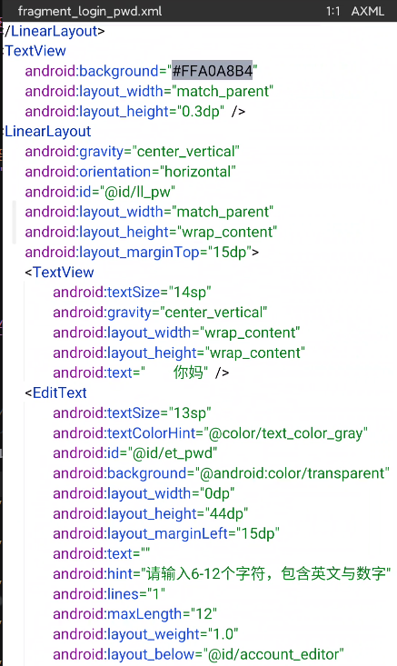

# modify static resource

located tips: open via jadx, find java work code, pay attention to the method's name, usually xml's name is align with its method name while developing.

定位技巧：jadx打开，找到java业务逻辑，注意方法名，一般开发的时候xml命名会和方法名保持一致

successfully modified

# remove dialog update message

located via key words, if ur unsure, use frida to check.

open dex with dex editor. comment it

# debug mode 

By default, Android system does not allow applications to be debugged at will. If you want to debug, you need to meet one of the two conditions.

- ` ro.debug = 1 (default is 0) ` in Android system.  [recommended] 
  - Scheme 1: Base on `MagiskHidePropsConf` module of Magisk. rewrite its value to 1
  
  - Scheme2: customize AOSP
  
- include `android:debuggable="true"` in app's `AndroidManifest.xml` by MT Manager

now lets say Scheme 1. after installing the module, reboot your device.

`adb shell getprop ro.debuggable` most of time its 0

enter `adb shell`, and then`props`. select 5

## jadx dynamic debug

double click the pid you want to attach

