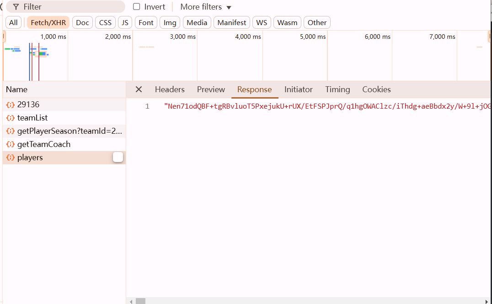
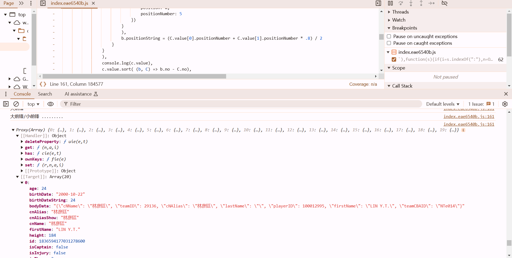
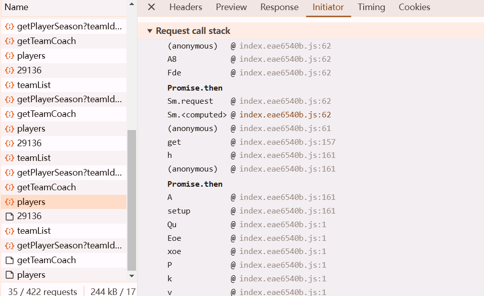
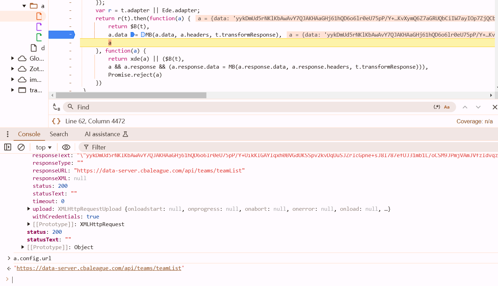
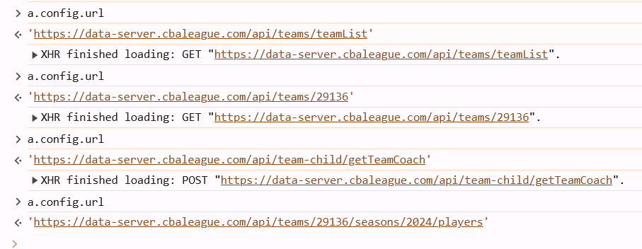
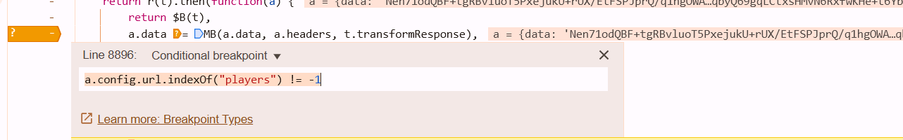
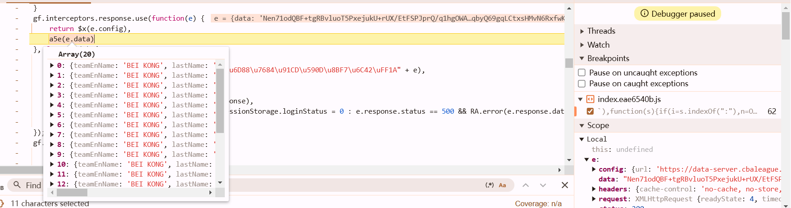
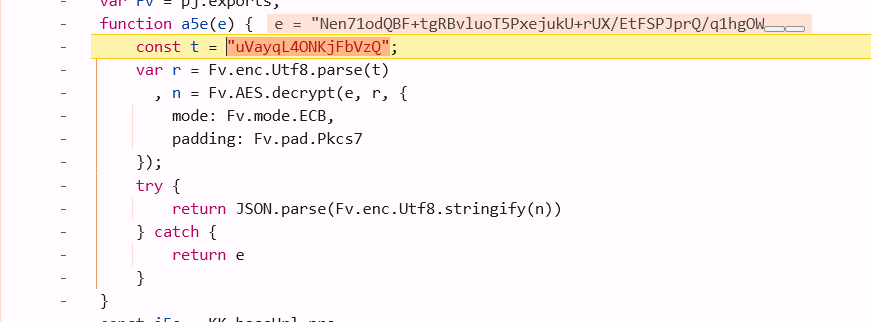

https://www.cbaleague.com/data/#/teamMain?teamId=29136

api: https://data-server.cbaleague.com/api/teams/29136/seasons/2024/players



观察控制台发现bro直接在console里打印了解密后的数据...



可知在此函数之前数据已经解密

或从调用栈Promise.then之后的函数中进去





多次下断点



利用a下条件断点，断到我们需要的那个url



```javascript
a.config.url.indexOf("players") ！= -1
```

继续往后走，找到解密函数



