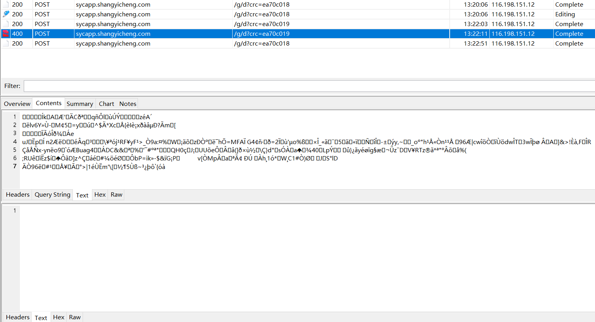
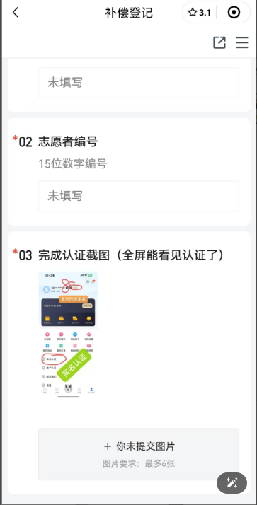
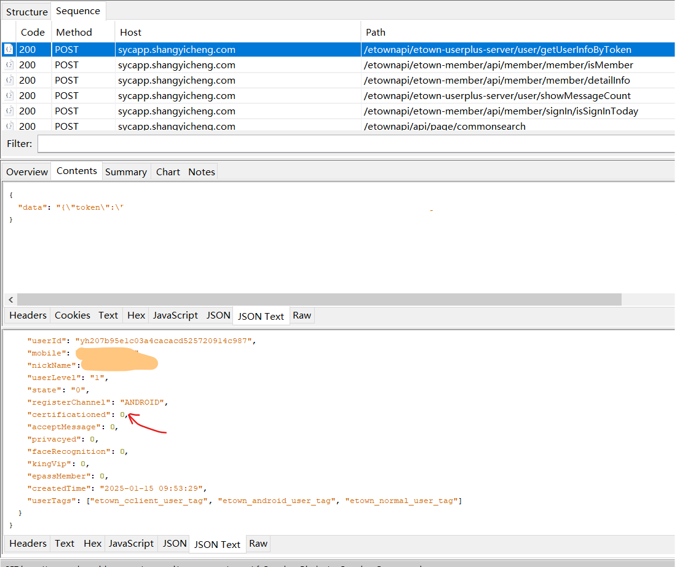
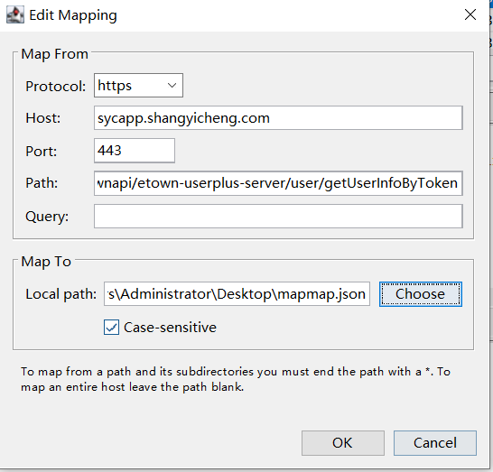
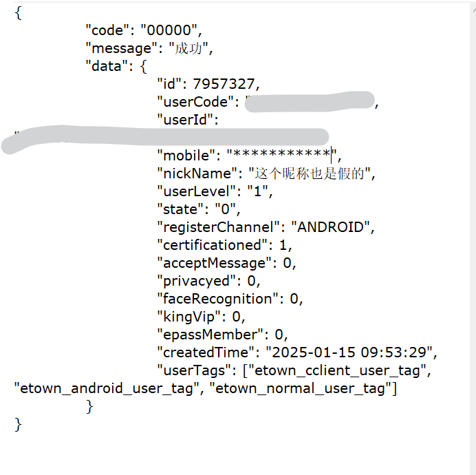
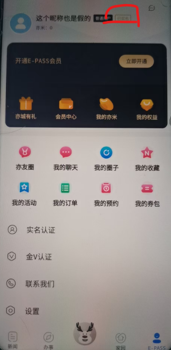

# 发送加密数据

加密数据正确与否都不会有返回结果，但如果是错误的加密数据，状态码是400

crc会变，直接删去不行

# 伪造实名认证截图

作为一名热衷于做志愿的大学牲，小JR加入了一个线上志愿群，上传完成实名认证的截图就能领取志愿时长。但小JR不想泄露自己的隐私给阿猫阿狗，于是他想出了一个妙招。

他打开了Charles准备抓包，但是一开启代理，app就显示没有网络。他使用`Justtruseme`模块导入老色批，抓包问题就解决了。

在个人界面刷新后，小JR注意到这个包

猜测`certificationed`就是实名认证的情况，会显示在UI上

于是map local，把它改为1

