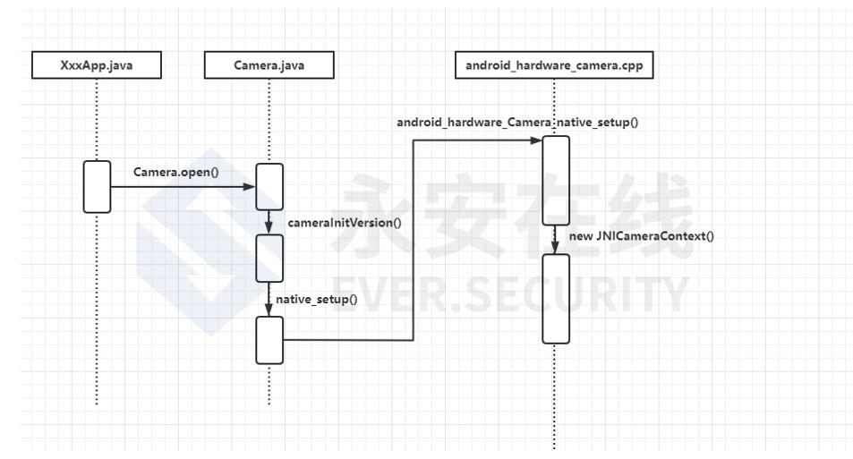

# bypass face recognition

## ROM

Normally, an application use `Camera.open()` method in Android Framework, enter `android_hardware_camera.cpp` and trigger `new JNICameraContext`.

Modify aosp source code, change JNICameraContext, load a third module `libvirtualcamera.so`. the `libvirtualcamera.so` module integrates the `ffmpeg` library. The author uses the `ffmpeg` library to load pre-recorded video files, decode them, and convert them into the data format required by a normal camera. This processed data then replaces the raw data coming from the real camera, thus achieving the effect of hijacking the camera.

## virtual camera + fresh ppl

Black market operators utilize remote camera software on cloud phones to bind to a real mobile device's camera. They then sync pre-recorded facial videos in real-time to the cloud phone, allowing them to bypass the target app's security measures.

