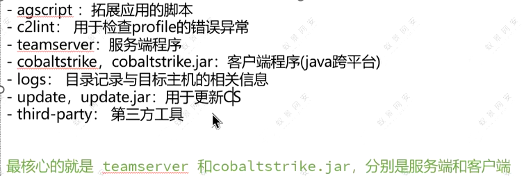
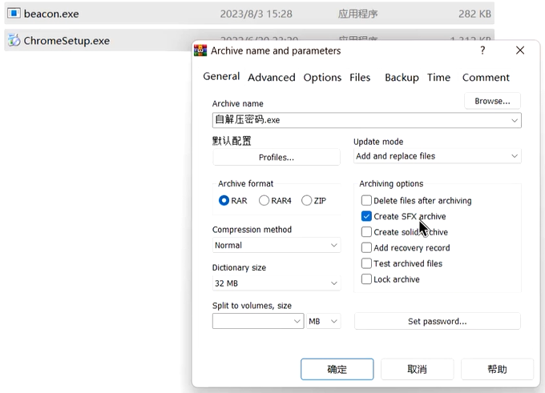
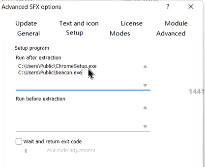
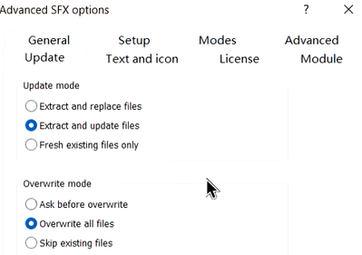

# sql盲注

left('fuck', 1)  是 f，下标从1开始，不是0

0:email

1:referers

2:uagents

3:users

`limit 1, 2` 1表示从第1个表开始，2表示取出两个

# 赚钱和考证

掌握4个左右：初级工作，8~12k

67个：中级，15k

9个以上: 20k以上

会的越多，薪资越高

全掌握：30k以上

CISSP需要工作经验.CISSP和Security+是国际认证的，想出国就考. 国际考试除了Security+都需工作经验

在校可考NISP，大学生首选。NISP2级在工作中可以置换CISP

软考中级有网安。在工作中考比较好。“信息安全工程师”。只要备考肯定能过

OSCP也要求工作经验。关注CISE和CISP-PTE就行

教育SRC比较简单

安全客，企业SRC，有钱

# TCP/IP协议浅谈

挖漏洞终点：post请求体，ua,Get参数

扫描器的误报率比较高

网站可能存在漏洞的地方：get参数/cookie/user-agent/post请求体

修改请求，查看响应体中的变化来确定有没有漏洞，比如，修改了，相应报错sql，说明存在sql注入漏洞

看响应体，有没有出现敏感信息（身份证号，密码，响应体中可能会出现的密码）

# 自解压木马

是付费工具，破解版不要运行update.jar

`ls -la` 查看是否有执行权限

`chmod +x teamserver` 给它执行权限 

账户名和密码都是cyz

设置交互时间，设成5秒就差不多了，少了容易被发现

自解压木马

先准备好生成的木马和用于伪装的正常Exe文件，用winRAR，选中`Create SFX archive`

点`Advance` 选择`SFX options`，写解压路径

写运行路径

选择隐蔽解压方式

更新方式

# Linux权限提升

略

挖SRC：东方财富应急相应中心，漏洞盒子

国外 hackerone