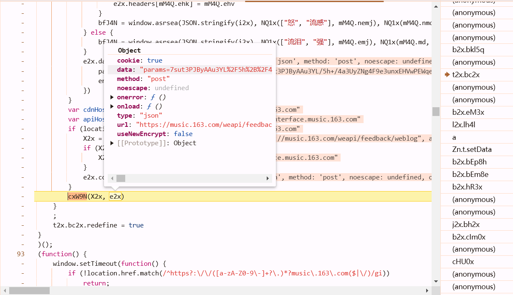
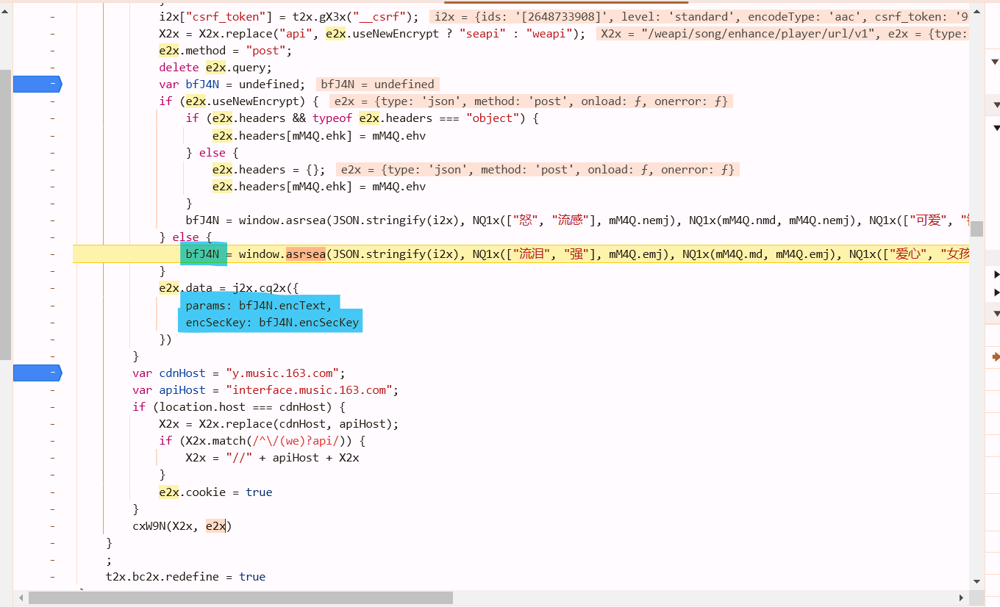
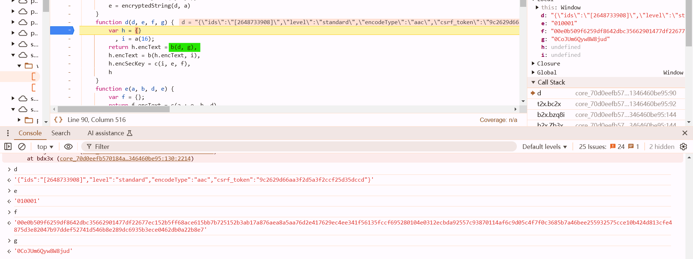
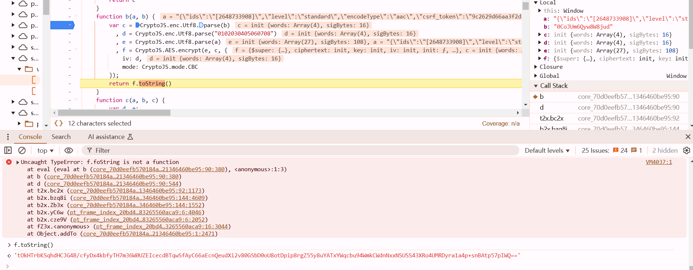
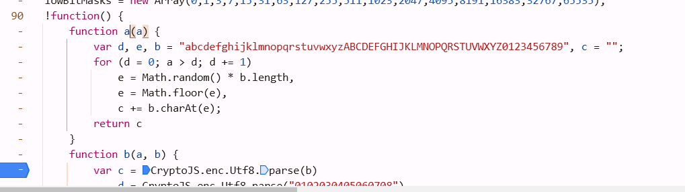
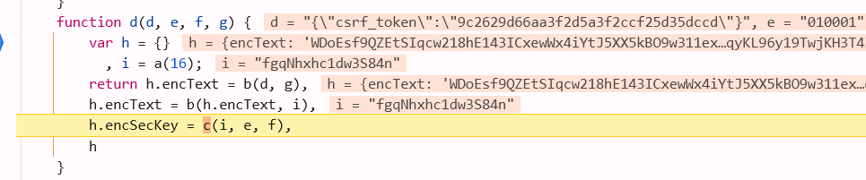
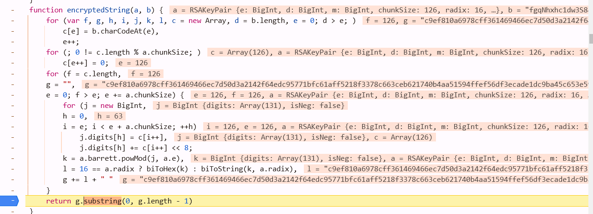
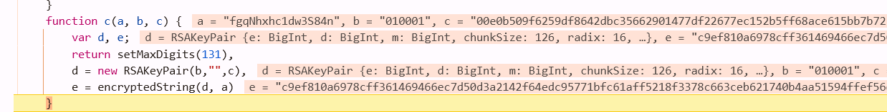
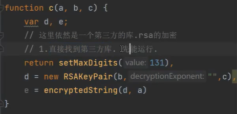

## 目标：获取到歌曲下载链接


`csrf_token`在退出登陆是为空，因此猜测此参数与登陆信息有关


`params`与`encSecKey`需要逆向

## 利用调用栈，寻找加密点



可知，在`t2x.bc2x`处，被加密，它下面的anoymous还是明文


打断点，程序走到这里



进入`asrsea`函数



# 解密

## 法一：js2py 纯python还原算法

### params

b有点可疑，进去看看,b是AES加密



```
a: 明文
c: 密钥 b传入，往前找，发现是固定值
d: iv 固定值
```

二次加密





`i=a(16)` 是随机值，传入后是key

```python
def b(data, key):
    key = key.encode("utf-8")
    data = data.encode("utf-8")
    data = pad(data, 16)
    aes = AES.new(key=key, IV=b"0102030405060708", mode=AES.MODE_CBC)
    bs = aes.encrypt(data)
    return base64.b64encode(bs).decode()

data = {
    "csrf_token": "9c2629d66aa3f2d5a3f2ccf25d35dccd",
    "encodeType": "aac",
    "ids": "[2148548104]",  # 这里加不加""都可以
    "level": "standard"
}
data = json.dumps(data, separators=(',', ':'))
first = b(data, g:定值)
second = b(first, i:定值)
```


### encSecKey

RSA加密





```python
def c(i, e, f):  # 暂时不管它这个rsa加密
    e = int(e, 16)
    f = int(f, 16)
    i = i[::-1]  # 从后往前来, python基础, 字符串, 切片
    bs = i.encode("utf-8")
    s = binascii.b2a_hex(bs).decode()
    s = int(s, 16)
    # 全都是数字
    mi = (s**e) % f  # rsa加密
    print(format(mi, "x"))
    return format(mi, "x")

encSecKey = c(i:随机值, e:固定, f:固定)
```

## 法二：扣代码

缺少CryptoJS：`npm install crypto-js` 去npmjs.com 搜，找到写法。全局 `-g` 安装容易找不到包，坑，不用它。

```javascript
var CryptoJS = require("crypto-js"); // 导入
```



使用`old_rsa.js`直接复制黏贴进来运行

