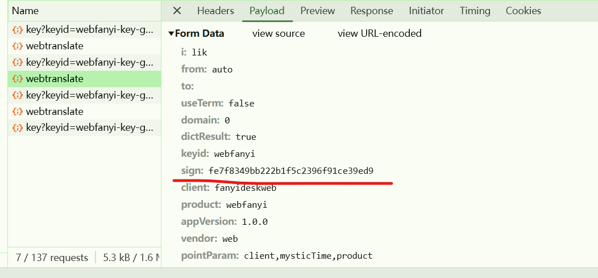
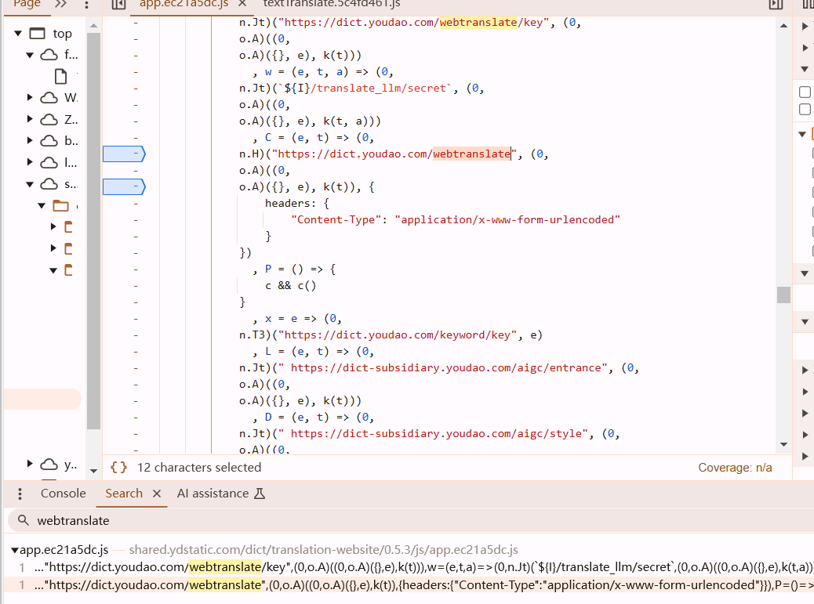
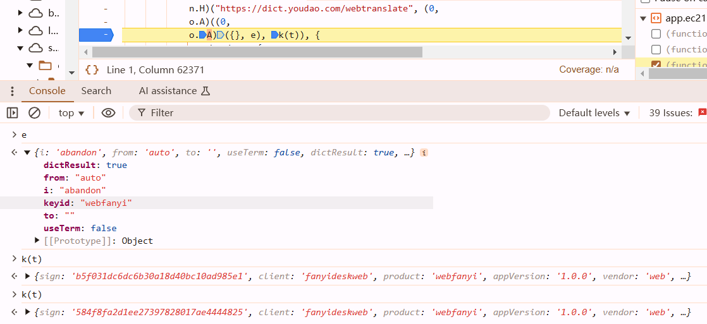
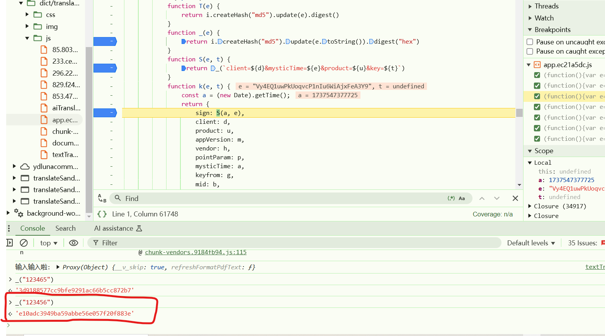
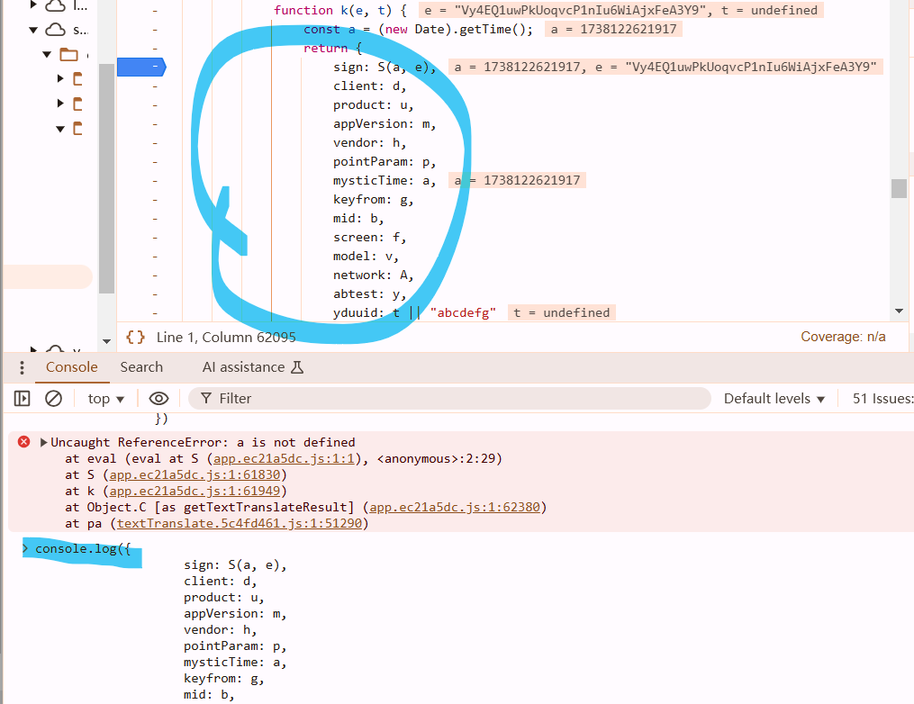
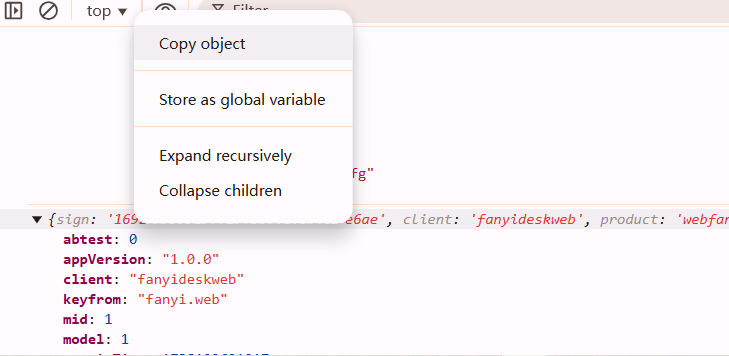
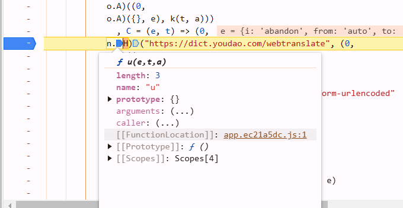
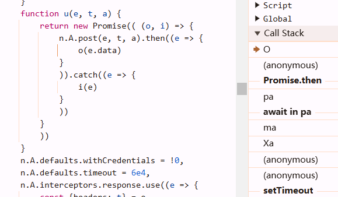
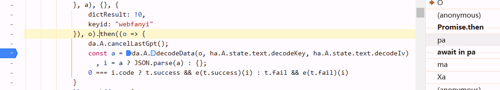
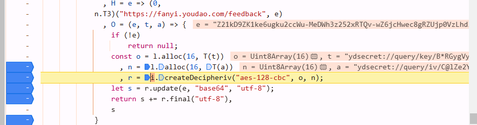

## Payload: sign



search url to locate



```javascript
C = (e, t) => (0,
            n.H)("https://dict.youdao.com/webtranslate", (0,
            o.A)((0,
            o.A)({}, e), k(t)), {
                headers: {
                    "Content-Type": "application/x-www-form-urlencoded"
                }
            })
```

```javascript
function C(e, t) {
    return n.H("https://dict.youdao.com/webtranslate",o.A(o.A({}, e), k(t)), {
        headers: {
            "Content-Type": "application/x-www-form-urlencoded"
        }
    })
}
```

```javascript
function C(e, t) {
    const url = "https://dict.youdao.com/webtranslate";
    const payload = o.A(o.A({}, e), k(t)); // merge multiple objects
    const headers = {
        "Content-Type": "application/x-www-form-urlencoded"
    };

    return n.H(url, payload, { headers });
}
```

assume：
- `e = { a: 1, b: 2 }`
- `t = "someValue"`
- `k(t)` return `{ c: 3, d: 4 }`

then：
```javascript
o.A(o.A({}, e), k(t))
```
1. **First  Call**:
   
   ```javascript
   o.A({}, { a: 1, b: 2 }) // Returns { a: 1, b: 2 }
   ```
2. **Second  Call**:
   
   ```javascript
   o.A({ a: 1, b: 2 }, { c: 3, d: 4 }) // Returns { a: 1, b: 2, c: 3, d: 4 }
   ```
   Final result:
```javascript
{ a: 1, b: 2, c: 3, d: 4 }
```






it's the normal md5 lol. copy the return object





### 扣代码
```javascript
var crypto = require("crypto");

function _(e) {
    return crypto.createHash("md5").update(e.toString()).digest("hex")
}

function S(e, t) {
    return _(`client=fanyideskweb&mysticTime=${e}&product=webfanyi&key=${t}`)
}

// console.log(S(e, "Vy4EQ1uwPkUoqvcP1nIu6WiAjxFeA3Y9"))
function k(word) {
    var e = (new Date).getTime();
    return {
        "sign": S(e, "Vy4EQ1uwPkUoqvcP1nIu6WiAjxFeA3Y9"),
        "client": "fanyideskweb",
        "product": "webfanyi",
        "appVersion": "1.0.0",
        "vendor": "web",
        "pointParam": "client,mysticTime,product",
        "mysticTime": e,
        "keyfrom": "fanyi.web",
        "mid": 1,
        "screen": 1,
        "model": 1,
        "network": "wifi",
        "abtest": 0,
        "yduuid": "abcdefg",
        // remember to merge objects
        "i": word,
        "from": "auto",
        "to": "",
        "useTerm": false,
        "domain": "0",
        "dictResult": true,
        "keyid": "webfanyi"
    }
}
```
```python
form_data = js.call("k", word)
resp = requests.post(url=url, data=form_data, headers=headers)
```

### js2py

```python
def S(e, t):
    """
    e: int(time.time() * 1000)
    t: "Vy4EQ1uwPkUoqvcP1nIu6WiAjxFeA3Y9"
    """
    data_string = f'client=fanyideskweb&mysticTime={e}&product=webfanyi&key={t}'
    obj = md5()
    obj.update(data_string.encode("utf-8"))
    return obj.hexdigest()
```

## decrypt

```
content-type:application/x-www-form-urlencoded
```

once you find this line in headers, it indicates that its an axios.



```javascript
            function u(e, t, a) {
                return new Promise(( (o, i) => {
                    n.A.post(e, t, a).then((e => {
                        o(e.data)
                    }
                    )).catch((e => {
                        i(e)
                    }
                    ))
                }
                ))
            }
```

`n.A.post` is a function from a library like Axios that makes an HTTP POST request.

1. **What is `o`?**
   - `o` is the first parameter of the `Promise` executor function. By convention, it is named `resolve`.
   - It is a function provided by the `Promise` constructor to **fulfill the promise**.
2. **What does `o` do?**
   - When `o` is called, the `Promise` transitions from the **pending** state to the **fulfilled** state.
   - The argument passed to `o` becomes the resolved value of the `Promise`. In this case, `e.data` is passed to `o`, so the resolved value of the `Promise` will be `e.data`.
3. **When is `o` called?**
   - `o` is called inside the `.then()` callback, which means it is triggered when the POST request (`n.A.post`) succeeds.

### Key Points

- `o` is the **resolve function** of the `Promise`.
- It is called when the asynchronous operation (in this case, the POST request) succeeds.
- The argument passed to `o` becomes the resolved value of the `Promise`.
- In this code, `o(e.data)` resolves the `Promise` with the response data from the POST request

there will be a function like `u().then()` to process the return value of `e.data`

so you need to find back, find where is `then`. use Call Stack.







###  扣代码

```javascript
function T(e) {
    return crypto.createHash("md5").update(e).digest()
}

function O(e) {
    var t = 'ydsecret://query/key/B*RGygVywfNBwpmBaZg*WT7SIOUP2T0C9WHMZN39j^DAdaZhAnxvGcCY6VYFwnHl'
    var a = 'ydsecret://query/iv/C@lZe2YzHtZ2CYgaXKSVfsb7Y4QWHjITPPZ0nQp87fBeJ!Iv6v^6fvi2WN@bYpJ4'
    
    const o = Buffer.alloc(16, T(t))
    , n = Buffer.alloc(16, T(a))
    , r = crypto.createDecipheriv("aes-128-cbc", o, n);
    let s = r.update(e, "base64", "utf-8");
    return s += r.final("utf-8"),
    s
}

var e = "Z21kD9ZK1ke6ugku2ccWu-MeDWh3z252xRTQv-wZ6jcHwec8gRZUjp0VzLhd3jyUAkgcbwIDHff28GifOsWS2iT8c9s1PSMpZ1iAZMlAYvvzOqpb1Qj78CUkSI4Hf_G6_NxrSaUp3v-KPJ2TOpfUPvpaQtrUEaYYSqK_LTtCmf6Hn9roxdD36fwXw2xlIfvZ2JhJv43AyJpdIOv39bhX-WhzilJ2NTk5c2WSG0HboPfme6g3Z4Lab5Q7TNvhMBjPTtHZCdwN5W2UlZufX8cRQkjiim9dcaNuB04aR_wXCD0pQ-niP4EBwdtwYp4sa2CCynv0GykkRoBIhj6SslNo9IjVMmgx111xzedKn1Vhg53dUpTmHK8v4LCRUwOTIGdxKOuyTuYYhq62jX4S7-pFKpzO1XJ5Skqk8hz-UMP8k7oVVJ0xbpiyvl4ebFQjXLtvvT9HSMxnpfZhx-nzS-M4-ca4HjZTKEP_GbNI4jCJL7--k6zyYdH4I8NUTYryz0oPHYumyEZOQIGJzu7HHNliSfKk9Dkc-9xyn1R78Hq42YPfcu010igdl5vrSbrVY5AVXBdaFmJjStK8U836jBPqcQvY-reQL8XcsgqZhlFAxoyPeT_r1_K03geTxci9xqR2Lnwhyde9D6KrmWHs6Sy0kxEqfkDzOvqDVgqdJOPVjrbGIZGZj-zohYnSbokIlM0A2-Uu8H29Mz0qLjIHFj8IKaK6WkFVcEG4Vz835WyZiZVaXv-FB_OQNGAqzDAfDaU1drJQlYmSGvqiwKHz_YwvKw=="
console.log(O(e));
```

### js2py

in node, definition of base64 is different with python's. replace `b64decode()` with `urlsafe_b64decode()`

```python
def urlsafe_b64decode(s):
    """Decode bytes using the URL- and filesystem-safe Base64 alphabet.

    Argument s is a bytes-like object or ASCII string to decode.  The result
    is returned as a bytes object.  A binascii.Error is raised if the input
    is incorrectly padded.  Characters that are not in the URL-safe base-64
    alphabet, and are not a plus '+' or slash '/', are discarded prior to the
    padding check.

    The alphabet uses '-' instead of '+' and '_' instead of '/'.
    """
    s = _bytes_from_decode_data(s)
    s = s.translate(_urlsafe_decode_translation)
    return b64decode(s)
```

#### cryptography

```python
import hashlib
from cryptography.hazmat.primitives.ciphers import Cipher, algorithms, modes
from cryptography.hazmat.backends import default_backend
import base64

def T(e):
    # Create an MD5 hash of the input string
    md5 = hashlib.md5()
    md5.update(e.encode('utf-8'))
    return md5.digest()  # Return the raw MD5 hash bytes

def O(e):
    t = 'ydsecret://query/key/B*RGygVywfNBwpmBaZg*WT7SIOUP2T0C9WHMZN39j^DAdaZhAnxvGcCY6VYFwnHl'
    a = 'ydsecret://query/iv/C@lZe2YzHtZ2CYgaXKSVfsb7Y4QWHjITPPZ0nQp87fBeJ!Iv6v^6fvi2WN@bYpJ4'
    # Generate 16-byte keys and IVs using MD5
    o = T(t)[:16]  # Use the first 16 bytes of the MD5 hash as the key
    n = T(a)[:16]  # Use the first 16 bytes of the MD5 hash as the IV
    # Decode the base64 input
    ciphertext = base64.urlsafe_b64decode(e)
    # Create an AES-128-CBC cipher
    cipher = Cipher(algorithms.AES(o), modes.CBC(n), backend=default_backend())
    decryptor = cipher.decryptor()
    # Decrypt the data
    decrypted_data = decryptor.update(ciphertext) + decryptor.finalize()
    # Remove padding (if any) and decode to UTF-8
    return decrypted_data.decode('utf-8').rstrip('\x00')

print(O(e))
```

#### Crypto

```python
from Crypto.Cipher import AES
from Crypto.Util.Padding import unpad
import base64
import hashlib

def T(s):
    return hashlib.md5(s.encode('utf-8')).digest()  # Compute MD5 hash and return bytes
t = 'ydsecret://query/key/B*RGygVywfNBwpmBaZg*WT7SIOUP2T0C9WHMZN39j^DAdaZhAnxvGcCY6VYFwnHl'
a = 'ydsecret://query/iv/C@lZe2YzHtZ2CYgaXKSVfsb7Y4QWHjITPPZ0nQp87fBeJ!Iv6v^6fvi2WN@bYpJ4'
decoded_data = base64.urlsafe_b64decode(e)
key = T(t) # AES-128 requires a 16-byte key
iv = T(a)  # IV should also be 16 bytes
aes = AES.new(key=key, mode=AES.MODE_CBC, iv=iv)
decrypted_data = unpad(aes.decrypt(decoded_data), AES.block_size)
# Convert decrypted bytes to string
result = decrypted_data.decode('utf-8')
print(result)
```


