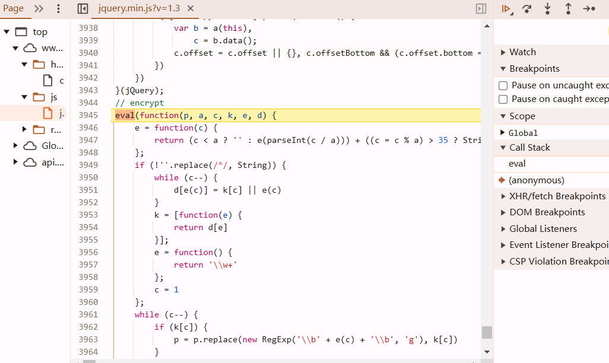

https://www.aqistudy.cn/

use Charles/Fiddler to capture packet. they are merged by multiple pages. copy the url to search bar.


```
https://www.aqistudy.cn/html/city_realtime.php?v=2.3
```


enter the target page so we don't need to deal with infinite debugging twice.

it means its jquery


## bypass infinite debug


**a VM js file may come from eval or Function**, use hook to locate it. it loads so many js,


add this snippet to hook

```javascript
var eval_ = eval;
eval = function() {
    debugger;
    return eval_.apply(this, arguments);
};
```

refresh, it do nothing with VM



type `arguments[0]` to see its function. type it when the breakpoint is at eval


let it go until you find the right place


comment them. but we still meet infinite debug. find back


comment the first eval, over :D

## h1zlb1QoZ encrypt


By examining the initiator, one can easily locate the position of the function.


```javascript
    return function(method, obj) {
        var appId = '0e5df784c9068129938846e4fd750fdd';
        var clienttype = 'WEB';
        var timestamp = new Date().getTime();
        var param = {
            appId: appId,
            method: method,
            timestamp: timestamp,
            clienttype: clienttype,
            object: obj,
            secret: hex_md5(appId + method + timestamp + clienttype + JSON.stringify(ObjectSort(obj)))
        };
        param = BASE64.encrypt(JSON.stringify(param));
        return param
    }
```


### js2py

```python
import json
import time
import hashlib
import base64

def hex_md5(s):
    # Calculate the MD5 hash of a string and return it as a hex string
    return hashlib.md5(s.encode('utf-8')).hexdigest()

def generate_param(method, obj):
    app_id = '0e5df784c9068129938846e4fd750fdd'
    clienttype = 'WEB'
    timestamp = int(time.time() * 1000)  # Current time in milliseconds
    # Create the secret by concatenating values and hashing with MD5
    secret = hex_md5(
        app_id + method + str(timestamp) + clienttype + '{"city":"上海"}'  # change to 'city' causes false result
    )

    # Build the parameter dictionary
    param = {
        'appId': app_id,
        'method': method,
        'timestamp': timestamp,
        'clienttype': clienttype,
        'object': obj,
        'secret': secret
    }

    # Convert the parameter dictionary to a JSON string and encode it in base64
    param_json = json.dumps(param, separators=(',', ':'))
    param_base64 = base64.b64encode(param_json.encode('utf-8')).decode('utf-8')

    return param_base64

# Example usage
method = 'GETDATA'
obj = {"city": "上海"}
result = generate_param(method, obj)
print(result)
```

### 扣代码

https://appl2m4pcpu3553.pc.xiaoe-tech.com/live_pc/l_6735c4e1e4b0694c94ff6449

## decrypt

```javascript
        $.ajax({
            url: '../apinew/aqistudyapi.php',
            data: {
                h1zlb1QoZ: pUpOMOU
            },
            type: "post",
            success: function(dXacm) {
                dXacm = d6o2KJrVnYKBvdlc6mTrx4(dXacm);
                oUSlm6 = JSON.parse(dXacm);
                if (oUSlm6.success) {
                    if (pGVTjEm > 0) {
                        oUSlm6.result.time = new Date().getTime();
                        localStorageUtil.save(kVIY, oUSlm6.result)
                    }
                    cA43Npnni(oUSlm6.result)
                } else {
                    console.log(oUSlm6.errcode, oUSlm6.errmsg)
                }
            }
        })
```

### js2py

```python
from Crypto.Cipher import AES, DES
from Crypto.Hash import MD5
import base64

def md5(key):
    return MD5.new(key.encode()).hexdigest()

def aes_decrypt(text, key, iv):
    secretkey = md5(key)[16:32].encode('utf-8')
    secretiv = md5(iv)[:16].encode('utf-8')
    cipher = AES.new(secretkey, AES.MODE_CBC, secretiv)
    decrypted = cipher.decrypt(base64.b64decode(text))
    return decrypted.rstrip(b'\0').decode('utf-8')

def des_decrypt(text, key, iv):
    secretkey = md5(key)[:8].encode('utf-8')  # fuck.
    secretiv = md5(iv)[24:32].encode('utf-8')
    cipher = DES.new(key=secretkey, mode=DES.MODE_CBC, iv=secretiv)
    decrypted = cipher.decrypt(base64.b64decode(text))
    return decrypted.rstrip(b'\0').decode('utf-8')
    return cipher

def base64_encrypt(text):
    return base64.b64encode(text.encode()).decode()

def base64_decrypt(text):
    return base64.b64decode(text).decode('utf-8')

def d6o2KJrVnYKBvdlc6mTrx4(data):
    data = aes_decrypt(data, "a5slhqEdLos7hvjr", "bhb9eTODiif32jv0")
    data = des_decrypt(data, "hXenRdbrF1iqaMLr", "xAWozmps3eqYftMA")
    data = base64_decrypt(data)
    return data
```

### 扣代码

```javascript
var CryptoJS = require("crypto-js");
var AES = {
    decrypt: function(text, key, iv) {
        var secretkey = (CryptoJS.MD5(key).toString()).substr(16, 16);
        var secretiv = (CryptoJS.MD5(iv).toString()).substr(0, 16);
        secretkey = CryptoJS.enc.Utf8.parse(secretkey);
        secretiv = CryptoJS.enc.Utf8.parse(secretiv);
        var result = CryptoJS.AES.decrypt(text, secretkey, {
            iv: secretiv,
            mode: CryptoJS.mode.CBC,
            padding: CryptoJS.pad.Pkcs7
        });
        return result.toString(CryptoJS.enc.Utf8)
    }
};

var DES = {
    decrypt: function(text, key, iv) {
        var secretkey = (CryptoJS.MD5(key).toString()).substr(0, 16);
        var secretiv = (CryptoJS.MD5(iv).toString()).substr(24, 8);
        secretkey = CryptoJS.enc.Utf8.parse(secretkey);
        secretiv = CryptoJS.enc.Utf8.parse(secretiv);
        var result = CryptoJS.DES.decrypt(text, secretkey, {
            iv: secretiv,
            mode: CryptoJS.mode.CBC,
            padding: CryptoJS.pad.Pkcs7
        });
        return result.toString(CryptoJS.enc.Utf8)
    }
};

var BASE64 = {
    encrypt: function(text) {
        var b = new Base64();
        return b.encode(text)
    },
    decrypt: function(text) {
        var b = new Base64();
        return b.decode(text)
    }
};

function d6o2KJrVnYKBvdlc6mTrx4(data) {
    data = AES.decrypt(data, "a5slhqEdLos7hvjr", "bhb9eTODiif32jv0");
    data = DES.decrypt(data, "hXenRdbrF1iqaMLr", "xAWozmps3eqYftMA");
    data = BASE64.decrypt(data);
    return data
}

function Base64(data) {
    this.decode = function(data) {
        return Buffer.from(data, 'base64').toString('utf-8');
    }
};

var data = "9Kw+wawzqavYIcXt/0UR0SqVTQZV47/6UABBDd..."
console.log(d6o2KJrVnYKBvdlc6mTrx4(data));
```
