https://www.birdreport.cn/home/search/report.html?search=eyJ0YXhvbmlkIjoiIiwic3RhcnRUaW1lIjoiIiwiZW5kVGltZSI6IiIsInByb3ZpbmNlIjoi6Z2S5rW355yBIiwiY2l0eSI6IiIsImRpc3RyaWN0IjoiIiwicG9pbnRuYW1lIjoiIiwidXNlcm5hbWUiOiIiLCJzZXJpYWxfaWQiOiIiLCJjdGltZSI6IiIsInRheG9ubmFtZSI6IiIsInN0YXRlIjoiIiwibW9kZSI6IjAiLCJvdXRzaWRlX3R5cGUiOjB9

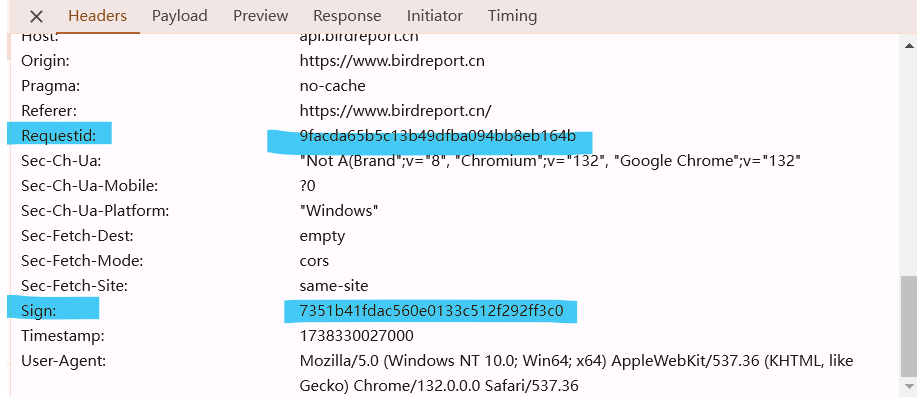

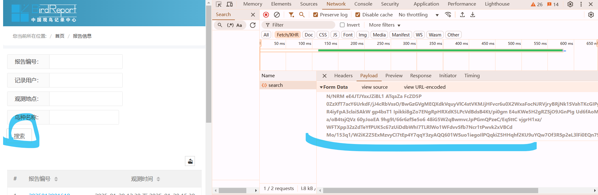

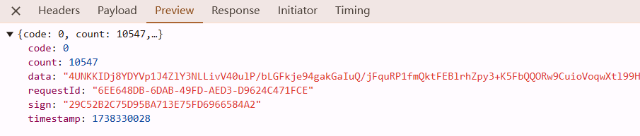

choose the function in front of `ajax` 

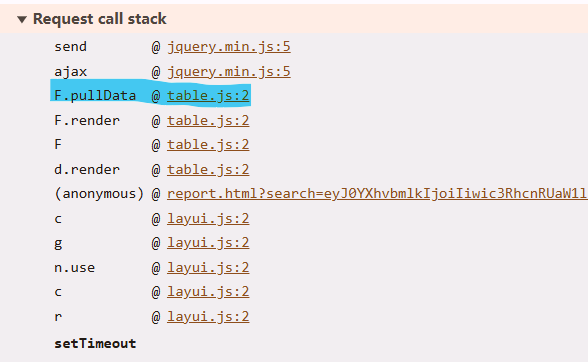

it still not encrypted, so the place will be at `ajax` or `send`

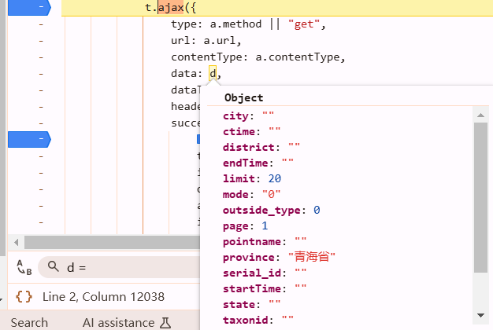

enter `ajax`, set a breakpoint

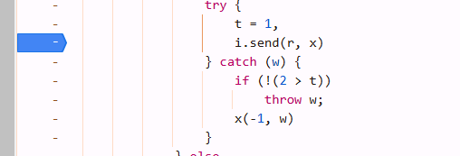

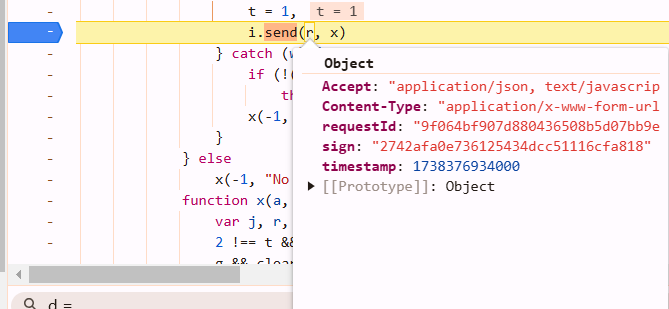

r.sign was encrypted, find back. set over next function call until you find the value of r changed.

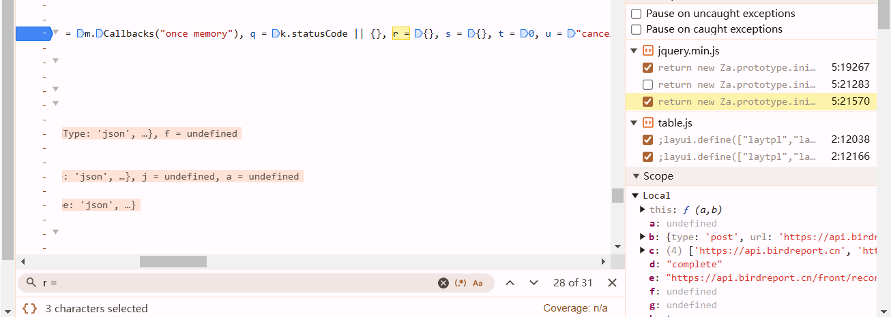

at this line. enter beforeSend

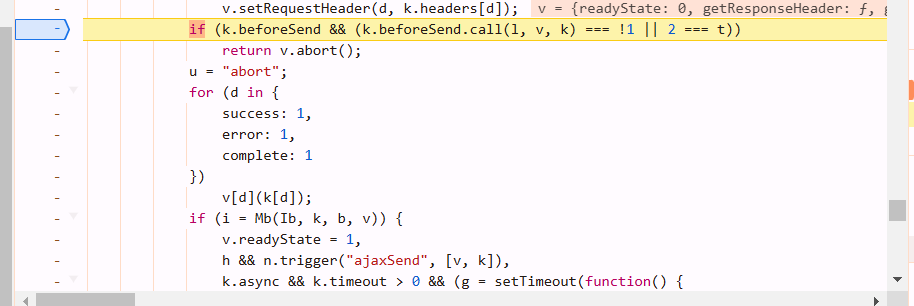

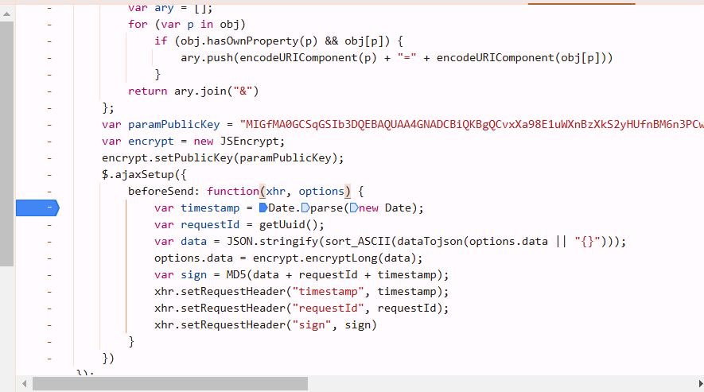

## 扣代码

### encrypt part

#### RSA

once you notice this `encryptLong` function, `npm install node-encrypt-js`

```javascript
var JSEncrypt = require("node-encrypt-js")
var encrypt = new JSEncrypt();
encrypt.setPublicKey(paramPublicKey);

data = encrypt.encryptLong(data);
```

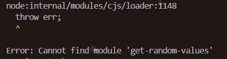

bc this library need `node-jsencrypt`: `npm install node-jsencrypt`.

#### md5

```javascript
var crypto = require("crypto");

function MD5(s) {
    return crypto.createHash("md5").update(s).digest("hex");
}
```

```javascript
var data = "page=1&limit=20&taxonid=&startTime=&endTime=&province=%E9%9D%92%E6%B5%B7%E7%9C%81&city=&district=&pointname=&username=&serial_id=&ctime=&taxonname=&state=&mode=0&outside_type=0"

function fn(data) {
    var timestamp = Date.parse(new Date());
    var requestId = getUuid();
    var data = JSON.stringify(sort_ASCII(dataTojson(data || '{}')));
    var final_data = encrypt.encryptLong(data);
    var sign = MD5(data + requestId + timestamp);
//     a.setRequestHeader("timestamp", c);
//     a.setRequestHeader('requestId', d);
//     a.setRequestHeader('sign', f)
    return {
        headers: {
            timestamp,
            requestId,
            sign
        },
        final_data
    }
}
```

```json
{
  headers: {
    timestamp: 1738379831000,
    requestId: '2bcb5841100da1483d1a68a1e5852f4d',
    sign: '1edd1c9f11d4380bc809c739a2b00fc2'
  },
  data: 'Sb2+K7WoX3bF0CEZzJcE+Njn+jTaVpKR5BDGrjCgmkbHbBG5pq9Ujj5rDxy98MJPBRJv5ACLh6H9BDvoMwTf5fJBeMeWA66EupEs87meRLVOWt5UC/a3wVg0MfY5kkL409usdiIGIi9Su7ZF68qnAcSw8m0aWmhB6QJ/psc1cbw='
}
```

```
requests.exceptions.InvalidHeader: Header part (1738550561000) from {'timestamp': 
1738550561000} must be of type str or bytes, not <class 'int'>
```

`"timestamp": timestamp+"",`

```python
import requests
import execjs
from urllib.parse import urlencode

f = open("dick.js", mode="r", encoding="utf-8")
js = execjs.compile(f.read())

data = {
    "page": 1,
    "limit": 20,
    "taxonid": "",
    "startTime": "",
    "endTime": "",
    "province": "青海省",
    "city": "",
    "district": "",
    "pointname": "",
    "username": "",
    "serial_id": "",
    "ctime": "",
    "taxonname": "",
    "state": "",
    "mode": "0",
    "outside_type": 0
}

params = urlencode(data)

ret = js.call("fn", params)
ret_header = ret['headers']
ret_data = ret['final_data']

headers = {
    'Accept': 'application/json, text/javascript, */*; q=0.01',
    'Accept-Language': 'zh-CN,zh;q=0.9,en;q=0.8,en-US;q=0.7',
    'Cache-Control': 'no-cache',
    'Connection': 'keep-alive',
    'Content-Type': 'application/x-www-form-urlencoded; charset=UTF-8',
    'Origin': 'https://www.birdreport.cn',
    'Pragma': 'no-cache',
    'Referer': 'https://www.birdreport.cn/',
    'Sec-Fetch-Dest': 'empty',
    'Sec-Fetch-Mode': 'cors',
    'Sec-Fetch-Site': 'same-site',
    'User-Agent': 'Mozilla/5.0 (Windows NT 10.0; Win64; x64) AppleWebKit/537.36 (KHTML, like Gecko) Chrome/132.0.0.0 Safari/537.36',
    'sec-ch-ua': '"Not A(Brand";v="8", "Chromium";v="132", "Google Chrome";v="132"',
    'sec-ch-ua-mobile': '?0',
    'sec-ch-ua-platform': '"Windows"',
}
# merge headers
headers.update(ret_header)

response = requests.post('https://api.birdreport.cn/front/record/activity/search', headers=headers, data=ret_data)  # look, it directly use the value of ret_data string without building a dictionary
print(response.text)
```

### decrypt part

Select the function that occurs before sending the ajax request.

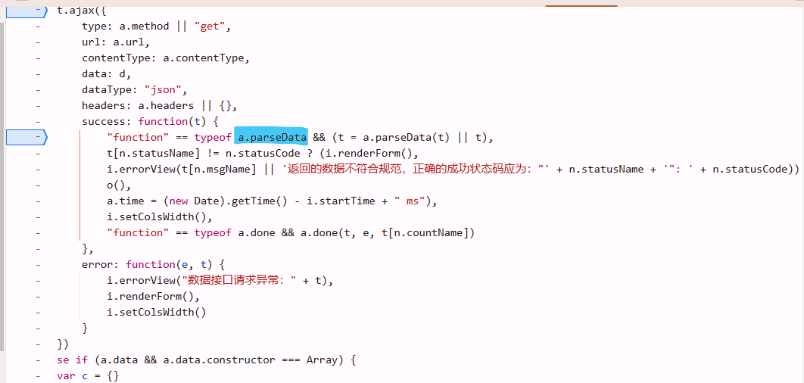

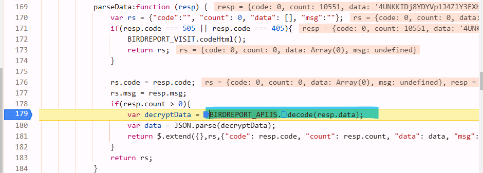

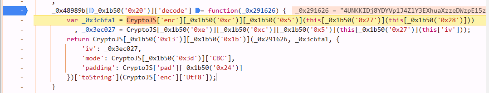

```javascript
function dec(_0x291626){
    var _0x3c6fa1 = CryptoJS['enc']['Utf8']['parse']('C8EB5514AF5ADDB94B2207B08C66601C')
      , _0x3ec027 = CryptoJS['enc']['Utf8']['parse']('55DD79C6F04E1A67');
    return CryptoJS['AES']['decrypt'](_0x291626, _0x3c6fa1, {
        'iv': _0x3ec027,
        'mode': CryptoJS['mode']['CBC'],
        'padding': CryptoJS['pad']['Pkcs7']
    })['toString'](CryptoJS['enc']['Utf8']);
}
```

## js2py


```python
from Crypto.Cipher import AES
import base64
_0x291626 = "..."
key = 'C8EB5514AF5ADDB94B2207B08C66601C'.encode('utf-8')
iv = '55DD79C6F04E1A67'.encode('utf-8')
aes = AES.new(
    key=key,
    mode=AES.MODE_CBC,
    iv=iv
)
b = aes.decrypt(base64.b64decode(_0x291626))
print(b.decode("utf-8"))
```

