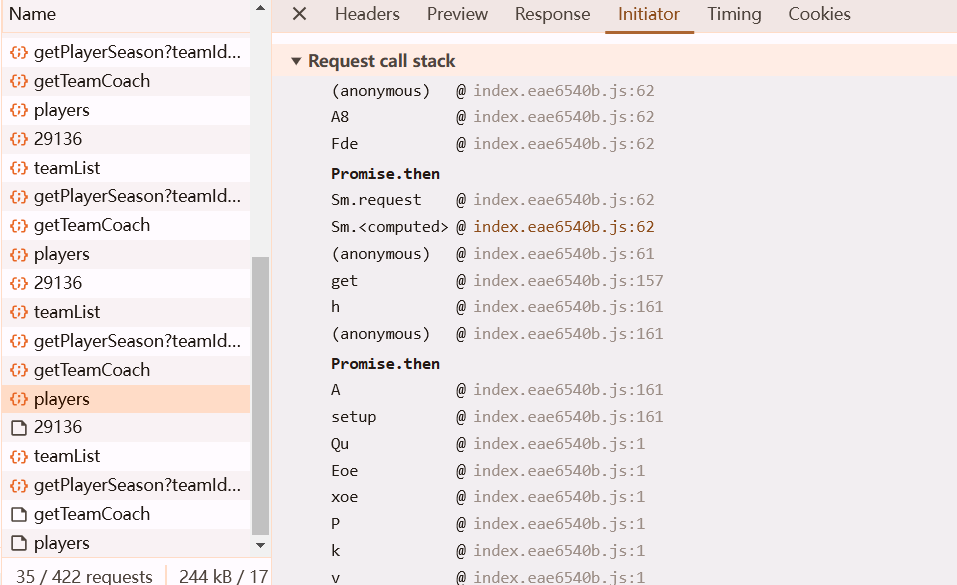

https://www.cbaleague.com/data/#/teamMain?teamId=29136

api: https://data-server.cbaleague.com/api/teams/29136/seasons/2024/players


观察控制台发现bro直接在console里打印了解密后的数据...


可知在此函数之前数据已经解密

或从调用栈Promise.then之后的函数中进去




多次下断点


利用a下条件断点，断到我们需要的那个url


```javascript
a.config.url.indexOf("players") ！= -1
```

继续往后走，找到解密函数


## 法一

```python
from Crypto.Cipher import AES
import base64
s = "图里e的值，api返回的response，太长省略"
sb = base64.b64decode(s)
key = "uVayqL4ONKjFbVzQ".encode("utf-8")
aes = AES.new(key=key, mode=AES.MODE_ECB)
raw = aes.decrypt(sb)
print(raw.decode("utf-8"))
```

## 法二

```javascript
var Fv = require("crypto-js");

function a5e(e) {
    const t = "uVayqL4ONKjFbVzQ";
    var r = Fv.enc.Utf8.parse(t)
      , n = Fv.AES.decrypt(e, r, {
        mode: Fv.mode.ECB,
        padding: Fv.pad.Pkcs7
    });
    return JSON.parse(Fv.enc.Utf8.stringify(n))
}

// console.log(a5e("图里e的值，api返回的response，太长省略"));
```

```python
# 注意, 很多网站返回的内容是多了双引号或者单引号的
# s = 'xlkjfdlskajflkadsj'
# s = "'xlkjfdlskajflkadsj'"
import execjs  # pyexecjs2

f = open('cba.js', mode="r", encoding="utf-8")
js_code = f.read()
f.close()

js = execjs.compile(js_code)
ret = js.call("a5e", resp.text.strip('"'))  # 去掉 ""
print(ret)
```

## 定位方法二

看到promise.then,搜interceptors


