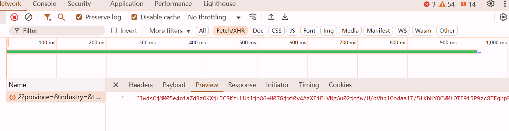
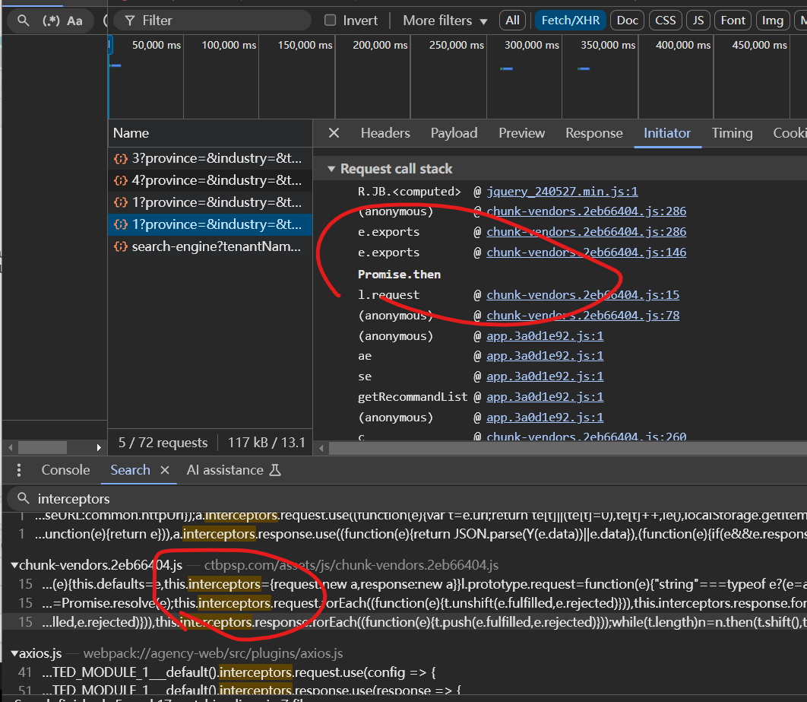
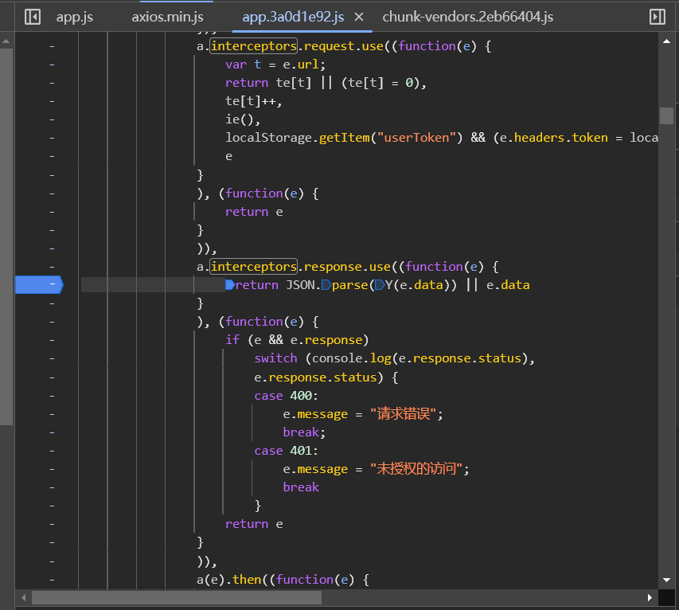
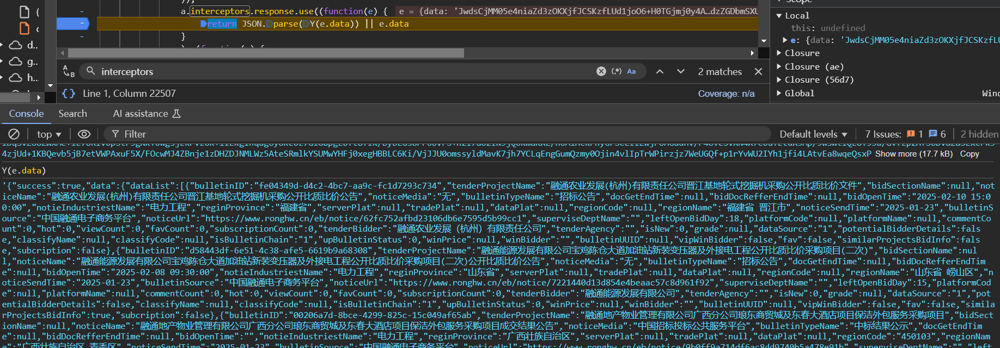
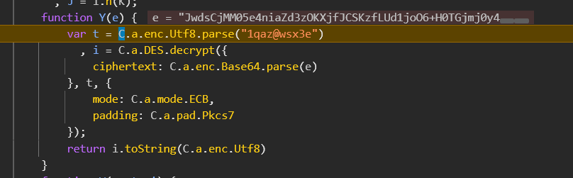
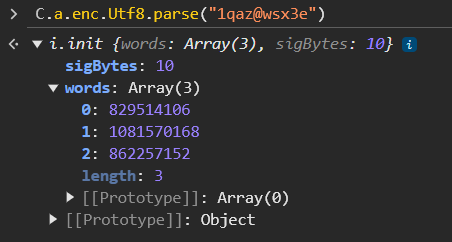
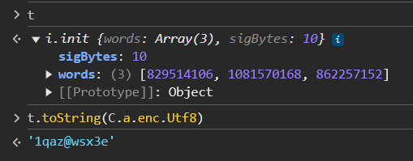
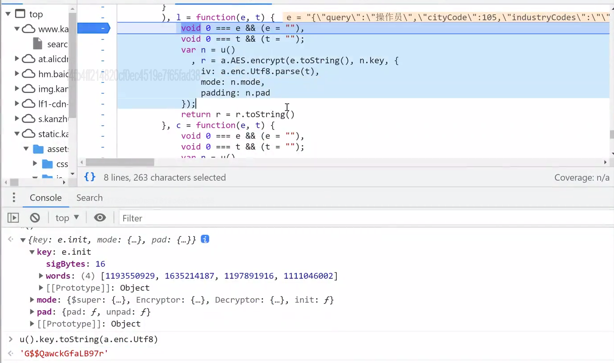
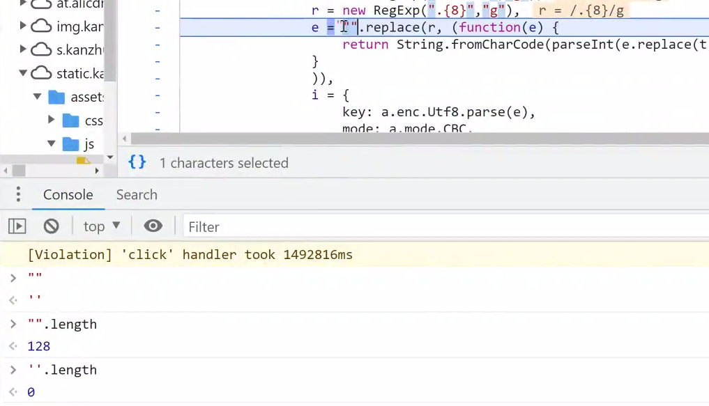

*http://ctbpsp.com/#/*




点击翻页，这是目标

看到 `Promise.then` 优先搜索 `interceptors` 搜不到再搜别的



这个是axios的源码，不看这里，继续点进下一个搜索结果

因为是请求返回的结果，所以在这里打断点



找到解密函数





```python
des=DES.new(key=b'1qaz@wsx',mode=DES.MODE_ECB)  # DES 的 key是8位，但是js里的多了两个，所以把它删掉
bs=base64.b64decode(data)
ss=des.decrypt(bs).decode('utf-8')
print(ss)
```

```javascript
var CryptoJS = require("crypto-js");

function Y(e) {
    var t = CryptoJS.enc.Utf8.parse("1qaz@wsx3e")
      , i = CryptoJS.DES.decrypt({
        ciphertext: CryptoJS.enc.Base64.parse(e)
    }, t, {
        mode: CryptoJS.mode.ECB,
        padding: CryptoJS.pad.Pkcs7
    });
    return i.toString(CryptoJS.enc.Utf8) // i是crypto封装的字节
    // i.toString() 可能是十六进制字符串，也有可能是Base64
}
data = "密文..."
console.log(Y(data))
```



记住这个东西是crypto封装的字节，有时这个过程会隐藏起来，你只能看到t

如果有个变量直接存放了这些字节，那么就不好用python去处理，所以在console里使用 `t.toString(C.a.enc.Utf8)` 处理后，就能得到原先写在括号里的字符串



```javascript
t.toString(CryptoJS.enc.Utf8)  // byte -> str
```

记住这个格式

```
CryptoJS.DES.decrypt(
	{密文},
	密钥,
	{
		mode: CryptoJS.mode.xxx 加密方式,
		iv,
		padding: CryptoJS.pad.Pkcs7
	}
)
```

eg. 已经寄掉的网站



注意有个坑，有时候，一些东西并不会显示出来


