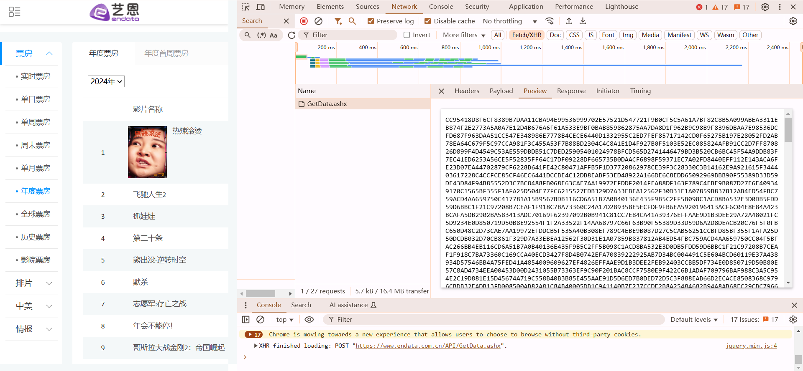
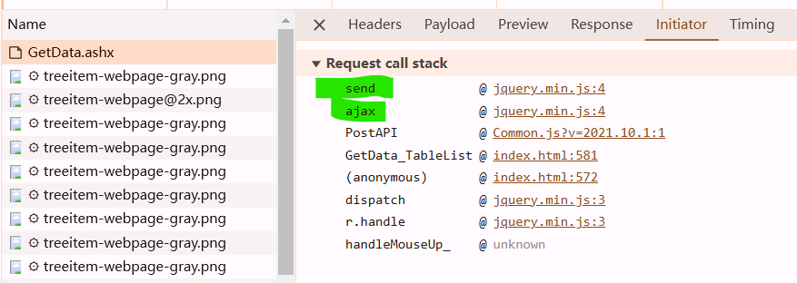
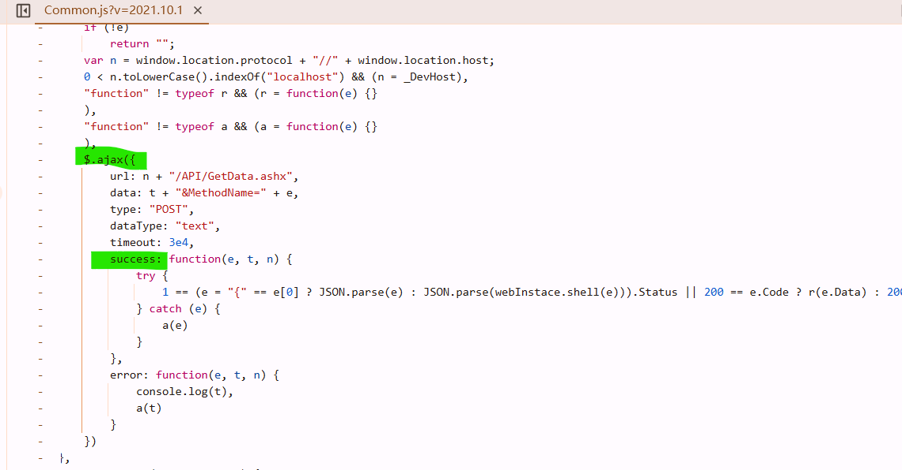
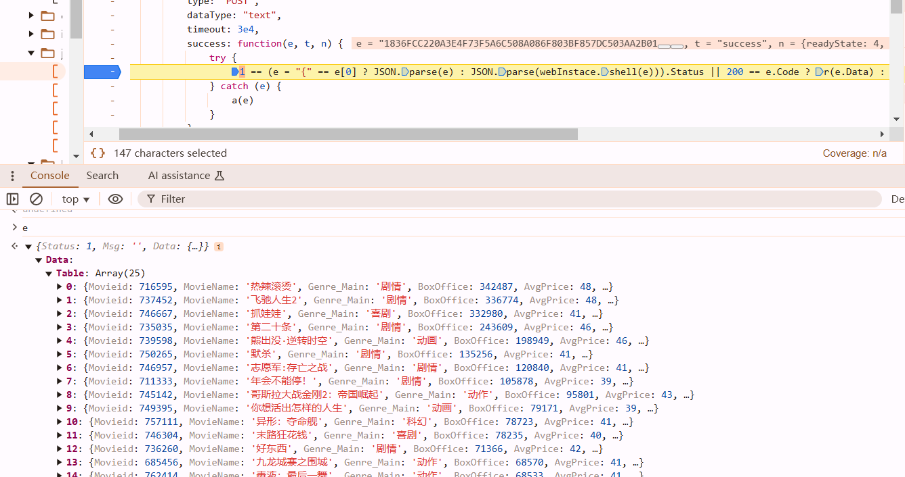
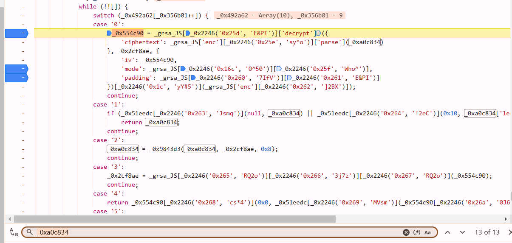
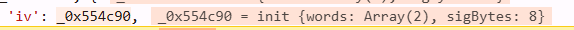

https://www.endata.com.cn/BoxOffice/BO/Year/index.html



once you see it, you shold realize its `jquery ajax`



enter `PostAPI`, find the code snippet like



success: means do it after successfully send that request. set a breakpoint at here. so we know data is decrypted within this line.



```javascript
1 == (e = "{" == e[0] ? JSON.parse(e) : JSON.parse(webInstace.shell(e))).Status || 200 == e.Code ? r(e.Data) : 200 == e.code ? r(e.data) : a(e.Msg)
```

 The main idea is to split the nested ternary operators into multiple `if-else` statements and add necessary comments to explain each step of the operation.

```javascript
// Check if e starts with '{'. If so, parse it directly as a JSON object. Otherwise, call webInstace.shell(e) and parse the result.
if (e[0] === "{") {
    e = JSON.parse(e);
} else {
    e = JSON.parse(webInstace.shell(e));
}

// Check if the Status property of e is equal to 1.
if (e.Status === 1) {
    // If the condition is met, call the r function and pass e.Data as an argument.
    r(e.Data);
} else if (e.Code === 200) {
    // If e.Status is not equal to 1, check if e.Code is equal to 200.
    // If the condition is met, call the r function and pass e.Data as an argument.
    r(e.Data);
} else if (e.code === 200) {
    // If e.Code is not equal to 200, check if e.code is equal to 200.
    // If the condition is met, call the r function and pass e.data as an argument.
    r(e.data);
} else {
    // If none of the above conditions are met, call the a function and pass e.Msg as an argument.
    a(e.Msg);
}
```

after `webInstace.shell(e)` is called, it can be dealt with `JSON.parse` so probably shell is the decrypted function. we can also confirm that via console output :)

## ob


... fuck. too much to record :(

let's just look at here, search `_0xa0c834`, and we can find this



```javascript
_0xa0c834 = _0x9843d3(_0xa0c834, _0x2cf8ae, 0x8);
_0x2cf8ae = _grsa_JS['enc']['Utf8']['parse'](_0x554c90);  // _0x554c90 = "311CB283"
_0x554c90 = _grsa_JS['enc']['Utf8']['parse'](_0x554c90);  

_0x554c90 = _grsa_JS['DES']['decrypt']({
    'ciphertext': _grsa_JS['enc']['Hex']['parse'](e)
}, _0x2cf8ae, {
    'iv': _0x554c90,
    'mode': _grsa_JS['mode']['ECB'],
    'padding': _grsa_JS['pad']['Pkcs7']
})['toString'](_grsa_JS['enc']['Utf8']);
```



iv shows as byte, `_0x554c90.toString(_grsa_JS['enc']['Utf8'])` turns out to be `'98E010F1'`

# Bug

always raising 

```
line 196, in decrypt
    raise ValueError("Data must be aligned to block boundary in ECB mode")
ValueError: Data must be aligned to block boundary in ECB mode
```

```python
# Ensure the hex string has an even length
if len(e) % 2 != 0:
    e = '0' + e  # Pad with a leading zero if odd-length

from Crypto.Cipher import DES
from Crypto.Util.Padding import unpad
import binascii

# Assuming _grsa_JS['enc']['Hex']['parse'] is equivalent to converting hex to bytes
ciphertext = binascii.unhexlify(e)  # e is the hex string
key = '311CB283'.encode("utf-8")  # The key used for decryption
iv = '311CB283'.encode("utf-8")  # Initialization vector (if needed)

# Create a DES cipher object
des = DES.new(key=key, mode=DES.MODE_ECB)  # ECB mode does not use IV

# Decrypt the ciphertext
decrypted_data = des.decrypt(ciphertext)  # HERE 😡
```

# 扣代码

https://appl2m4pcpu3553.pc.xiaoe-tech.com/live_pc/l_6735c4dfe4b023c058a47cd1
