target： https://www.hfhuizhan.com

1. data encryption

   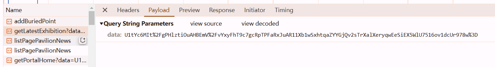

2. response descryption

   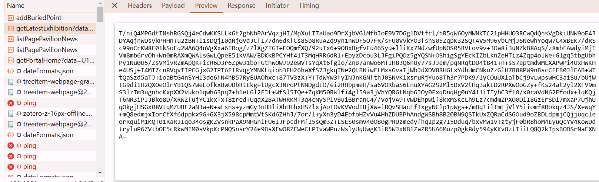

## search

notice `Promise.then`, so search `interceptors` in `Search` tab

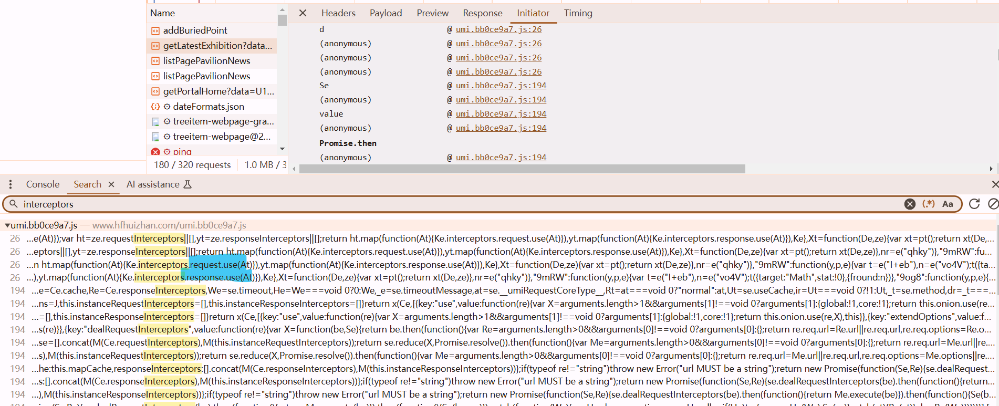

enter

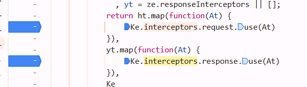

## request data encryption

check out `At`, we got `requestInterceptors`

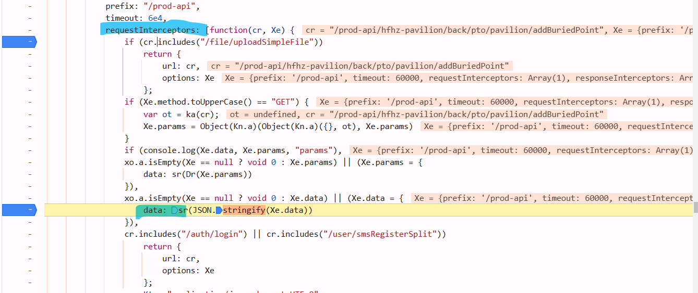

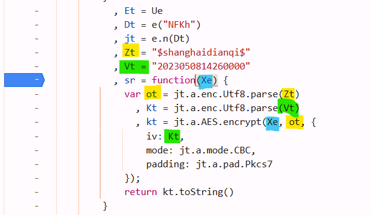

```python
def enc_data(s):
    key = "$shanghaidianqi$".encode("utf-8")
    iv = "2023050814260000".encode("utf-8")
    aes = AES.new(
        key=key,
        mode=AES.MODE_CBC,
        iv=iv
    )
    raw = pad(s.encode('utf-8'), 16)
    b = aes.encrypt(raw)
    return base64.b64encode(b).decode()


s = "/prod-api/hfhz-pavilion/back/pto/pavilion/getLatestExhibition=undefined"
data = enc_data(s)
print(data)  # ‘U1tYc6MIt/gPHlztiOuAHBEmV/vYxyFhT9c7gcRpTPFaRxJuAR11Xb1wSxhtqaZYYGjQv2sTrXalXeryqwEeSiEX5WlU7516ov1dcUr978w=’

params = {
    'data': data,
}

response = requests.get(
    'https://www.hfhuizhan.com/prod-api/hfhz-pavilion/back/pto/pavilion/getLatestExhibition',
    params=params,
    headers=headers,
)
```

## response decryption

enter the interceptors `At`, got this function

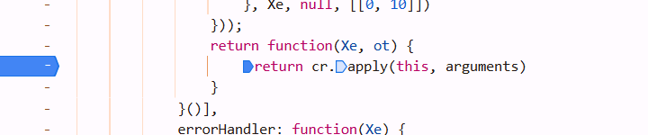

but dont click `cr` while mouse hanging over it, its asychronous so it will enter a wrong function. at this situation, single step debugger is not suitable

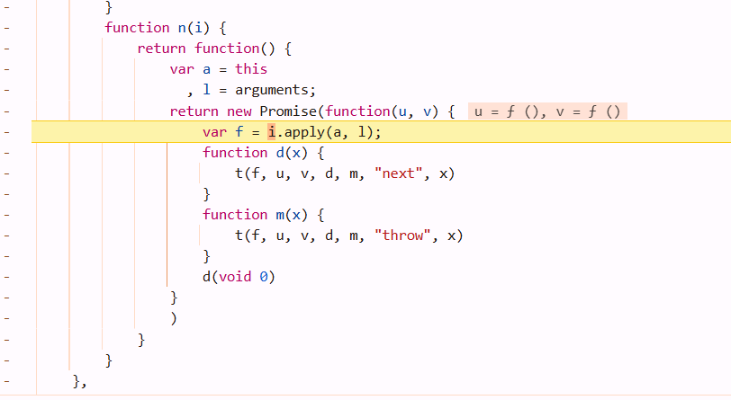

just click `cr` and notice its above that function

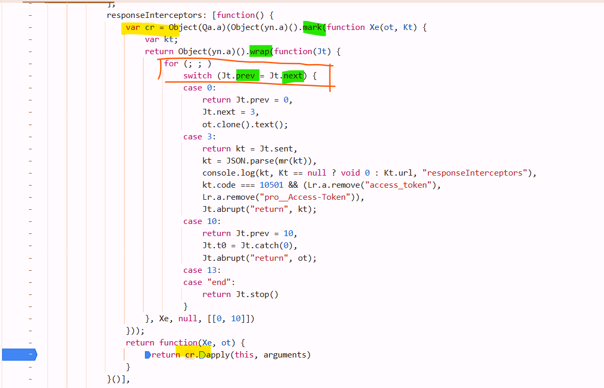

**remember: When the code is the same as that framed by the orange box in the figure, it indicates the feature of asynchronous execution.** 

At this point, **do not perform single-step debugging.** Consider the `case` as `await` a task.

`Jt.sent` receive the response value of it's last step :`ot.clone().text()`

set breakpoints at `return ...` below `case x`, use **this button** to debug


if you want to jump from `case 0` to `case 3`, different cases, use **this button**. but in the case block, single step debug is OK.

`Jt.next = 3` means its next task is in the `case 3` block. the result of `ot.clone().next()` cant be found in the block `case0`, you must step into `case 3` Jt.sent to retrive its value.

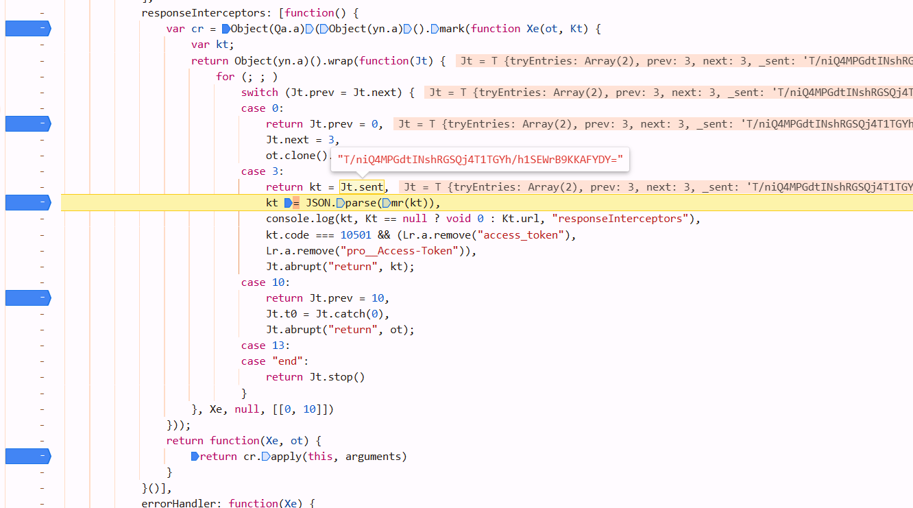

after `mr()`, `kt` can be parsed by `Json`, so `mr` may be the decrypt function

boom

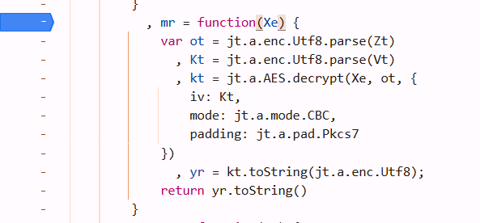

```python
from Crypto.Cipher import AES
# from Crypto.Util.Padding import pad, unpad
import base64

s = "too long..."

key = "$shanghaidianqi$".encode("utf-8")
iv = "2023050814260000".encode("utf-8")
aes = AES.new(
    key=key,
    mode=AES.MODE_CBC,
    iv=iv
)

b = aes.decrypt(base64.b64decode(s))
print(b.decode("utf-8"))
```

## pure js

```javascript
var jt = {}; // pay attention to this kind of format
jt.a = require("crypto-js");  // jt.a.enc.Utf8.parse

var Zt = "$shanghaidianqi$";
var Vt = "2023050814260000";
var sr = function(Xe) {
    Xe = JSON.stringify(Xe);  // add this line to transform py dict to string
            var ot = jt.a.enc.Utf8.parse(Zt)
              , Kt = jt.a.enc.Utf8.parse(Vt)
              , kt = jt.a.AES.encrypt(Xe, ot, {
                iv: Kt,
                mode: jt.a.mode.CBC,
                padding: jt.a.pad.Pkcs7
            });
            return JSON.stringify({
                data: kt.toString()
            });  // return JSON
        }
var mr = function(Xe) {
    var ot = jt.a.enc.Utf8.parse(Zt)
      , Kt = jt.a.enc.Utf8.parse(Vt)
      , kt = jt.a.AES.decrypt(Xe, ot, {
        iv: Kt,
        mode: jt.a.mode.CBC,
        padding: jt.a.pad.Pkcs7
    })
      , yr = kt.toString(jt.a.enc.Utf8);
    return JSON.parse(yr.toString());
}
```

```python
import json
import requests
import execjs

f = open("binhu.js", mode="r", encoding="utf-8")
js_code = f.read()
f.close()
js = execjs.compile(js_code)

url = "https://www.hfhuizhan.com/prod-api/hfhz-exhibition/back/exhibition/listExhibitionNotPage"

# its api is different with what i've been working for that's not the point though
ming_data = {
    "yyyyMM": "2024-11"
}

ret = js.call("sr", ming_data)

# my_headers = {...}

resp = requests.post(url, data=ret, headers=my_headers)
ming = js.call("mr", resp.text)  # it can trigger UnicodeDecodeError. dont konw why :(
print(ming)
```
