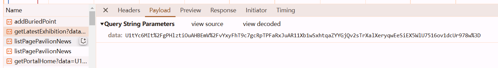
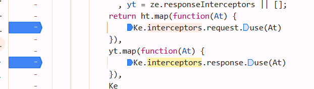
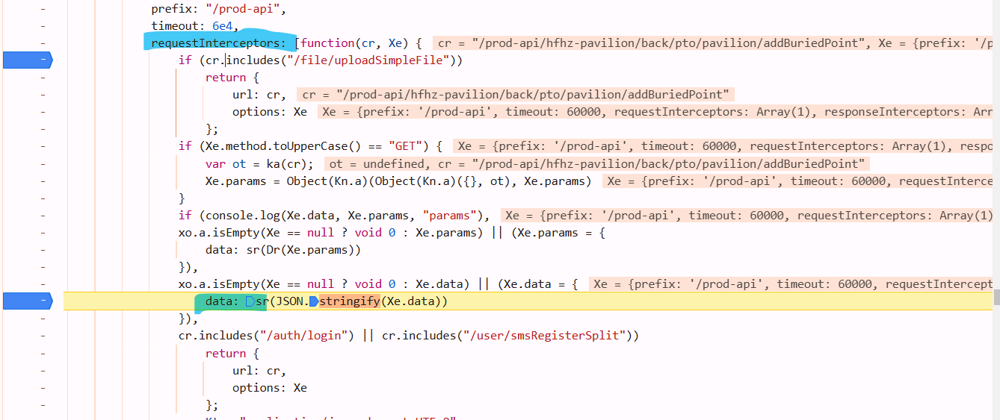
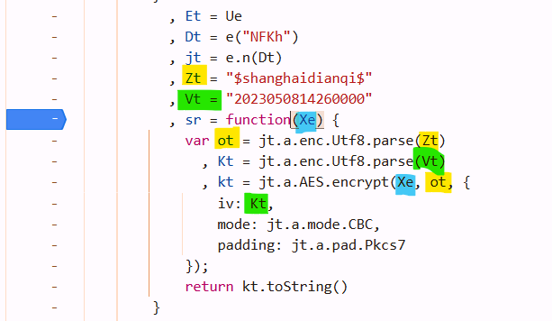
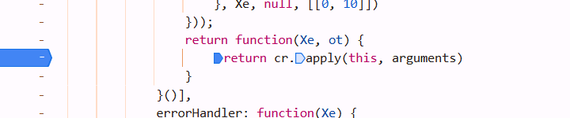
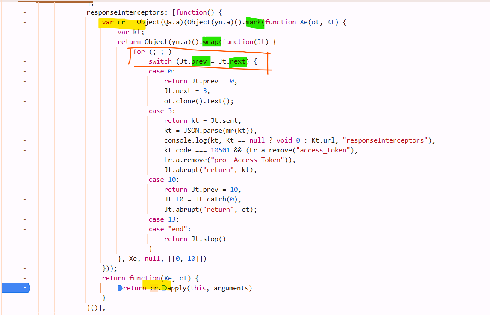
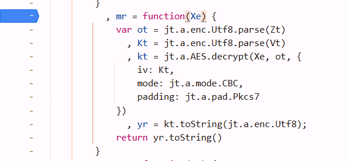

target： https://www.hfhuizhan.com

1. data encryption

   

2. response descryption

   

## search

notice `Promise.then`, so search `interceptors` in `Search` tab


enter



## request data encryption

check out `At`, we got `requestInterceptors`





```python
```


## response decryption

enter the interceptors `At`, got this function



but dont click `cr` while mouse hanging over it, its asychronous so it will enter a wrong function. at this situation, single step debugger is not suitable


just click `cr` and notice its above that function



**remember: When the code is the same as that framed by the orange box in the figure, it indicates the feature of asynchronous execution.** 

At this point, **do not perform single-step debugging.** Consider the `case` as `await` a task.

`Jt.sent` receive the response value of it's last step :`ot.clone().text()`

set breakpoints at `return ...` below `case x`, use **this button** to debug


if you want to jump from `case 0` to `case 3`, different cases, use **this button**. but in the case block, single step debug is OK.

`Jt.next = 3` means its next task is in the `case 3` block. the result of `ot.clone().next()` cant be found in the block `case0`, you must step into `case 3` Jt.sent to retrive its value.


after `mr()`, `kt` can be parsed by `Json`, so `mr` may be the decrypt function

boom



