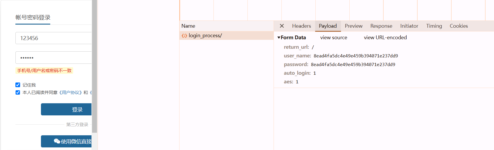
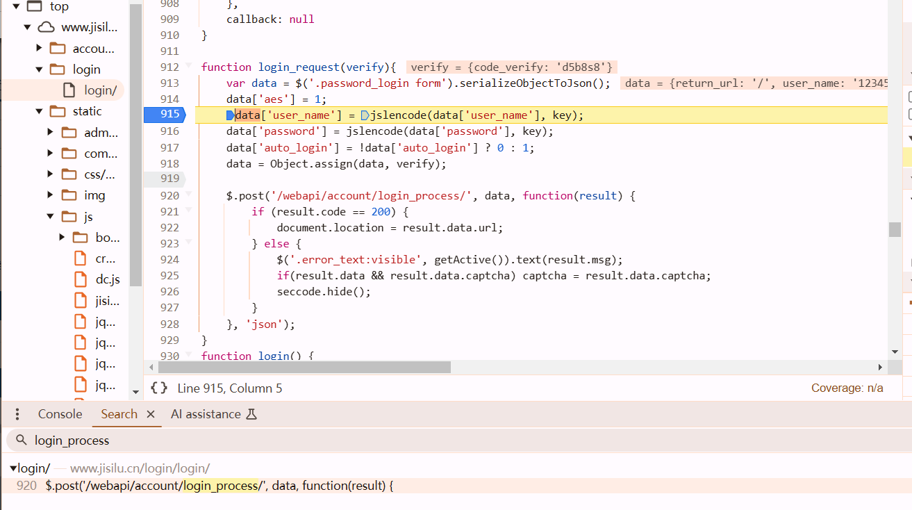
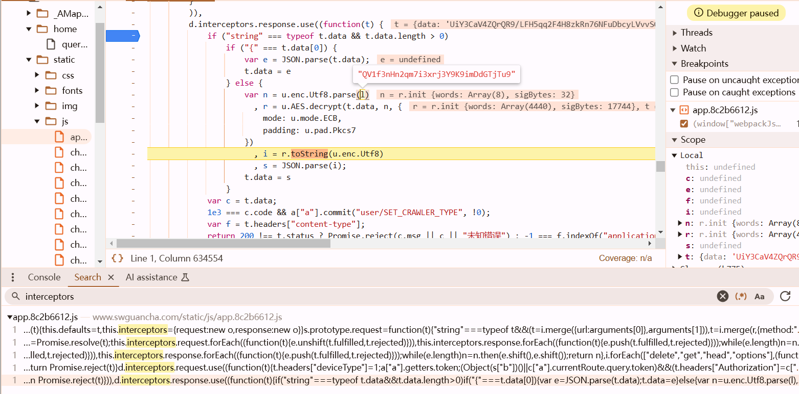
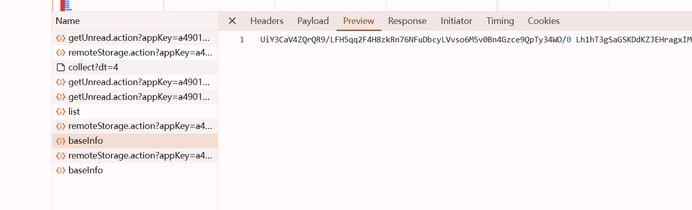
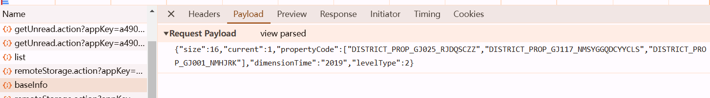

# EZ 1

https://www.jisilu.cn/login/



search by url



```javascript
var key = '397151C04723421F';

function jslencode(text, aes_key) {
    var key = CryptoJS.enc.Utf8.parse(aes_key);
    var iv = CryptoJS.enc.Utf8.parse("");
    var srcs = CryptoJS.enc.Utf8.parse(text);
    var encrypted = CryptoJS.AES.encrypt(srcs, key, {
        iv: iv,
        mode: CryptoJS.mode.ECB,
        padding: CryptoJS.pad.Pkcs7
    });
    return encrypted.ciphertext.toString(CryptoJS.enc.Hex)
}
```

```python
from Crypto.Cipher import AES
from Crypto.Util.Padding import pad
from binascii import hexlify

def jslencode(text, aes_key):
    key = aes_key.encode('utf-8')  # Convert the key to bytes
    iv = b''  # Empty IV for ECB mode
    cipher = AES.new(key, AES.MODE_ECB)  # Create a new AES cipher object
    srcs = text.encode('utf-8')  # Convert the text to bytes
    encrypted = cipher.encrypt(pad(srcs, AES.block_size))  # Encrypt and pad the text
    return hexlify(encrypted).decode('utf-8')  # Return the hex representation of the ciphertext


aes_key = '397151C04723421F'
text = "123456"

print(jslencode(text, aes_key))
```

# EZ 2

https://www.swguancha.com/home/query-city-page





```python
from Crypto.Cipher import AES
from Crypto.Util.Padding import unpad
import base64
encrypted_data = "..."
key = 'QV1f3nHn2qm7i3xrj3Y9K9imDdGTjTu9'
# Convert the key to bytes
key_bytes = key.encode('utf-8')
# Decode the base64 encoded encrypted data
encrypted_data_bytes = base64.b64decode(encrypted_data)
# Create AES cipher object
cipher = AES.new(key_bytes, AES.MODE_ECB)
# Decrypt the data
decrypted_data = unpad(cipher.decrypt(encrypted_data_bytes), AES.block_size)
# Convert decrypted bytes to string
decrypted_string = decrypted_data.decode('utf-8')
print(decrypted_string)
```

## attention

sometimes there exist special characters so copy it to pycharm and just run it may lead to failure decryption. so its better to 

## requests

```
'Content-Type': 'application/json;charset=UTF-8',
```



there two methods to send this request

- curl to python

```python
json_data = {
    'size': 16,
    'current': 1,
    'propertyCode': [
        'DISTRICT_PROP_GJ025_RJDQSCZZ',
        'DISTRICT_PROP_GJ117_NMSYGGQDCYYCLS',
        'DISTRICT_PROP_GJ001_NMHJRK',
    ],
    'dimensionTime': '2019',
    'levelType': 2,
}

response = requests.post('https://app.swguancha.com/client/v1/cPublic/consumer/baseInfo', headers=headers, json=json_data)

# Note: json_data will not be serialized by requests
# exactly as it was in the original request.
# data = '{"size":16,"current":1,"propertyCode":["DISTRICT_PROP_GJ025_RJDQSCZZ","DISTRICT_PROP_GJ117_NMSYGGQDCYYCLS","DISTRICT_PROP_GJ001_NMHJRK"],"dimensionTime":"2019","levelType":2}'
# response = requests.post('https://app.swguancha.com/client/v1/cPublic/consumer/baseInfo', headers=headers, data=data)
```

```python
response = requests.post('https://app.swguancha.com/client/v1/cPublic/consumer/baseInfo', headers=headers, data=json_data)  
```

this is incorrect, only get

```
{"timestamp":"2025-01-26 14:57:18","path":"/client/v1/cPublic/consumer/baseInfo","status":500,"error":"Internal Server Error","message":"syntax error, pos 1, line 1, column 2size=16&current=1&propertyCode=DISTRICT_PROP_GJ025_RJDQSCZZ&propertyCode=DISTRICT_PROP_GJ117_NMSYGGQDCYYCLS&propertyCode=DISTRICT_PROP_GJ001_NMHJRK&dimensionTime=2019&levelType=2","requestId":"40fd2dc9-24982833"}
```

- **from lufy's class(official)**

```python
data = {"size": 16,
        "current": 2,
        "propertyCode": [
            "DISTRICT_PROP_GJ025_RJDQSCZZ",
            "DISTRICT_PROP_GJ117_NMSYGGQDCYYCLS",
            "DISTRICT_PROP_GJ001_NMHJRK"],
        "dimensionTime": "2019",
        "levelType": 2
        }
resp = requests.post(url, data=json.dumps(data, separators=(',', ':')), headers=my_headers)
```

