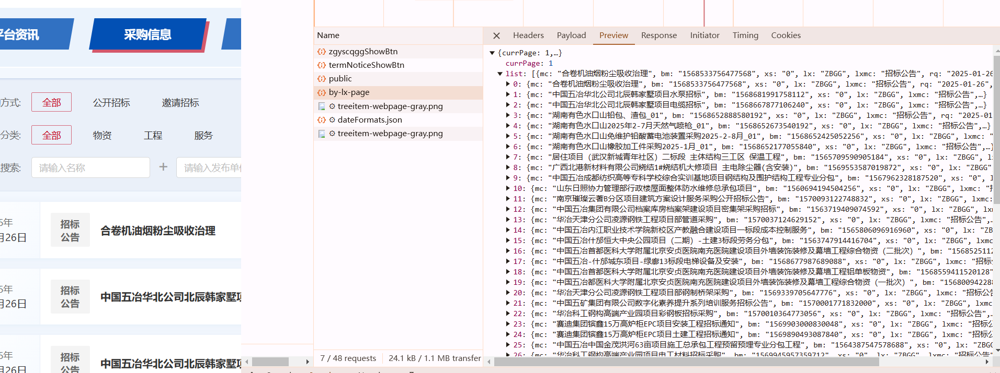
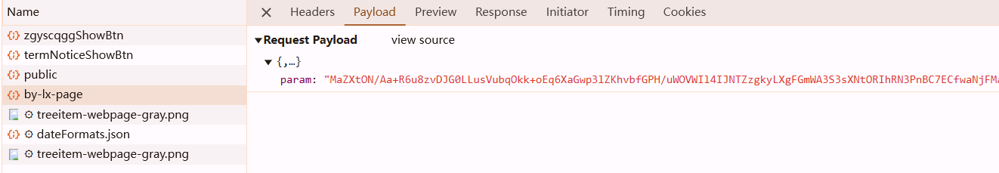
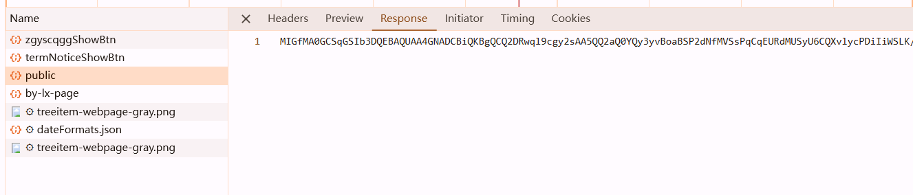
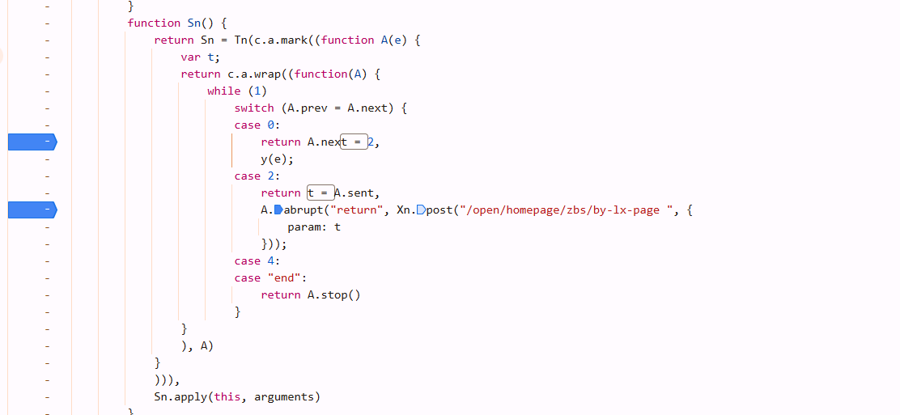
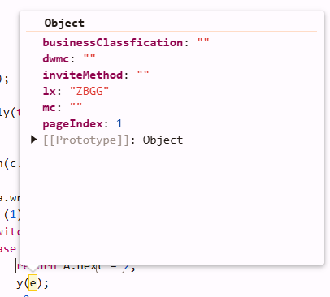
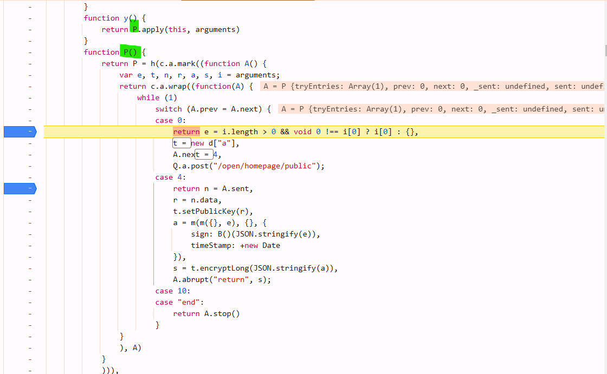
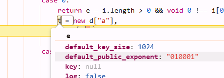
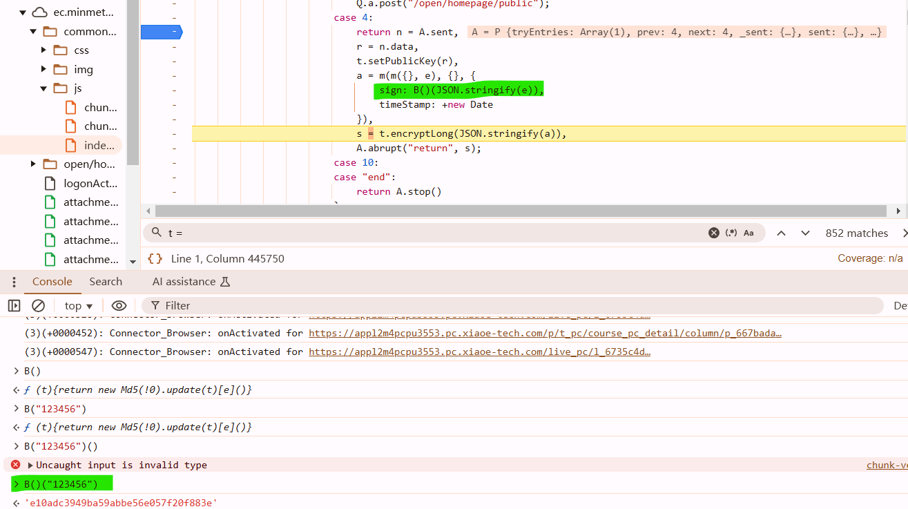
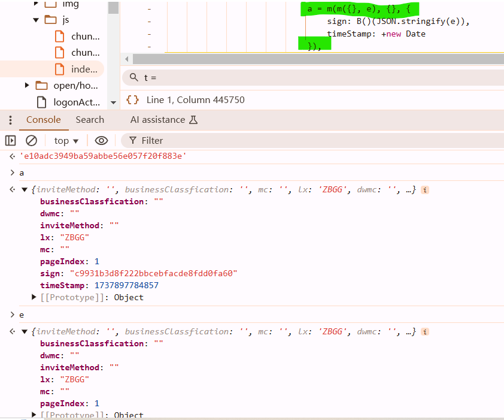

https://ec.minmetals.com.cn/open/home/purchase-info





okay, if you see `public` and it looks like this, then maybe RSA



# debug

param is from t, t is from `A.sent`, which is the return value of the last return value `y(e)`



so we got plaintext.

remember where to set breakpoints: in async process, set below `case`

dont't hang over on `P`, it will lead to wrong place. just look around, functions are usually near it.



so its rsa :)

```
npm install node-encrypt-js
```

use this shit to handle `encryptLong`, `node-jsencrypt` doesn't have this function but `node-encrypt-js` has, though it has less stars

```javascript
     a = m(m({}, e), {}, {
        sign: my_md5(JSON.stringify(e)), // sign -> md5 -> sha1 -> sha256, sha512
        timeStamp: new Date().getTime()
    })
```





most of time, snippet like *x(x({}, x({}, obj)), obj);* is combing shit. so they have the same effect

```javascript
    //  a = m(m({}, e), {}, {
    //     sign: my_md5(JSON.stringify(e)), // sign -> md5 -> sha1 -> sha256, sha512
    //     timeStamp: new Date().getTime()
    // })

    e.sign = my_md5(JSON.stringify(e));
    e.timeStamp = new Date().getTime()
```

no need to copy `m()` here. lol

pay attention to some shit in headers

```
"content-length": "0", means nothing in params
```

this request did have Payload so the content type should be `"content-type": "application/json"`

```javascript
var JSEncrypt = require("node-encrypt-js");
var crypto = require("crypto"); //nodejs自带的库,   我们之前用的是crypto-js
function my_md5(s){
    return crypto.createHash("md5").update(s).digest("hex");
}
function fn(e, r){ // e是明文参数(字典Object), r是公钥
    var t = new JSEncrypt();  // JSEncrypt()
    t.setPublicKey(r);
    e.sign = my_md5(JSON.stringify(e));
    e.timeStamp = new Date().getTime()
    var s = t.encryptLong(JSON.stringify(e));
    return JSON.stringify({  // directly trans to python so py no need to do json.dumps()
        param: s
    });
}
```

```python
params = {
     "businessClassfication": "",
     "dwmc": "",
     "inviteMethod": "",
     "lx": "ZBGG",
     "mc": "",
     "pageIndex": 4
}
pms = js.call("fn", params, pub_resp.text)

data_url = "https://ec.minmetals.com.cn/open/homepage/zbs/by-lx-page"
resp = session.post(data_url, data=pms)
print(resp.json())
```