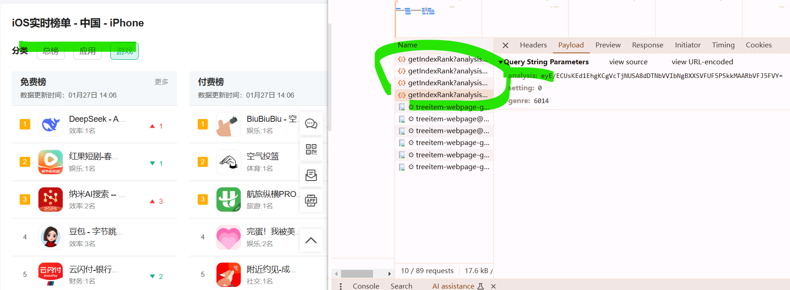
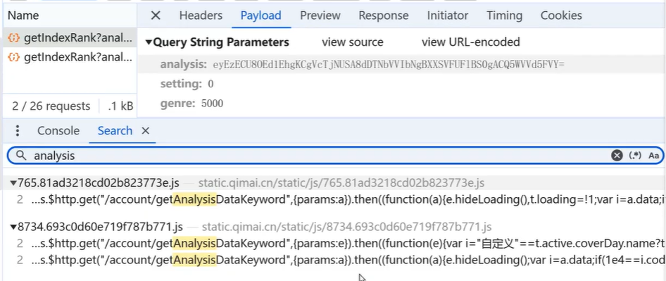
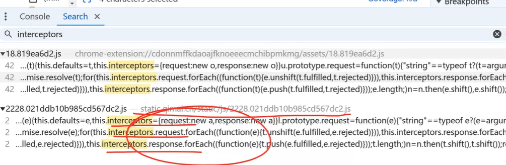
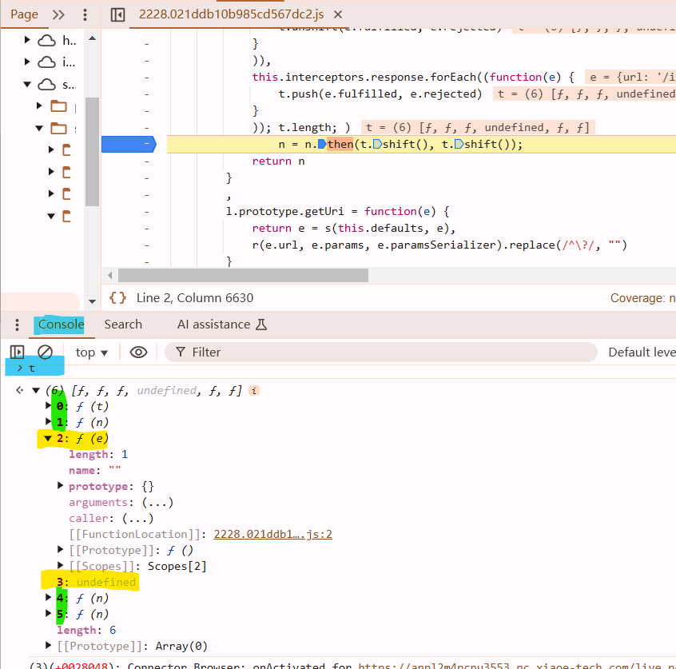
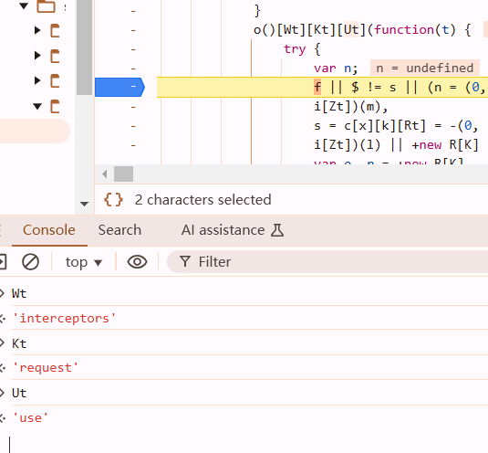

https://www.qimai.cn/



search failed :(



interceptors failed :((



# an important method

it's the source code of axios.notice the for block. 

```javascript
        function l(e) {
            this.defaults = e,
            this.interceptors = {
                request: new a,
                response: new a
            }
        }
        l.prototype.request = function(e) {
            "string" == typeof e ? (e = arguments[1] || {}).url = arguments[0] : e = e || {},
            (e = s(this.defaults, e)).method ? e.method = e.method.toLowerCase() : this.defaults.method ? e.method = this.defaults.method.toLowerCase() : e.method = "get";
            var t = [o, void 0]
              , n = Promise.resolve(e);
            for (this.interceptors.request.forEach((function(e) {
                t.unshift(e.fulfilled, e.rejected)
            }
            )),
            this.interceptors.response.forEach((function(e) {
                t.push(e.fulfilled, e.rejected)
            }
            )); t.length; )
                n = n.then(t.shift(), t.shift());
            return n
        }
```

the first parma of for is initialize something, it can be kicked out. when its been used: pass two functions, the first function: e is fulfilled, the second function is rejected.

`axios.interceptors.request.use(function(){}, function(){})`

```javascript
    r.prototype.use = function(e, t) {  // n.then(t.shift(), t.shift());
        return this.handlers.push({
            fulfilled: e,  // 
            rejected: t
        }),
        this.handlers.length - 1
    }
```

```javascript
var t =[o, undefined]; // requests
n = Promise.resolve(e);
this.interceptors.request.forEach((function(e) {
    t.unshift(e.fulfilled, e.rejected)
}
)),
// t = [111, 222, o, undefined] // after pushing shit into request interceptors
    
this.interceptors.response.forEach((function(e) {
    t.push(e.fulfilled, e.rejected)
}
));
// t = [111, 222, o, undefined, aaa, bbb]  // after pushing shit into response interceptors

for (; t.length; ) //程序执行到这里时候,  t里面装的,就是axios完整的流程
    n = n.then(t.shift(), t.shift());
// the first loop 
 n = n.then(111, 222); // 请求发送之前
 // 第二次循环
 n = n.then(o, undefined); // 发请求
  // 第三次循环
 n = n.then(aaa, bbb); // 响应回来之后, 干什么

// 使用拦截器 -> 请求
axios.interceptors.request.use(function(){哈哈}, function(){呵呵})
// 响应
axios.interceptors.response.use(function(){哈尔滨}, function(){牡丹江})

// t holds the whole work flow
[请求拦截器,  o, undefined,  响应拦截器]
```

don't use your moust hang over those functions, they will be executed



`2` and `undefined` is our target. `0` and `1 ` are request interceptors. `4` and `5` are response interceptors. to confirm it, enter `0, set a breakpoint and remove others.

