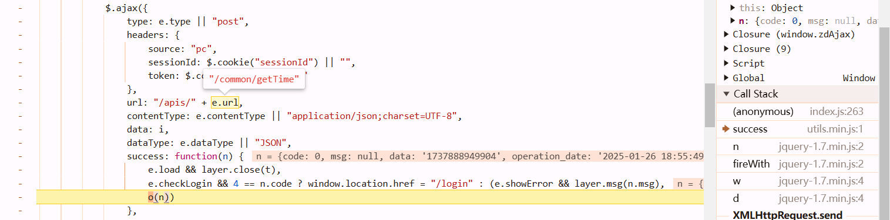

# login

https://user.wangxiao.cn/login?url=https%3a%2f%2fk.wangxiao.cn%2fuser%2f


once you saw it, its the rsa2 in [js逆向][js逆向.md]. just copy it to a new js file

```javascript
var JSEncrypt = require("node-jsencrypt");
var encryptFn = function(e) {
    var o = new JSEncrypt;
    return o.setPublicKey("MIGfMA0GCSqGSIb3DQEBAQUAA4GNADCBiQKBgQDA5Zq6ZdH/RMSvC8WKhp5gj6Ue4Lqjo0Q2PnyGbSkTlYku0HtVzbh3S9F9oHbxeO55E8tEEQ5wj/+52VMLavcuwkDypG66N6c1z0Fo2HgxV3e0tqt1wyNtmbwg7ruIYmFM+dErIpTiLRDvOy+0vgPcBVDfSUHwUSgUtIkyC47UNQIDAQAB"),
    o.encrypt(e)
}
```

and then we need to know where's `ress` from. go to the `call stack` tab, go into `success`


we know it comes from params `n`, which url is `getTime`



# cookie

https://ks.wangxiao.cn/practice/getQuestion?practiceType=2&sign=jzs1&subsign=7e96fb2ce0c7972f478b&examPointType=&questionType=&top=30


**session can't handle them.**

e: requests shit

o: function be like (res) => {}

n: ress


according to the first and the above figures, we noticed that cookies are generated by js snippet.

```
{
    "code": 0,
    "msg": "成功",
    "data": {
        "userName": "pc_081939710",
        "token": "ede14289-c746-465a-97c3-0b8ecd7b0d84",
        "headImg": null,
        "nickName": "195****6095",
        "sign": "ky",
        "isBindingMobile": "1",
        "isSubPa": "0",
        "userNameCookies": "i*********PWfAwQ==",
        "passwordCookies": "7Q**********/vME7vw=="
    },
    "operation_date": "2025-01-26 20:38:29"
}
```

```python
login_data = login_resp.json()['data']
session.cookies['autoLogin'] = "null"
session.cookies['userInfo'] = json.dumps(login_data, separators=(',', ':'))
session.cookies['token'] = login_data['token']

session.cookies['UserCookieName'] = login_data['userName']
session.cookies['OldUsername2'] = login_data['userNameCookies']
session.cookies['OldUsername'] = login_data['userNameCookies']
session.cookies['OldPassword'] = login_data['passwordCookies']
session.cookies['UserCookieName_'] = login_data['userName']
session.cookies['OldUsername2_'] = login_data['userNameCookies']
session.cookies['OldUsername_'] = login_data['userNameCookies']
session.cookies['OldPassword_'] = login_data['passwordCookies']
session.cookies[login_data['userName']+'_exam'] = login_data['sign']
print(session.cookies)
```

sometimes you need to pay attention, host in headers may change, it can be different with the login request's.

```python
data_resp = session.post(data_url, data=pay_data, headers={
    "content-type": "application/json; charset=UTF-8",
    "host": "ks.wangxiao.cn",  
})
```


