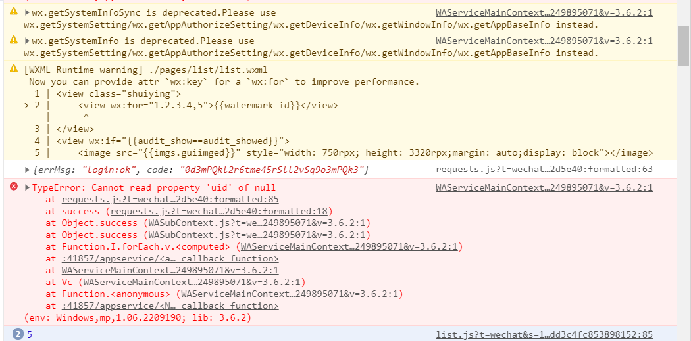
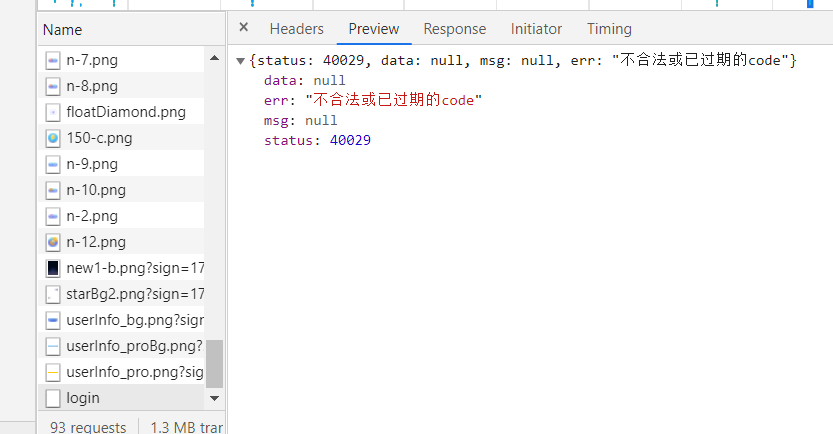
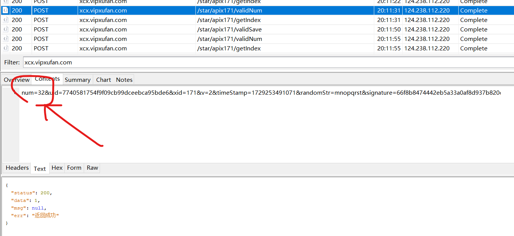
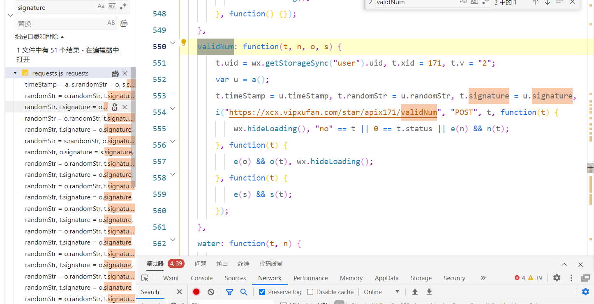
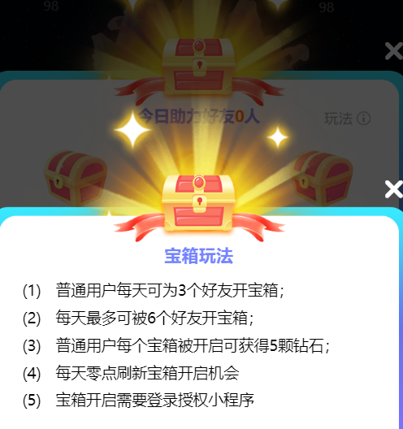
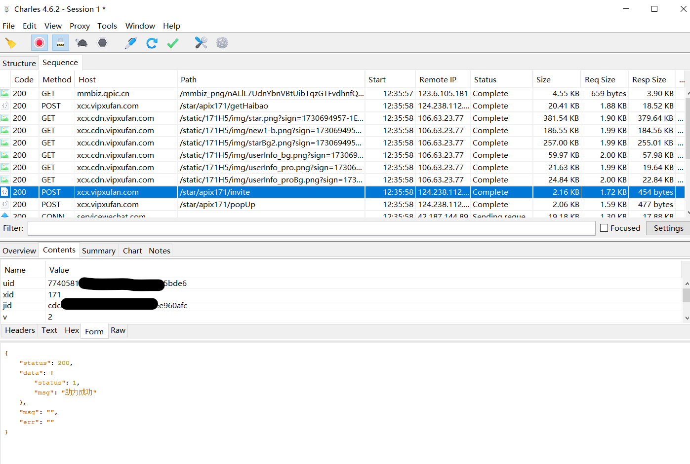
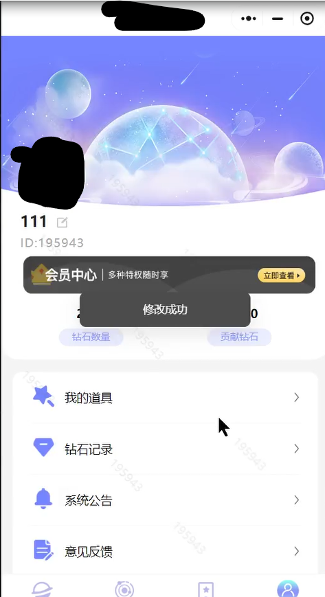

::github{repo="teapot-4l8/3star"}

# 运行
方法一：

在②群里把自己的助力链接发出来，我就能拿到你的账号进行操作，除了每天打开并关上一次小程序外，其余的都不用管

方法二：自己配置运行环境
1. 用抓包工具抓包。教程：https://www.bilibili.com/video/BV1vM4y1V78M/
3. 把 `uid` 换成你自己的
4. 运行脚本前手动打开一次小程序(手机/电脑均可)，然后关掉
5. 运行脚本 [完整挂机脚本](完整挂机脚本.py)
6. 等待程序运行结束

**脚本可脱机运行，运行时关闭小程序**

# 已完成：
- 每日签到，自动判断是否连续签到
- 微博超话（可能失败） TODO 自动翻页
- 任务·看视频x5
- 任务·打开小程序x2
- 任务·抽奖x6
- 每日上限钻石拉满并存入xyl星球 13秒就能获得钻石，不需要等30秒啦~
- 号池内的号相互助力，优先助力index靠前的uid


# 以下是原理记录，可以不看
# 调试，环境配置

微信开发者打开，提示`用户异常`，怀疑是ua或uid的关系。

抓正常的包，发现uid是有值的，用python,只替换掉uid，请求成功返回正确值。


```json
{"status":200,"data":{"massage":{"id":199012,"nickName":"","avatarUrl":"http:\/\/xcx.cdn.vipxufan.com\/dynamic\/171\/uploads\/7740581754f9f09cb99dceebca95bde6\/1729217878.jpg?sign=1729250708-1729250708-0-54ba2cb19fd1e7e41e5669c1d7a26d82","valid_num":57,"succession":1,"vip_end_date":null,"play_num":121,"vip_id":0,"kid_hit":1},"notice":0,"tanchu":0,"noticed":0,"is_show":0,"vip_img":[{"img":"http:\/\/xcx.cdn.vipxufan.com\/static\/171\/vip\/vip-1.png?sign=1729250708-1729250708-0-cff6ae29bb954e6568754aa23d412b9c","status":0,"name":"周会员","money":"28.00","money_vip":"58","msg":"回复\"6\""},{"img":"http:\/\/xcx.cdn.vipxufan.com\/dynamic\/171\/vip\/vip-2.png?sign=1729250708-1729250708-0-973f55ae56d45e110d01776cc9e82bed","status":0,"name":"月会员","money":"98.00","money_vip":"218","msg":"回复\"6\""},{"img":"http:\/\/xcx.cdn.vipxufan.com\/dynamic\/171\/vip\/vip-4.png?sign=1729250708-1729250708-0-3258e1c57f2b15f9032803984f2cd555","status":0,"name":"年会员","money":"528.00","money_vip":"1328","msg":"回复\"6\""}]},"msg":"ok","err":null}
```

观察返回值，发现id是正常的用户id。

微信开发者工具里的并没有成功登陆，不知道为什么，总是提示code不合法

# 静态分析

## 登陆

打开调试台，发现报错



感觉有点可疑

可发现登陆接口

```javascript
    function s(t, n) {
        wx.login({
            success: function(o) {
                console.log(o);
                var a = o.code;
                wx.showLoading({
                    title: "加载中",
                    mask: !0
                });
                var s = wx.get
                StorageSync("user");
                s.uid ? t.uid = s.uid : s = {},
                t.code = a,
                t.xid = 171,
                i("https://xcx.vipxufan.com/star/apix171/login", "POST", t, function(i) {
                    if (wx.hideLoading(),
                    "no" == i || 0 == i.status) {
                        var o = "登录失败,请稍后再试!";
                        i.msg && (o = i.msg),
                        wx.showModal({
                            title: "提示",
                            content: o,
                            showCancel: !1,
                            success: function(t) {}
                        });
                    } else
                        t.uinfo ? (s = JSON.parse(t.uinfo)).uid = i.data.uid : s.uid = i.data.uid,
                        wx.setStorageSync("user", s),
                        wx.setStorageSync("isLogin", "1"),
                        e(n) && n(i);
                }, function() {
                    wx.hideLoading();
                }, function() {});
            },
            fail: function() {
                wx.hideLoading();
            },
            complete: {}
        });
    }
```

```javascript
    function i(t, n, i, a, s, u) {
        "" == n && (n = "GET");
        var c = "application/json";
        "POST" == n && (c = "application/x-www-form-urlencoded"),
        wx.request({
            url: t,
            data: i,
            dataType: "json",
            method: n,
            header: {
                "Content-Type": c
            },
            success: function(n) {
                200 == n.statusCode ? e(a) && a(n.data) : (o(t, i, n),
                e(s) && s());
            },
            fail: function(n) {
                console.log("error"),
                o(t, i, n),
                e(s) && s();
            },
            complete: function() {
                e(u) && u();
            }
        });
    }
```

data是i,post请求

然后找network，发现原来是code出问题了



https://developers.weixin.qq.com/miniprogram/dev/api/open-api/login/wx.login.html

这是官方给的接口，code是官方返回的，那没办法了。。。暂时没想到解决思路，先放放


## 点击钻石

直接repeat会返回用户异常

接着上面，附近这块儿代码像加密的地方

```javascript
    function a() {
        var t = "abcdefghijklmnopqrstuvwxyzABCDEFGHIJKLMNOPQRSTUVWXYZ0123456789"
          , i = Math.floor(Math.random() * t.length) > t.length - 9 ? t.length - 9 : Math.floor(Math.random() * t.length)
          , o = t.slice(i, i + 8)
          , a = Math.ceil(new Date().valueOf())
          , e = n.hex_md5(a + o + "meida123456" + wx.getStorageSync("user").uid);
        e = n.hex_md5(e);
        var s = {};
        return s.timeStamp = a,
        s.randomStr = o,
        s.signature = e,
        s;
    }
```

它有三个地方可以点，我发现点了其中一个，然后点最小化让它挂在后台，再刷新，三个地方的数量会重新刷新，这貌似是个bug

点开抓包的地方，发现它的数量貌似是记录在前端的




搜索`validNum`



点进a，跳转到原先猜测的地方，说明加密位置就在那里。

写python函数

```python
def a(uid):
    t = "abcdefghijklmnopqrstuvwxyzABCDEFGHIJKLMNOPQRSTUVWXYZ0123456789"
    i = random.randint(0, len(t))
    if i > len(t) - 9:
        i = len(t) - 9
    o = t[i:i + 8]
    a = time.time() * 1000
    # 假设存在一个函数计算 MD5 的十六进制值，这里只是模拟
    def hex_md5(data):
        m = hashlib.md5()
        m.update(data.encode())
        return m.hexdigest()
    s = str(int(a)) + o + "meida123456" + uid
    # s = "1729254984360XYZ01234meida1234567740581754f9f09cb99dceebca95bde6"
    e = hex_md5(s)
    e = hex_md5(e)
    return a, o, e
```

遗憾的是，一个用户靠这种方法获得的钻石一天内有上限，超过了会提示用户异常

```json
{"status":200,"data":null,"msg":200,"err":"今日已产满"}
```

正常情况

```json
{"status":200,"data":1,"msg":null,"err":"返回成功"}
```

## 看视频

抓到包后直接repeat，居然能增加钻石个数，看来每个接口的校验严格程度都不一样啊！

视频一天只能看五次

```json
{
	"status": 200,
	"data": {
		"is_view": 1,
		"num": 5,
		"rank": 1,
		"total_num": 5,
		"msg": "ok"
	},
	"msg": "ok",
	"err": null
}
```

奇怪的是，昨天的脚本可以运行，但是今天的却没用了！一直返回

```json
{"status":200,"data":{"is_view":0},"msg":"ok","err":"no"}
```

看来应该是漏了某些包需要发送吧

10.22又试了一下，可以运行，发了不到5次，却是显示观看了视频5次，奇怪

## 发超话

微博超话发帖:会记录帖子是否被领取过

注意到返回内容

```json
{
	"status": 200,
	"data": {
		"status": 1,
		"msg": "快来wx小橙序『五号星球』一起为爱心公益助力，我们在[给你小心心]XX星球[给你小心心]等你哦~"
	},
	"msg": "",
	"err": ""
}
```

猜测msg是用来判断的基本模板。用gitee建立公开仓库，存入纯文档，点击`原始数据`,拿到url，塞进去测试能不能校验通过

试了，不能:(

再次尝试

内容为微博网页源代码

返回

```json
{"status":200,"data":0,"msg":"该超话任务不是今天的哦","err":null}
```

貌似还检测了发帖时间，还没在页面源代码里找到相应位置

伪造微博已完成。

## 助力（盗号 :D）

建模成数学问题：

用户可为3个uid开箱，最多被6个uid开想箱，现有list存放了n个uid，如何编写代码使得开箱数目为6的用户数量最大化




一个账户上限被助力6个

抓包发现 jid大概率是发送助力链接的账户凭证

返回

```json
{
	"status": 0,
	"data": null,
	"msg": "该好友助力任务已完成",
	"err": "no"
}
```

```json
{
	"status": 200,
	"data": {
		"status": 1,
		"msg": "助力成功"
	},
	"msg": "",
	"err": ""
}
```

```json
{
	"status": 0,
	"data": null,
	"msg": "您今日好友助力已达上限!",
	"err": "no"
}
```

```json
{"status":0,"data":null,"msg":"已助力过!","err":"no"}
```




于是替换脚本中的uid

没报错，那大概率就是了

此操作可用于盗号

### mitm劫持替换uid

参考官方文档 https://docs.mitmproxy.org/archive/v10/addons-examples/#filter-flows

成品 [middle_attack.py](middle_attack.py)



# 尝试

签到api，修改时间，没用

邀请用户，修改uid，没用

都会提示用户异常

获取钻石的记录疑似后台会保存，短时间内获取数量太多会提示用户异常

检查一下，发现每隔30秒都会有validsave的请求，而且短时间内重复发送会用户异常

最小间隔13秒

抽奖，注意到 一开始有一个angle，不知道修改angle能不能改变抽到的结果
```
"angle": "0",
```

返回的值似乎是固定的。尝试更改初始angle


对于这个任务，两种思路:

1. 每天更新gitee仓库里的文本日期并push到仓库，需要仓库密钥
2. 爬取微博超话，提取链接

# 组合
每日任务都写好了，挂机收钻石也写好了，把它们组合起来，可以运行了！

但是第二天，人傻了，直接运行task会提示用户异常

于是猜测每天打开小程序应该会有一个类似注册的请求

发现有个login，然后用python执行之前有问题的脚本，发现成功返回正确结果，说明遗漏了这个请求不行！

https://www.cnblogs.com/du-jun/p/12720945.html

记录一下转盘角度

270 90 90 225 180 360

315 135 45 315 45 225

315 180 90 360 225 90

45 315 180 150 315 315

270 180 270 45 360 270 

## 连续签到天数判断

signList

```json
{
	"status": 200,
	"data": {
		"list": [{
			"date": 1,
			"num": 5,
			"type": 2,
			"status": 0,
			"is_today": 0
		}, {
			"date": 2,
			"num": 6,
			"type": 2,
			"status": 0,
			"is_today": 0
		}, {
			"date": 3,
			"num": 7,
			"type": 2,
			"status": 1,
			"is_today": 0
		}, {
			"date": 4,
			"num": 8,
			"type": 2,
			"status": 0,
			"is_today": 0
		}, {
			"date": 5,
			"num": 9,
			"type": 2,
			"status": 0,
			"is_today": 0
		}, {
			"date": 6,
			"num": 10,
			"type": 2,
			"status": 0,
			"is_today": 0
		}, {
			"date": 7,
			"num": 10,
			"type": 2,
			"status": 1,
			"is_today": 0
		}, {
			"date": 8,
			"num": 11,
			"type": 2,
			"status": 0,
			"is_today": 0
		}, {
			"date": 9,
			"num": 12,
			"type": 2,
			"status": 0,
			"is_today": 0
		}, {
			"date": 10,
			"num": 13,
			"type": 2,
			"status": 0,
			"is_today": 0
		}, {
			"date": 11,
			"num": 14,
			"type": 2,
			"status": 0,
			"is_today": 0
		}, {
			"date": 12,
			"num": 15,
			"type": 2,
			"status": 0,
			"is_today": 0
		}, {
			"date": 13,
			"num": 16,
			"type": 2,
			"status": 0,
			"is_today": 0
		}, {
			"date": 14,
			"num": 17,
			"type": 2,
			"status": 0,
			"is_today": 0
		}, {
			"date": 15,
			"num": 17,
			"type": 2,
			"status": 1,
			"is_today": 0
		}, {
			"date": 16,
			"num": 18,
			"type": 2,
			"status": 0,
			"is_today": 0
		}, {
			"date": 17,
			"num": 19,
			"type": 2,
			"status": 0,
			"is_today": 0
		}, {
			"date": 18,
			"num": 20,
			"type": 1,
			"status": 0,
			"is_today": 0
		}, {
			"date": 19,
			"num": 21,
			"type": 1,
			"status": 0,
			"is_today": 0
		}, {
			"date": 20,
			"num": 22,
			"type": 1,
			"status": 0,
			"is_today": 0
		}, {
			"date": 21,
			"num": 23,
			"type": 2,
			"status": 0,
			"is_today": 0
		}, {
			"date": 22,
			"num": 24,
			"type": 1,
			"status": 0,
			"is_today": 0
		}, {
			"date": 23,
			"num": 25,
			"type": 1,
			"status": 0,
			"is_today": 0
		}, {
			"date": 24,
			"num": 26,
			"type": 1,
			"status": 0,
			"is_today": 0
		}, {
			"date": 25,
			"num": 27,
			"type": 1,
			"status": 0,
			"is_today": 0
		}, {
			"date": 26,
			"num": 28,
			"type": 1,
			"status": 0,
			"is_today": 0
		}, {
			"date": 27,
			"num": 29,
			"type": 1,
			"status": 0,
			"is_today": 0
		}, {
			"date": 28,
			"num": 30,
			"type": 1,
			"status": 0,
			"is_today": 0
		}, {
			"date": 29,
			"num": 31,
			"type": 1,
			"status": 0,
			"is_today": 0
		}, {
			"date": 30,
			"num": 32,
			"type": 1,
			"status": 0,
			"is_today": 0
		}, {
			"date": 31,
			"num": 33,
			"type": 1,
			"status": 1,
			"is_today": 1
		}],
		"sign_job": [{
			"id": 3,
			"name": "累计签到3天赠送1g能量",
			"ratio": "433",
			"status": 2,
			"day": 3
		}, {
			"id": 7,
			"name": "累计签到7天赠送100钻石和3g能量",
			"ratio": "186",
			"status": 1,
			"day": 7
		}, {
			"id": 15,
			"name": "累计签到15天赠送100g钻石和八折道具卡*1",
			"ratio": "87",
			"status": 0,
			"day": 15
		}, {
			"id": "31",
			"name": "累计签到31天赠送500g钻石和八折道具卡*2",
			"ratio": "42",
			"status": 0,
			"day": "31"
		}],
		"succession": 10,
		"title": "10月签到挑战",
		"is_sign": 1
	},
	"msg": "ok",
	"err": null
}
```


```
===============签到==================
{"status":200,"data":{"msg":"恭喜获得3钻石和1g能量","data":1,"number":3,"water":1},"msg":null,"err":"返回成功"}

{"status":0,"data":null,"msg":"用户异常","err":"0"}

===============看视频5+3次==================
{"status":200,"data":{"is_view":1,"num":5,"rank":1,"total_num":5,"msg":"ok"},"msg":"ok","err":null}
{"status":200,"data":{"is_view":1,"num":5,"rank":1,"total_num":5,"msg":"ok"},"msg":"ok","err":null}
{"status":200,"data":{"is_view":1,"num":5,"rank":1,"total_num":5,"msg":"ok"},"msg":"ok","err":null}
{"status":200,"data":{"is_view":1,"num":5,"rank":1,"total_num":5,"msg":"ok"},"msg":"ok","err":null}
{"status":200,"data":{"is_view":0,"num":5,"rank":1,"total_num":5,"msg":"ok"},"msg":"ok","err":null}

{"status":200,"data":{"is_view":0},"msg":"ok","err":"no"}

{"status":200,"data":{"cishu":1,"num":3,"rank":1,"total_num":5,"msg":"ok"},"msg":"ok","err":null}
{"status":200,"data":{"cishu":1,"num":2,"rank":1,"total_num":5,"msg":"ok"},"msg":"ok","err":null}
{"status":200,"data":{"cishu":0,"num":2,"rank":1,"total_num":5,"msg":"ok"},"msg":"ok","err":null}

{"status":0,"data":null,"msg":null,"err":"次数已经用完"}

===============打开小程序2次==================
{"status":200,"data":{"num":5,"msg":"ok"},"msg":"ok","err":null}
{"status":200,"data":{"num":5,"msg":"ok"},"msg":"ok","err":null}

===============抽奖6次==================
{"status":200,"data":{"rank":"","times":1,"angle":315,"content":{"id":7,"name":"25颗钻石","desc":"钻石","valid_num":25,"type":1,"rank":315,"water":0}},"msg":"ok","err":null}
{"status":200,"data":{"rank":"","times":1,"angle":315,"content":{"id":7,"name":"25颗钻石","desc":"钻石","valid_num":25,"type":1,"rank":315,"water":0}},"msg":"ok","err":null}
{"status":200,"data":{"rank":"","times":1,"angle":360,"content":{"id":8,"name":"8折道具卡","desc":"8折道具卡","valid_num":0,"type":3,"rank":360,"water":0}},"msg":"ok","err":null}
{"status":200,"data":{"rank":"","times":1,"angle":90,"content":{"id":2,"name":"5克能量","desc":"能量","valid_num":0,"type":2,"rank":90,"water":5}},"msg":"ok","err":null}
{"status":200,"data":{"rank":"","times":1,"angle":45,"content":{"id":1,"name":"15颗钻石","desc":"钻石","valid_num":15,"type":1,"rank":45,"water":0}},"msg":"ok","err":null}
{"status":200,"data":{"rank":"","times":1,"angle":90,"content":{"id":2,"name":"5克能量","desc":"能量","valid_num":0,"type":2,"rank":90,"water":5}},"msg":"ok","err":null}

{"status":200,"data":0,"msg":"次数以用完了","err":null}
{"status":200,"data":{"num":5,"water":0,"msg":"恭喜获得5钻石"},"msg":"ok","err":null}


```

```
===============看视频5+3次==================
{"status":200,"data":{"is_view":0},"msg":"ok","err":"no"}
{"status":0,"data":null,"msg":null,"err":"次数已经用完"}

===============打开小程序2次==================
{"status":0,"data":null,"msg":"该今日任务已达上限","err":"no"}

===============抽奖6次==================
{"status":200,"data":0,"msg":"次数以用完了","err":null}
{"status":0,"data":null,"msg":"该任务不可领取","err":"no"}
每日任务完成
循环次数=>250
需要54.166666666666664分钟
{'status': 200, 'data': 1, 'msg': None, 'err': '返回成功'}
```


