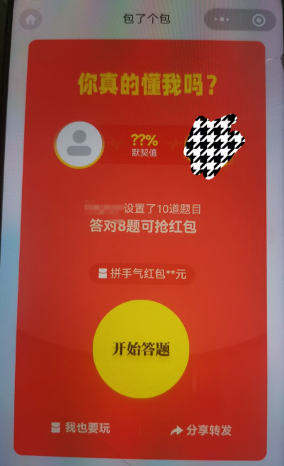
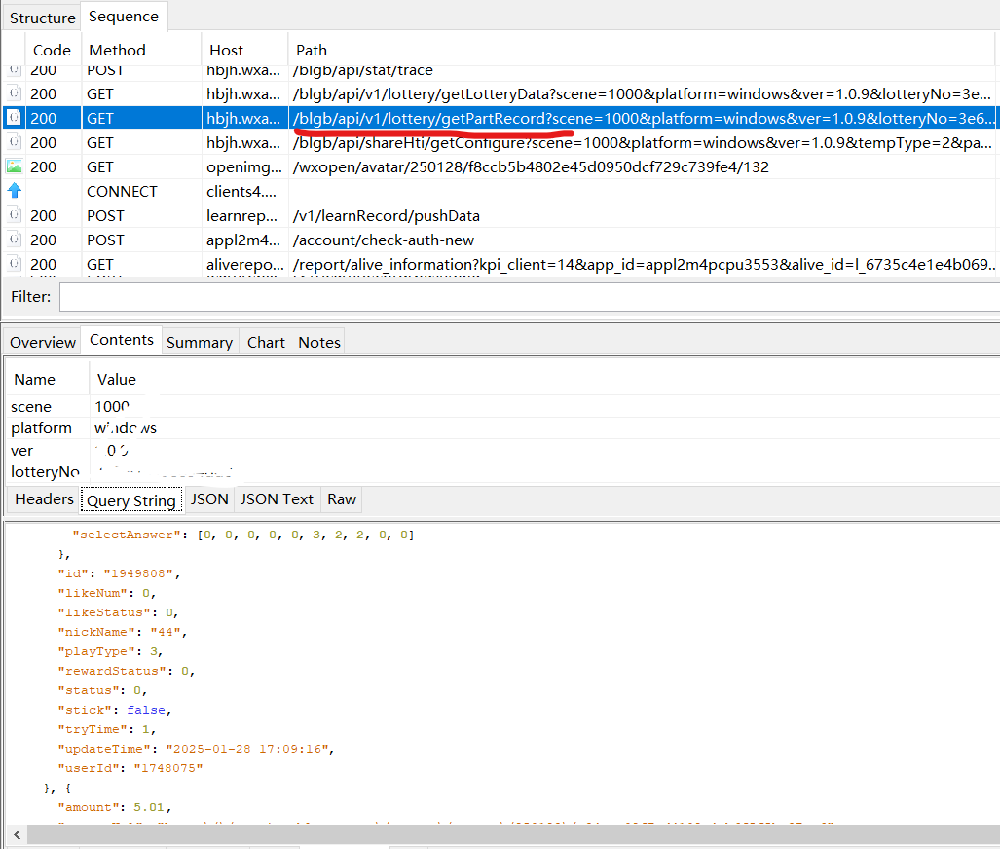
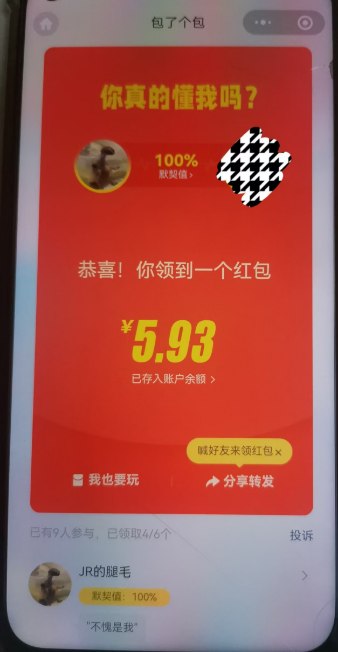

小程序：包了个包



搜索题目关键字，无结果。使用中文转unicode搜索后，有结果。返回json如下

```json
{
	"code": 0,
	"msg": "成功",
	"time": "1738055015354",
	"data": {
		"bgm": "https:\/\/lw-res.wxatech.com\/blgb\/yang\/BGM_2.mp3",
		"clearSuccess": "https:\/\/lw-res.wxatech.com\/blgb\/yang\/clear_2.mp3",
		"clickBtn": "https:\/\/lw-res.wxatech.com\/blgb\/yang\/click_2.mp3",
		"cosHost": "https:\/\/lw-res.wxatech.com\/",
		"detailStyle": "\/0",
		"grantList": [{
			"avatarUrl": "http:\/\/openimg.bleege.com\/wxopen\/avatar\/250128\/883f8c74349a41e49e6ee6d65e557c72",
			"gender": 0,
			"likeStatus": 0,
			"nickName": "XÐ",
			"rewardId": "1170922",
			"stick": false
		}, {
			"avatarUrl": "http:\/\/openimg.bleege.com\/wxopen\/avatar\/250128\/e84eae02f7ad4102a4eb6f5f5bc37ce6",
			"gender": 0,
			"likeStatus": 0,
			"nickName": "想吃太空人的喜之郎",
			"rewardId": "1170922",
			"stick": false
		}, {
			"avatarUrl": "http:\/\/openimg.bleege.com\/wxopen\/avatar\/250128\/88503ab978cd4b3eb1ea92b48bd8eebb",
			"gender": 0,
			"likeStatus": 0,
			"nickName": "Self",
			"rewardId": "1170922",
			"stick": false
		}],
		"isFollow": false,
		"lotteryRecord": {
			"advertisements": [],
			"avatarUrl": "http:\/\/openimg.bleege.com\/wxopen\/avatar\/250128\/747deaeccba64400aec643505577d085",
			"canShare": true,
			"checkTime": "2025-01-29 15:24:19",
			"createTime": "2025-01-28 15:24:14",
			"extraData": {
				"finishTime": 48,
				"lotteryProb": 100.0,
				"totalNum": 6,
				"type": 1
			},
			"gender": 0,
			"grantNum": 3,
			"lotteryNo": "3e60f1349e834dd0",
			"lotteryStatus": 2,
			"lotteryType": 0,
			"nickName": "Fetyloi*",
			"partNum": 7,
			"playRule": {
				"allowWrongNum": 8,
				"canViewAnswer": 2,
				"qaList": [{
					"correctCount": 0,
					"options": {
						"data": ["甜的东西", "辣的东西", "酸的东西"]
					},
					"question": "我更爱吃",
					"sort": 0,
					"sysQaId": "10698"
				}, {
					"correctCount": 0,
					"options": {
						"data": ["身高", "头发", "脸"]
					},
					"question": "我最不喜欢别人说我什么？",
					"sort": 1,
					"sysQaId": "10507"
				}, {
					"correctCount": 0,
					"options": {
						"data": ["有", "没有"]
					},
					"question": "我有过交友不慎的经历吗",
					"sort": 2,
					"sysQaId": "10813"
				}, {
					"correctCount": 0,
					"options": {
						"data": ["是的", "并没有"]
					},
					"question": "随着年龄的增长，我对另一半的要求是否越来越低",
					"sort": 3,
					"sysQaId": "10758"
				}, {
					"correctCount": 0,
					"options": {
						"data": ["(>^ω^<)喵", "狗"]
					},
					"question": "猫跟狗，我更喜欢哪一种？",
					"sort": 4,
					"sysQaId": "10727"
				}, {
					"correctCount": 0,
					"options": {
						"data": ["发超长语音", "只抢红包从来不发", "只发“在吗”不说正事", "很久才回消息"]
					},
					"question": "微信里与人聊天，我最讨厌哪种行为？",
					"sort": 5,
					"sysQaId": "10511"
				}, {
					"correctCount": 0,
					"options": {
						"data": ["当面私聊", "信件", "微信或QQ", "电话"]
					},
					"question": "如果我和你陷入了很深的误会，而我很在意这件事，我会用什么方法向你解释清楚？",
					"sort": 6,
					"sysQaId": "10492"
				}, {
					"correctCount": 0,
					"options": {
						"data": ["?花痴", "?喜笑颜开", "?无敌崇拜"]
					},
					"question": "如果男神\/女神跟我说话了，我会是怎样的表情？",
					"sort": 7,
					"sysQaId": "10497"
				}, {
					"correctCount": 0,
					"options": {
						"data": ["26字", "九宫格", "手写"]
					},
					"question": "手机打字我的是什么模式",
					"sort": 8,
					"sysQaId": "10757"
				}, {
					"correctCount": 0,
					"options": {
						"data": ["先吃一顿好吃的，其他的以后再说", "买点便宜易饱的食物，同时去找工作赚钱", "找盆友、姐妹、亲戚借钱"]
					},
					"question": "如果我现在只有一百块钱，我会",
					"sort": 9,
					"sysQaId": "10771"
				}],
				"qaNo": "62ed651230874f1c",
				"qaNum": 10,
				"switchTime": 0.0
			},
			"playType": 3,
			"redpackNo": "3e60f1349e834dd0",
			"refundAmount": 0.0,
			"remainAmount": 11.24,
			"specifiedUser": 1,
			"title": "包了个包-默契问答",
			"totalAmount": 20.0,
			"totalNum": 6,
			"type": 1,
			"userId": "1746001"
		},
		"reportScenes": {
			"1008": 1,
			"1044": 1,
			"1047": 2,
			"1048": 2,
			"1049": 2
		},
		"rewards": [{
			"extraData": {},
			"grantStatus": 10,
			"id": "1170922",
			"image": {
				"mainImage": "blgb\/image\/redImg\/red_main2.png"
			},
			"price": 20.0,
			"remainAmount": 11.24,
			"rewardTitle": "拼手气红包",
			"rewardType": 32,
			"totalNum": 6
		}],
		"selfData": {
			"canPart": true,
			"creator": false,
			"hasFillAddress": 0,
			"hasPart": false,
			"rewardStatus": false,
			"tryTime": 0,
			"waUser": {
				"avatarUrl": "http:\/\/openimg.bleege.com\/wxopen\/avatar\/250128\/f8ccb5b4802e45d0950dcf729c739fe4\/0",
				"gender": 0,
				"nickName": "44"
			}
		},
		"showContact": false,
		"showShareSetting": false,
		"templateIds": [],
		"thumbnailStyle": "\/h300w300"
	}
}
```

手动作答完毕，出结果，抓包



往下扒拉，前端可以看到别的用户的正确率


```json
{
	"code": 0,
	"msg": "\u6210\u529F",
	"time": "1738055356372",
	"data": {
		"cosHost": "https:\/\/lw-res.wxatech.com\/",
		"data": [{
			"avatarUrl": "http:\/\/openimg.bleege.com\/wxopen\/avatar\/250128\/f8ccb5b4802e45d0950dcf729c739fe4\/0",
			"grabData": {
				"ageFlag": 1,
				"beautyFlag": 1,
				"canBeautify": 0,
				"canViewAnswer": 2,
				"catchNum": 0,
				"correctNum": 6,
				"expressionFlag": 1,
				"genderFlag": 1,
				"glassesFlag": 1,
				"lit": 0,
				"maskFlag": 1,
				"maxCombo": 0,
				"score": 0,
				"selectAnswer": [0, 0, 0, 0, 0, 3, 2, 2, 0, 0]
			},
			"id": "1949808",
			"likeNum": 0,
			"likeStatus": 0,
			"nickName": "44",
			"playType": 3,
			"rewardStatus": 0,
			"status": 0,
			"stick": false,
			"tryTime": 1,
			"updateTime": "2025-01-28 17:09:16",
			"userId": "1748075"
		}, {
			"amount": 5.01,
			"avatarUrl": "http:\/\/openimg.bleege.com\/wxopen\/avatar\/250128\/e84eae02f7ad4102a4eb6f5f5bc37ce6",
			"comment": "\u8001\u677F\u5927\u6C14\uD83D\uDC4D\uD83C\uDFFB\uD83D\uDC4D\uD83C\uDFFB\u5E0C\u671B\u9AD8\u8003\u7684\u65F6\u5019\u6211\u4E5F\u80FD\u6709\u8FD9\u79CD\u8499\u9898\u8FD0\u6C14\uD83D\uDC4D\uD83C\uDFFB\uD83D\uDC4D\uD83C\uDFFB\uD83D\uDC4D\uD83C\uDFFB",
			"grabData": {
				"ageFlag": 1,
				"beautyFlag": 1,
				"canBeautify": 0,
				"canViewAnswer": 2,
				"catchNum": 0,
				"correctNum": 8,
				"expressionFlag": 1,
				"genderFlag": 1,
				"glassesFlag": 1,
				"lit": 0,
				"maskFlag": 1,
				"maxCombo": 0,
				"score": 0,
				"selectAnswer": [0, 0, 1, 1, 0, 2, 0, 1, 0, 1]
			},
			"grantStatus": 1,
			"id": "1948029",
			"likeNum": 0,
			"likeStatus": 0,
			"nickName": "\u60F3\u5403\u592A\u7A7A\u4EBA\u7684\u559C\u4E4B\u90CE",
			"playType": 3,
			"rewardId": "1170922",
			"rewardStatus": 1,
			"rewardTitle": "\u62FC\u624B\u6C14\u7EA2\u5305",
			"status": 1,
			"stick": false,
			"tryTime": 1,
			"updateTime": "2025-01-28 15:32:12",
			"userId": "1746397"
		}, {
			"amount": 2.43,
			"avatarUrl": "http:\/\/openimg.bleege.com\/wxopen\/avatar\/250128\/88503ab978cd4b3eb1ea92b48bd8eebb",
			"grabData": {
				"ageFlag": 1,
				"beautyFlag": 1,
				"canBeautify": 0,
				"canViewAnswer": 2,
				"catchNum": 0,
				"correctNum": 8,
				"expressionFlag": 1,
				"genderFlag": 1,
				"glassesFlag": 1,
				"lit": 0,
				"maskFlag": 1,
				"maxCombo": 0,
				"score": 0,
				"selectAnswer": [1, 0, 0, 1, 0, 1, 0, 1, 0, 1]
			},
			"grantStatus": 1,
			"id": "1947994",
			"likeNum": 0,
			"likeStatus": 0,
			"nickName": "Self",
			"playType": 3,
			"rewardId": "1170922",
			"rewardStatus": 1,
			"rewardTitle": "\u62FC\u624B\u6C14\u7EA2\u5305",
			"status": 1,
			"stick": false,
			"tryTime": 1,
			"updateTime": "2025-01-28 15:30:04",
			"userId": "1746350"
		}, {
			"amount": 1.32,
			"avatarUrl": "http:\/\/openimg.bleege.com\/wxopen\/avatar\/250128\/883f8c74349a41e49e6ee6d65e557c72",
			"grabData": {
				"ageFlag": 1,
				"beautyFlag": 1,
				"canBeautify": 0,
				"canViewAnswer": 2,
				"catchNum": 0,
				"correctNum": 8,
				"expressionFlag": 1,
				"genderFlag": 1,
				"glassesFlag": 1,
				"lit": 0,
				"maskFlag": 1,
				"maxCombo": 0,
				"score": 0,
				"selectAnswer": [1, 0, 0, 1, 0, 3, 2, 1, 0, 1]
			},
			"grantStatus": 1,
			"id": "1948949",
			"likeNum": 0,
			"likeStatus": 0,
			"nickName": "X\u00D0",
			"playType": 3,
			"rewardId": "1170922",
			"rewardStatus": 1,
			"rewardTitle": "\u62FC\u624B\u6C14\u7EA2\u5305",
			"status": 1,
			"stick": false,
			"tryTime": 1,
			"updateTime": "2025-01-28 16:27:29",
			"userId": "1747189"
		}, {
			"avatarUrl": "http:\/\/openimg.bleege.com\/wxopen\/avatar\/250128\/a6bfd20ce8904576a6c1d936dd00e1a5",
			"grabData": {
				"ageFlag": 1,
				"beautyFlag": 1,
				"canBeautify": 0,
				"canViewAnswer": 2,
				"catchNum": 0,
				"correctNum": 7,
				"expressionFlag": 1,
				"genderFlag": 1,
				"glassesFlag": 1,
				"lit": 0,
				"maskFlag": 1,
				"maxCombo": 0,
				"score": 0,
				"selectAnswer": [0, 2, 0, 0, 1, 3, 0, 1, 0, 1]
			},
			"id": "1948452",
			"likeNum": 0,
			"likeStatus": 0,
			"nickName": ":P",
			"playType": 3,
			"rewardStatus": 0,
			"status": 0,
			"stick": false,
			"tryTime": 1,
			"updateTime": "2025-01-28 16:00:50",
			"userId": "1746893"
		}, {
			"avatarUrl": "http:\/\/openimg.bleege.com\/wxopen\/avatar\/250128\/290c6416d972442293d24de8f64e46a4",
			"grabData": {
				"ageFlag": 1,
				"beautyFlag": 1,
				"canBeautify": 0,
				"canViewAnswer": 2,
				"catchNum": 0,
				"correctNum": 7,
				"expressionFlag": 1,
				"genderFlag": 1,
				"glassesFlag": 1,
				"lit": 0,
				"maskFlag": 1,
				"maxCombo": 0,
				"score": 0,
				"selectAnswer": [1, 0, 0, 1, 0, 2, 0, 2, 0, 1]
			},
			"id": "1948337",
			"likeNum": 0,
			"likeStatus": 0,
			"nickName": "\u552F\u552F",
			"playType": 3,
			"rewardStatus": 0,
			"status": 0,
			"stick": false,
			"tryTime": 1,
			"updateTime": "2025-01-28 15:54:45",
			"userId": "1746760"
		}, {
			"avatarUrl": "http:\/\/openimg.bleege.com\/wxopen\/avatar\/250128\/ab2f2e8a9e6848bd88df55d8e9b43208",
			"grabData": {
				"ageFlag": 1,
				"beautyFlag": 1,
				"canBeautify": 0,
				"canViewAnswer": 2,
				"catchNum": 0,
				"correctNum": 6,
				"expressionFlag": 1,
				"genderFlag": 1,
				"glassesFlag": 1,
				"lit": 0,
				"maskFlag": 1,
				"maxCombo": 0,
				"score": 0,
				"selectAnswer": [0, 0, 0, 0, 0, 3, 2, 0, 0, 0]
			},
			"id": "1948195",
			"likeNum": 0,
			"likeStatus": 0,
			"nickName": "o",
			"playType": 3,
			"rewardStatus": 0,
			"status": 0,
			"stick": false,
			"tryTime": 1,
			"updateTime": "2025-01-28 15:43:45",
			"userId": "1746323"
		}, {
			"avatarUrl": "http:\/\/openimg.bleege.com\/wxopen\/avatar\/250128\/998ff72e3abf4ad9a1517530556e36df",
			"grabData": {
				"ageFlag": 1,
				"beautyFlag": 1,
				"canBeautify": 0,
				"canViewAnswer": 2,
				"catchNum": 0,
				"correctNum": 6,
				"expressionFlag": 1,
				"genderFlag": 1,
				"glassesFlag": 1,
				"lit": 0,
				"maskFlag": 1,
				"maxCombo": 0,
				"score": 0,
				"selectAnswer": [0, 1, 0, 1, 0, 2, 2, 1, 0, 0]
			},
			"id": "1948102",
			"likeNum": 0,
			"likeStatus": 0,
			"nickName": "\u561F\u561F\u561F\u561F\uFF5E",
			"playType": 3,
			"rewardStatus": 0,
			"status": 0,
			"stick": false,
			"tryTime": 1,
			"updateTime": "2025-01-28 15:37:09",
			"userId": "1746488"
		}],
		"hasMore": false,
		"isCreator": false,
		"lotteryStatus": 2,
		"pageNum": 1,
		"pageSize": 50,
		"partNum": 0
	}
}
```

找个线上的unicode转中文，得到结果，观察发现，nickName对应其它用户，selectAnswer是每个用户选择的选项。

由于数据不是很多，只有8个用户的作答情况，遂手动整理：

```python
user_answer_list = [
    {
        "selectAnswer": [0, 0, 0, 0, 0, 3, 2, 2, 0, 0],
        "accuracy_rate": 0.6
    },
    {
        "selectAnswer": [0, 0, 1, 1, 0, 2, 0, 1, 0, 1],
        "accuracy_rate": 0.8
    },
    {
        "selectAnswer": [1, 0, 0, 1, 0, 1, 0, 1, 0, 1],
        "accuracy_rate": 0.8
    },
    {
        "selectAnswer": [1, 0, 0, 1, 0, 3, 2, 1, 0, 1],
        "accuracy_rate": 0.8
    },
    {
        "selectAnswer": [0, 2, 0, 0, 1, 3, 0, 1, 0, 1],
        "accuracy_rate": 0.7
    },
    {
        "selectAnswer": [1, 0, 0, 1, 0, 2, 0, 2, 0, 1],
        "accuracy_rate": 0.7
    },
    {
        "selectAnswer": [0, 0, 0, 0, 0, 3, 2, 0, 0, 0],
        "accuracy_rate": 0.6
    },
    {
        "selectAnswer": [0, 1, 0, 1, 0, 2, 2, 1, 0, 0],
        "accuracy_rate": 0.6
    }
]
```

丢给deepseek

```
qaList 中，有10题。question表示题目，options里的data表示选项。
user_answer_list 中一共有8个用户的答题情况，对应它们的正确率。
selectAnswer分别表示10题该用户的选选项下标，比如，0表示选择data里第零个元素，1表示选择了data里第二个元素。
我希望你从中推理出这10题的正确选项，并给出推理过程或程序
```

根据用户提供的答题数据，我们可以通过统计每个选项的加权选择次数来推断正确答案。具体步骤如下：

1. **计算每个选项的权重总和**：将每个用户的选择按正确率加权累加（正确率越高，该用户的答案权重越大）。
2. **选择最高权重的选项**：对每道题，选权重总和最高的选项作为正确答案。

以下是实现代码和结果：

```python
qaList = [...]  # 这里替换为你的qaList数据
user_answer_list = [...]  # 这里替换为你的user_answer_list数据

# 计算每道题的正确选项
correct_answers = []
for question_idx in range(10):
    option_weights = {}
    for user in user_answer_list:
        selected = user["selectAnswer"][question_idx]
        weight = user["accuracy_rate"]
        if selected not in option_weights:
            option_weights[selected] = 0.0
        option_weights[selected] += weight
    # 取权重最高的选项
    max_weight = max(option_weights.values())
    correct_answer = [k for k, v in option_weights.items() if v == max_weight][0]
    correct_answers.append(correct_answer)

# 输出结果
for idx, ans_idx in enumerate(correct_answers):
    question = qaList[idx]["question"]
    options = qaList[idx]["options"]["data"]
    print(f"题目{idx}: {question}")
    print(f"  正确选项: [{ans_idx}] {options[ans_idx]}\n")
```

---

### **推理结果**
以下是每道题的正确答案及选项内容：

1. **题目0: 我更爱吃**  
   正确选项: `[0] 甜的东西`  
   **推理**: 高正确率用户（0.8）多数选择 `甜的东西`，权重总和最高。

2. **题目1: 我最不喜欢别人说我什么？**  
   正确选项: `[0] 身高`  
   **推理**: 绝大多数用户选择 `身高`，高权重用户集中在此选项。

3. **题目2: 我有过交友不慎的经历吗**  
   正确选项: `[0] 有`  
   **推理**: 高正确率用户（0.8）多数选择 `有`，权重累计更高。

4. **题目3: 随着年龄的增长，我对另一半的要求是否越来越低**  
   正确选项: `[1] 并没有`  
   **推理**: 高正确率用户（0.8）多数选择 `并没有`，权重明显领先。

5. **题目4: 猫跟狗，我更喜欢哪一种？**  
   正确选项: `[0] (>^ω^<)喵`  
   **推理**: 绝大多数用户选择 `喵`，仅1个低权重用户选择狗。

6. **题目5: 微信里与人聊天，我最讨厌哪种行为？**  
   正确选项: `[3] 很久才回消息`  
   **推理**: 高权重用户（0.8）选择此选项，权重总和最高。

7. **题目6: 如果我和你陷入了很深的误会，我会用什么方法解释？**  
   正确选项: `[0] 当面私聊`  
   **推理**: 高正确率用户（0.8）集中选择 `当面私聊`。

8. **题目7: 如果男神/女神跟我说话了，我会是怎样的表情？**  
   正确选项: `[1] 😁喜笑颜开`  
   **推理**: 权重统计中 `喜笑颜开` 和 `😍花痴` 接近，但高权重用户更倾向前者。

9. **题目8: 手机打字我的是什么模式**  
   正确选项: `[0] 26字`  
   **推理**: 所有用户一致选择 `26字`，权重绝对领先。

10. **题目9: 如果我现在只有一百块钱，我会**  
    正确选项: `[1] 买点便宜易饱的食物，同时去找工作赚钱`  
    **推理**: 高正确率用户（0.8）多数选择此选项，权重累计最高。

---

### **关键逻辑说明**
- **权重计算**：用户的正确率越高，其选择的选项权重越大。例如，正确率0.8的用户的选择权重是0.6用户的1.33倍。
- **统计依据**：假设高正确率用户更可能在所有题目中选择正确答案，因此他们的选择对最终结果影响更大。

战绩可查




## deepseek推理过程

用户提供了qaList，里面有10个问题，每个问题有选项。而user_answer_list里有8个用户的回答，每个用户对10题都选了答案，并且有一个正确率。正确率是0.6到0.8不等，说明每个用户有6到8题正确。

我的目标是找出每道题的正确选项，也就是哪个选项的索引被正确用户选中的次数最多。比如，对于某道题，正确用户（正确率较高的用户）更可能选择了正确答案，而错误用户可能选错了。

首先，我需要确定哪些用户是可信的，即正确率高的用户更可能选对了大部分题目。比如，正确率为0.8的用户比0.6的更可信。但可能有些用户虽然总体正确率高，但在某些题上可能还是错的。所以可能需要综合考虑所有用户的选择，尤其是正确率高的用户的答案。

接下来，我需要为每个问题统计每个选项被选择的次数，但要根据用户的正确率进行加权。比如，正确率高的用户的答案权重更大，这样他们的选择对正确答案的影响更大。例如，正确率0.8的用户的选择比0.6的用户的更有参考价值。

另一种方法是假设正确率高的用户的答案更可能正确，因此找出每个题目中被高正确率用户选择最多的选项作为正确答案。比如，对于每个问题，统计所有用户的选择，然后根据他们的正确率给予不同的权重，最后选权重最高的选项。

或者，可以将用户按正确率排序，选择正确率最高的用户作为基准，但可能多个用户正确率高，需要综合他们的答案。

### 具体步骤可能如下：

1. 对于每道题（0到9），遍历所有用户的selectAnswer中对应的答案。
2. 统计每个选项被选择的次数，但每个用户的贡献根据其正确率加权。例如，正确率0.8的用户的选择权重为0.8，而正确率0.6的权重为0.6。
3. 对于每个问题，计算每个选项的总权重，选择总权重最高的选项作为正确答案。
4. 或者，也可以简单统计所有用户的选择，但考虑正确率高的用户更可能正确，因此他们的答案更可信。

但可能存在一个问题：如果某个正确率高的用户在某个题上选错了，而其他正确率低的用户选对了，但这种方法可能无法处理这种情况。不过，总体而言，正确率高的用户更可能在多数题目上正确，因此他们的答案更可信。

现在需要具体实现这个逻辑。例如，对于每道题i，遍历每个用户，取该用户在第i题的选择，乘以该用户的正确率（或者可能需要进行其他处理，比如将正确率视为用户在该题正确的概率？或者可能更简单地将正确率高的用户的选择视为更可能正确）。

或者，可以认为用户的正确率是其所有题目正确的比例，所以每个用户有正确率*10题的正确数量。例如，正确率0.8的用户有8题正确，2题错误。所以，对于每道题，用户的选择可能是正确的概率为0.8的概率正确，或者需要更复杂的处理。

这可能比较复杂，或许采用加权统计的方式更可行。例如，每个选项的得分是该用户正确率的累加，当用户选择了该选项。最后，得分最高的选项即为正确答案。

### 编写代码来实现这个逻辑：

- 遍历每个问题（0-9）
- 对于每个问题，创建一个字典来统计每个选项的权重总和
- 遍历每个用户
- 获取用户在该题的选择（比如题目0的选择是selectAnswer[0]）
- 将该用户的accuracy_rate加到该选项的权重总和中
- 最后，对于该题，选权重总和最高的选项作为正确答案

这样处理的话，每个用户的选择对该题的贡献是其正确率，正确率高的用户的选择会被更重视。如果正确答案是某个选项，那么正确率高的用户更可能选择了它，因此他们的权重累加会更高。

例如，假设题目0的正确选项是0，那么正确率高的用户可能大多选了0，而正确率低的用户可能选错。所以，选项0的总权重会是0.8+0.8+0.7+0.6+...等，而其他选项的权重可能较低。

### 编写代码的大致步骤：

1. 初始化一个结果列表，保存每个题的正确答案索引。

2. 对每个题 i（0到9）：

   a. 创建一个字典，记录选项索引对应的总权重。

   b. 遍历每个用户：

   ​	i. 获取用户在该题的选择 `ans = user['selectAnswer'`][i]

   ​	ii. 获取用户的正确率 `rate = user['accuracy_rate']`

   ​	iii. 将rate加到字典中ans对应的键上。

   c. 找出字典中总权重最高的选项，作为该题的正确答案。

   d. 如果有多个选项的权重相同且最高，可能需要处理，但假设数据中不会出现这种情况。

3. 输出每题的正确答案及对应的权重统计。

### 验证这个方法的合理性

例如，看题目0的用户选择：

选项0的总权重是0.6+0.8+0.7+0.6+0.6=3.3（用户0、1、4、6、7）

选项1的总权重是0.8+0.8+0.7=2.3（用户2、3、5）

所以选项0的权重更高，正确选项是0。而实际可能正确选项是0吗？因为题目0的问题“我更爱吃”，选项是甜、辣、酸。假设正确回答是甜，即选项0，那么正确用户（正确率高的用户1、2、3）中，用户1选0（正确率0.8），用户2选1（0.8），用户3选1（0.8），这样他们的选择是否矛盾？

这可能需要更复杂的计算，但可能难以手动处理。因此，可能用户希望使用简单的加权统计方法，即每个用户的答案的权重是其正确率，正确选项是总权重最高的那个。虽然这可能不完美，但可能给出合理的结果。

## 推理总结

通过统计每个选项被用户选择的权重（用户的正确率作为权重），累加后选择最高权重的选项作为正确答案。这种方法假设正确率高的用户更可能在各个题目上选择正确选项，因此他们的选择具有更高的权重。虽然可能存在个别题目错误，但整体上能够推断出正确答案。

1. **数据准备**：
   - **题目数据**：`qaList` 包含10个问题，每个问题有题目、选项列表（`options.data`）和唯一标识。
   - **用户答案**：`user_answer_list` 包含8个用户的答题记录，每个用户提供10题的选项索引（`selectAnswer`）和正确率（`accuracy_rate`）。

2. **权重累加原则**：
   - **核心假设**：正确率高的用户更可能选择正确答案，因此他们的选择应赋予更高权重。
   - **公式**：对每题的每个选项，计算所有用户选择该选项的权重总和，权重为用户正确率。

3. **逐题统计过程**：
   - **遍历每道题**（共10题）：
     - 初始化一个字典 `option_weights`，记录该题每个选项的累计权重。
     - **遍历每个用户**：
       - 获取该用户在此题的选项索引 `selected`。
       - 将该用户的正确率 `accuracy_rate` 累加到 `option_weights[selected]`。
     - 找出累计权重最高的选项，作为该题的正确答案。

4. **处理特殊情况**：
   - **平局情况**：若多个选项权重相同且最高，默认取第一个出现的选项（代码中未明确处理，但数据中未出现此情况）。
   - **索引越界**：假设用户提供的 `selectAnswer` 下标均有效（如选项数≥下标+1）。

5. **结果输出**：
   - 对于每道题，输出题目内容、正确选项的下标及对应选项文本。

**示例验证**（以第5题为例）：
- **题目**：微信里与人聊天，我最讨厌哪种行为？
- **选项**：["发超长语音", "只抢红包从来不发", "只发“在吗”不说正事", "很久才回消息"]
- **用户选择统计**：
  - 用户0选3（正确率0.6 → 权重+0.6）
  - 用户1选2（正确率0.8 → 权重+0.8）
  - 用户2选1（正确率0.8 → 权重+0.8）
  - 用户3选3（正确率0.8 → 权重+0.8）
  - 用户4选3（正确率0.7 → 权重+0.7）
  - 用户5选2（正确率0.7 → 权重+0.7）
  - 用户6选3（正确率0.6 → 权重+0.6）
  - 用户7选2（正确率0.6 → 权重+0.6）
- **权重计算**：
  - 选项0：无选择 → 0
  - 选项1：用户2 → 0.8
  - 选项2：用户1、5、7 → 0.8+0.7+0.6=2.1
  - 选项3：用户0、3、4、6 → 0.6+0.8+0.7+0.6=2.7
- **正确选项**：选项3（权重2.7最高）

**最终结论**：通过加权统计，高正确率用户的选择集中决定了每道题的正确答案，最终输出结果反映了多数高权重用户的共识。

## 结语

怀疑过是否是前端验证，不过粗略地看过每一个请求后好像并没有找到判断的地方