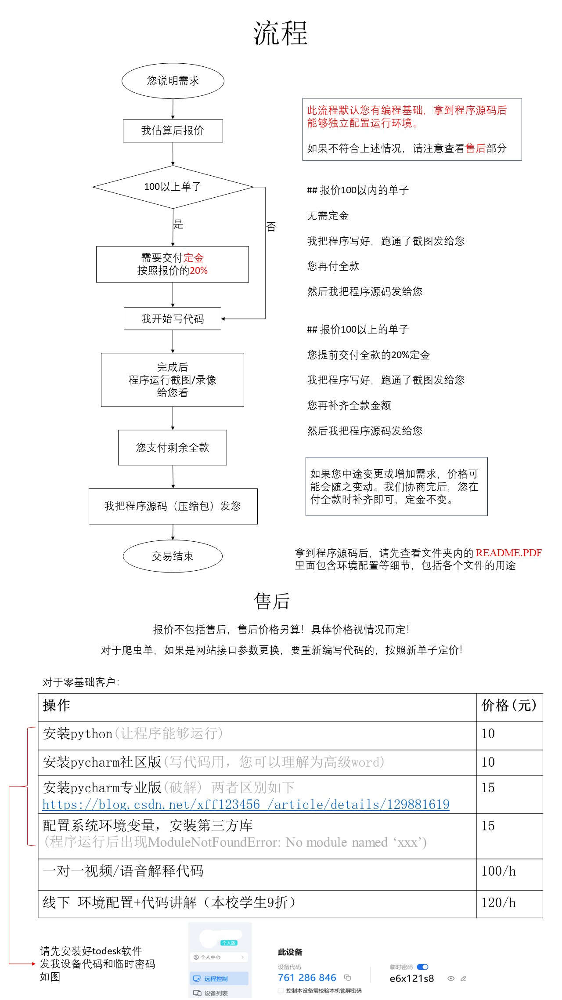

# 本人承接 

计算机类：**爬虫 | app破解 api接口逆向 | 可视化 | 爬虫相关毕设 | 非计算机专业的编程作业** 

绘画类：**板绘 | 同人 | oc(不是我的) | 手绘(包邮) | 定制任意构图和内容**

其它：**国家级比赛经验 | 一对一线上教学(编程/物理) | 能动专业课辅导(传热/工热) | 能动专业课设 | 做冰糖葫芦...** 

为提高沟通效率，*计算机类填此表，如果可以做，我会联系您*

点击链接    https://www.wjx.cn/vm/YGMgS4A.aspx

或扫码填写

<!-- TODO 上线后显示不出图片 正常图片在/_astro目录下 -->

其它默认全部可接，＋Q `1372585211`,备注类型，加完后直接发我具体需求

    

# 计算机类交易流程

## 视频讲解类先付全款后开腾讯会议

# 定价

根据具体项目难度评估

# 绘画类交易流程与估价

| 项目               | 起步价（单位：元） |
| ------------------ | ------------------ |
| 头像               | 50                 |
| 单人角色半身无背景 | 100                |
| 手绘               | 100                |

# 售卖

🐒博士期末速成课系列

IDA 8.3 Pro 破解版

本校能动专业课程设计（汽轮机、锅炉、燃气轮机概论等）

本校实验报告（传热学、燃烧学、汽轮机、泵与风机）
